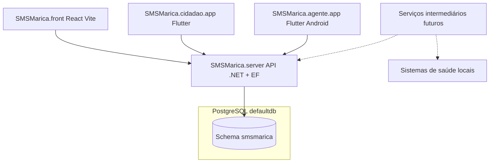

# SMS Maricá — Plataforma de saúde e mobilidade

Documentação de alto nível (top-down) do ecossistema **SMSMarica**: visão do repositório raiz até cada subprojeto e responsabilidades futuras.

---

## 1. Visão na raiz (`SMSMarica/`)

O **SMSMarica** é um projeto amplo de saúde voltado à população. A ideia é integrar diversos sistemas de saúde locais por meio de uma **camada intermediária comum**: uma API principal e, no futuro, serviços intermediários que transportam e normalizam dados entre sistemas legados e a plataforma.

**Por ora**, o foco deste repositório é:

- **API em C# (.NET) + Entity Framework Core** persistindo em **PostgreSQL**.
- **Cadastros e CRUDs** do domínio de transporte sanitário / tratamentos (pacientes, motoristas, veículos, unidades, tratamentos, usuários, agendamentos derivados da periodicidade, etc.).
- **Aplicativo cidadão** (Flutter): cadastro, complementação de dados, integração com WhatsApp (planejado), visualização de agendamentos de translado, confirmação de disponibilidade, alocação em veículo com assento visualizado, tempos estimados de chegada (ida e volta, estilo “Uber”), avaliação do motorista e canal de sugestões/críticas.
- **Aplicativo motorista** (Flutter, **somente Android**): rotas, “próximo” ponto, abertura de apps de navegação (Waze/Maps) via integrações nativas, envio periódico de GPS e uso de **geofencing** para detectar chegada em residências e pontos de destino.
- **Front administrativo** (React + Vite): perfil **operador** e perfil **gestor** (mais informações e dashboards).

A organização em pastas na raiz reflete essa divisão de produtos e times:

| Diretório | Papel no ecossistema |
|-----------|----------------------|
| `SMSMarica.server/` | API backend .NET, EF Core, regras de negócio, integrações futuras. |
| `SMSMarica.front/` | SPA React (Vite) para operação e gestão. |
| `SMSMarica.cidadao.app/` | App Flutter para o cidadão/paciente. |
| `SMSMarica.agente.app/` | App Flutter para o motorista (Android). |

*(Os diretórios podem estar vazios no início; esta documentação fixa o contrato de cada um.)*

---

## 2. Banco de dados — regra crítica (leia com atenção)

O PostgreSQL utilizado é o **mesmo cluster / mesma instância e o mesmo banco lógico** já usado pelo projeto **Automais.IO** (por convenção, o banco referido como **`defaultdb`**).

**Porém:** todo o modelo de dados do SMSMarica reside **exclusivamente** no schema PostgreSQL:

```text
smsmarica
```

- Nome do schema: **`smsmarica`** (minúsculas, como convenção típica do Postgres).
- **Nunca** cruzar tabelas, FKs, views ou migrations com schemas de outros produtos (por exemplo, o do Automais.IO).
- **Migrations EF Core** devem ser geradas e aplicadas **somente** contra objetos no schema `smsmarica` (mapeamento explícito de schema em entidades ou convenção centralizada no `DbContext`).
- Isso garante isolamento lógico no mesmo banco físico: backup, permissões e políticas podem ser refinadas depois (roles com `search_path` ou grants por schema), mas a regra de produto é: **zero dependência de tabelas fora de `smsmarica`**.

Dados de GPS em alta frequência podem, no futuro, ir para um armazenamento de séries temporais (ex.: **InfluxDB** ou similar); o **administrativo** permanece em Postgres no schema `smsmarica`.

---

## 3. Domínio principal da API (visão funcional)

### 3.1 Paciente

Cadastro com **todos os dados necessários para equivalência ao que se espera no contexto do CNS** (Cadastro Nacional de Saúde): identificação, documentos, contatos, endereço, vínculos assistenciais, etc., conforme evolução do projeto e validação jurídica/local.

### 3.2 Tratamento e periodicidade

Ao associar um **tratamento** a um paciente, define-se a **periodicidade** das sessões, por exemplo:

- todos os dias, a partir do dia **X**, por **N** sessões;
- a cada **2** dias, a partir do dia **X**, por **N** sessões;
- **1x por semana** (e outras cadências).

Com isso, o sistema deve **gerar automaticamente** a linha do tempo de deslocamentos necessários (ida ao local de exame/tratamento e retorno), alimentando listagens **diárias** de pessoas que precisam ser buscadas em casa, levadas ao destino e depois devolvidas.

### 3.3 Unidades

Cadastro das **unidades de saúde** (ou pontos) que realizam o tratamento. Tanto **paciente** quanto **unidades** devem ter **referência GPS** (coordenadas confiáveis para roteirização e algoritmos futuros).

### 3.4 Motorista e veículo

- **Motorista:** dados cadastrais e operacionais para transporte.
- **Veículo:** configuração inspirada em **cadastro de assentos de aeronave**: o operador alocará **paciente** e eventual **acompanhante** em assentos marcados.

**Modelagem do veículo:**

- Não se assume “cada fileira tem o mesmo número de assentos”.
- O cadastro permite **adicionar fileiras**; em **cada fileira**, informar **quantos assentos** existem.
- Isso permite gerar depois um **layout fiel** (ex.: van específica) e um **algoritmo de numeração/posicionamento** de assentos para UI e para regras de alocação.

### 3.5 Usuários

Usuários do sistema (operador, gestor, perfis futuros), com autenticação/autorização alinhada ao front React e às políticas da API.

### 3.6 Rastreamento e geofencing

Motoristas terão trajeto rastreado; haverá ingestão de pontos GPS (tabela em Postgres no schema `smsmarica` e/ou solução de time-series conforme volume). Apps usarão **geofencing** para marcar chegadas em endereços e unidades.

---

## 4. Subprojeto `SMSMarica.server/`

**Responsabilidade:** API REST (e eventualmente gRPC/signalr, se necessário), autenticação, autorização, validações, geração de agendas a partir de periodicidade, alocação em veículos/assentos, integrações futuras com sistemas legados.

**Stack prevista:**

- .NET (versão alinhada ao padrão do time).
- Entity Framework Core + PostgreSQL (`defaultdb`, schema **`smsmarica`** apenas).
- OpenAPI/Swagger para contrato com front e apps.

**Conteúdo típico (quando o código for criado):**

- Projeto da API (ASP.NET Core).
- Projeto de domínio/infra (opcional, conforme arquitetura).
- Migrations EF com namespace/schema explícito para `smsmarica`.
- Configuração por ambiente (`appsettings`, secrets) **sem** misturar connection strings de outros produtos de forma ambígua — o isolamento é por **schema**, não por “outro banco”.

---

## 5. Subprojeto `SMSMarica.front/`

**Responsabilidade:** interface web para **operador** e **gestor**.

**Stack prevista:**

- React + **Vite**.
- Duas experiências (ou módulos): **perfil operador** (fluxos do dia a dia) e **perfil gestor** (dashboards e visões agregadas).

**Conteúdo típico:**

- `src/` com rotas, layouts por perfil, páginas de CRUD e telas de alocação (mapa de assentos do veículo, listagens diárias de translado, etc.).
- Cliente HTTP gerado ou tipado contra a API do `SMSMarica.server`.

---

## 6. Subprojeto `SMSMarica.cidadao.app/`

**Responsabilidade:** app **Flutter** para o cidadão/paciente.

**Funcionalidades-alvo (roadmap):**

- Ver e completar cadastro.
- Integração com **WhatsApp** (notificações ou atendimento — a definir na implementação).
- Ver agendamentos de translado; **confirmar disponibilidade**.
- Quando alocado: ver **assento** (representação gráfica), **ETA** do veículo na ida e na volta.
- **Avaliar** o motorista; enviar **sugestões e críticas**.

**Conteúdo típico:**

- `lib/` com módulos de auth, agenda, mapa/assentos, avaliação.
- Integração com API do `SMSMarica.server`.

---

## 7. Subprojeto `SMSMarica.agente.app/`

**Responsabilidade:** app **Flutter** para **motorista**, **somente Android** (decisão de produto: menos superfície de teste inicial, integrações nativas de navegação).

**Funcionalidades-alvo:**

- Lista/sequência de paradas; destaque do **“próximo”** ponto.
- Abrir **Waze** ou **Google Maps** (ou app preferido) via intent/plataforma nativa.
- **Postagem periódica** de coordenadas GPS para a API (ou pipeline de séries temporais).
- **Geofencing** para detectar proximidade/chegada em residências e pontos institucionais.

**Conteúdo típico:**

- `lib/` com serviço de localização em foreground/background conforme políticas Google Play e LGPD.
- Módulo de navegação externa.

---

## 8. Fluxo resumido (Mermaid)



---

## 9. Próximos passos sugeridos (documentação viva)

1. Inicializar solução .NET em `SMSMarica.server` com `DbContext` fixando `modelBuilder.HasDefaultSchema("smsmarica")` (ou equivalente por entidade).
2. Definir o **diagrama entidade-relacionamento** inicial (Paciente, Tratamento, Periodicidade, Sessão gerada, Unidade, Motorista, Veículo, Fileira, Assento, Usuário, Alocação, Avaliação).
3. Registrar neste `README` ou em `docs/` a versão do .NET, do Flutter e convenções de branch/commit quando o código existir.

---

*Documento iniciado para alinhar produto, arquitetura e isolamento de schema. Atualize à medida que requisitos legais (LGPD, CNS) e integrações forem fechados com o município.*
# SMSMarica

