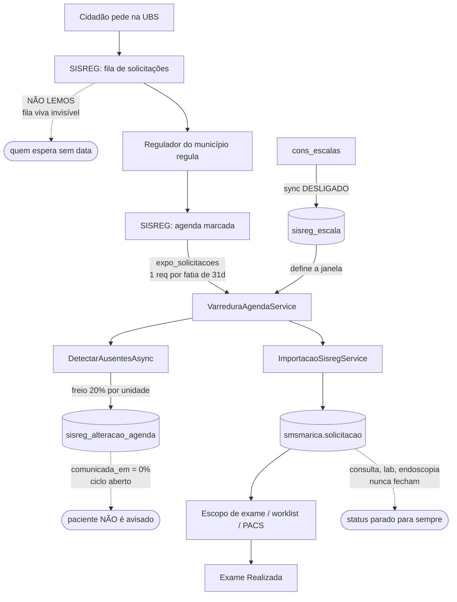

# Análise da Regulação + integração SISREG — 09/09/2026

> Levantamento feito em 09/09/2026 sobre o código, a documentação e o **banco de produção**
> (somente leitura, sem dado pessoal). Nenhuma chamada foi feita ao SISREG, ao SER ou ao SERNIT.
>
> **Como foi feito:** 6 leitores mapearam os subsistemas; 5 sondas rodaram **436 consultas** na
> base; 5 lentes independentes (cidadão, regulador, integridade, eficiência, aprendizados)
> analisaram o material e produziram **72 achados**; 36 passaram por dupla verificação adversarial
> (evidência + utilidade). **3 foram refutados**, 44 vereditos sustentaram os demais, e 25
> verificações não chegaram a rodar — esses achados estão marcados como **não verificados**, não
> como confirmados.

---

## 1. Resumo executivo

O motor de leitura do SISREG está **bom**: traz a agenda da rede inteira por ~223 requisições/dia,
com fatiamento, freios de orçamento e trilha de execução. O que falta não é máquina — é **fechar o
ciclo**. Três buracos explicam quase tudo:

**O sistema sabe quem tem data, mas não sabe quem espera.** `expo_solicitacoes` só exporta
marcações: `data_agendada` é nula em 25 de 1.021.143 linhas. A espera que publicamos (mediana 54
dias) é a de quem **já foi atendido** — quem está na fila há 8 ou 20 meses sem data simplesmente
não existe na base. É o indicador central da regulação, e ele é inobservável por construção.

**Nada fecha.** Existem **0 solicitações canceladas** e **0 com `cancelado_em`** em um milhão de
linhas. 984.963 (96,5%) estão "Agendada" com data já passada; só 1.907 estão "Realizada", todas
exames de imagem fechados pelo PACS. Consulta, laboratório e endoscopia nunca fecham. Pior: há
**dois regimes de status** — a carga histórica gravou tudo como *Agendada*, o importador diário
grava tudo como *Solicitada* mesmo com data. Contagem por status não serve para decidir nada.

**Detectamos mudanças e não fazemos nada com elas.** A fila tem 2.298 linhas; `comunicada_em` está
vazia em **100%** delas, incluindo 62 remarcações de horário. Das 1.348 tratadas, 1.344 foram num
único instante, em lote, sem `tratada_por`. E 456 vagas que o SISREG diz não existir mais seguem
abertas na tela local.

**As cinco ações que mais mudam a vida do cidadão e do regulador:**

1. **Ligar o sincronismo de escalas.** A chave `escalasAtivo` **não existe** em nenhum
   `parametros_json` — o scheduler lê `false` e nunca dispara. Houve uma única sincronização
   manual. Em **30/09**, 145 escalas de 11 unidades vencem e a janela dessas unidades cai ao piso
   de 21 dias sem ninguém perceber.
2. **Vigia de silêncio.** A chave-mestra ficou dias desligada e ninguém foi avisado — só
   descobrimos ontem, por acaso. Nenhum alerta existe para "a rede parou de varrer".
3. **Fechar o ciclo da fila de alterações**: separar falsa de real, dar resolução, e ligar o aviso
   ao paciente (hoje `EnviarManualAsync` **recusa** a finalidade `ConfirmacaoAgendamento` — o
   "avisar paciente" de remarcação falha sempre).
4. **Recortar o detector de ausência** em vez de pulá-lo (`ce3673c`). É pré-requisito da sua ideia
   do "−3 dias" e custa +6 requisições/noite.
5. **Teto de janela em 180 dias**: economiza 34 requisições/noite (−15%) sem perder um único
   agendamento — não há **nada** marcado além de 120 dias em toda a rede.

**O caso do Centro Materno Infantil merece decisão hoje.** As 300 ausências de ontem **não são**
leitura incompleta: são 3–4 agendas inteiras de um profissional (US de mamas Ter/Qui 08:00 26
vagas, USG-DIU Ter 15:00, colposcopia Sex) sumindo **100%** entre 10/09 e 08/10, e **0%** a partir
daí. Isso é cancelamento real em bloco — ~283 pessoas com horário marcado que provavelmente não
serão atendidas e não foram avisadas.

---

## 2. Como o sistema funciona hoje

**A janela não é "21 dias".** Vai de hoje até a **última escala ativa** da unidade
(`UltimoDiaDeAgendaAsync`); os 21 dias são um **piso** para unidade sem escala. Hoje: 17 unidades
no piso, 12 com 113 dias, uma com 203, uma com 254 e o Centro de Radiologia com **1.110 dias** —
por causa de duas escalas com vigência até setembro/2029.

**O custo tem dois motores, não um.** Para unidade com janela longa, manda o **comprimento**
(fatias de 31 dias). Para as 6 maiores, manda o **volume** (teto de 700 registros quebra a fatia
até o dia). O CDT gasta 26 requisições para 4 fatias de calendário; o Hospital Santo Antônio gasta
21 requisições para a **menor janela possível**, com 20 quebras de 700.

---

## 3. O que medimos na base

**Tempos de espera** (168.468 solicitações com data em 2026):

| Etapa | p50 | p75 | p90 | máx |
|---|---|---|---|---|
| T1 pedido → regulação | 3 d | 58 d | 237 d | 1.886 d |
| T1 só de quem esperou (>0) | 33 d | 160 d | 341 d | 1.886 d |
| T2 regulação → data marcada | 32 d | 57 d | 79 d | 178 d |
| **T3 espera total** | **54 d** | **104 d** | **292 d** | **1.946 d** |

38% são regulados no mesmo dia — misturar isso com a fila de regulação achata a mediana. **12.227
pessoas (7,3%)** esperaram mais de um ano. E os meses de out/nov/dez estão **censurados à direita**:
só entram pedidos já regulados hoje, então dezembro aparece com T1 = 0. Não é bom desempenho, é
falta de dado.

**Integridade** (1.021.143 solicitações):

- **0** canceladas, **0** com `cancelado_em`.
- 984.963 "Agendada" com data passada; **1.907** "Realizada" (só imagem).
- 5.317 exames de imagem futuros **sem satélite** `exame_imagem` — não vão à worklist.
- 46.005 pacientes sem CPF no hub; 129.708 sem CNS.
- `prioridade` é inerte: 1.021.115 de 1.021.143 são "Eletiva" — o importador fixa isso.
- `atualizado_em` nulo em 99,7%: a varredura não carimba a linha ao reler.

**Fila de alterações** (2.298 linhas, 950 pendentes):

- `comunicada_em` preenchida: **0**.
- 1.344 das 1.348 tratadas num único instante, sem `tratada_por`.
- **206 tipo 3 são só espaço em branco** no nome (`"CONSULTA  EM"` → `"CONSULTA EM"`) — 55% do
  ruído; e 168 são códigos oscilando nos dois sentidos no Santo Antônio.
- **52 ausências falsas** por janela passada continuam pendentes (as 20 do episódio pré-guarda
  mais 32 remanescentes).
- Tipo 2 (Executante) **nunca ocorreu** em 2.298 linhas.

**Escalas e ocupação:**

- 1.586 escalas vigentes em **35** das 45 unidades; 53,5% são de GRUPO.
- Ocupação aproximada dos próximos 7 dias: 6.185 vagas × 5.474 agendados.
- Centro de Reabilitação: 2.304 vagas para 88 agendamentos em 21 dias (**4%**).
- Radiocenter: 21 escalas vigentes, 88 vagas/semana, **zero** agenda futura — a agenda caiu de
  ~900/mês (jan–mai) para 0 em setembro.

**Custo da varredura (30 dias):** 283 execuções, 2.085 requisições. **35,9% (748 req) foram gastas
em execuções que não concluíram** — 291 em canceladas, 209 em erros, 180 delas por reinício do
serviço (deploy mata varredura viva).

---

## 4. Achados

Ordenados por prioridade. Os que passaram pela verificação adversarial estão sustentados por dois
verificadores independentes (evidência + utilidade); os demais estão marcados.

**Refutados na verificação — não reabrir sem dado novo:**

1. *Consolidação da espera por CTE única* — já existe em produção
   (`AgendaRegulacao/AgendaDemandaService.cs` tem exatamente a CTE proposta).
2. *Um dos achados sobre tratamento da fila* — o mecanismo descrito já está implementado em
   `AlteracoesAgendaService.TratarLoteAsync`.
3. *Um achado sobre decisão destravada por colunas existentes* — os fatos conferem, mas a decisão
   prometida não é identificável com essas colunas.

### 1. [P0] Ninguém é avisado quando a rede para de varrer: chave-mestra desligada e falhas da varredura diária não geram alerta nenhum
**Lente:** Aprendizados · **Esforço:** dias · **Confiança:** alta

**Evidência.** VarreduraSisregScheduler.cs:72, EscalasSincronizacaoScheduler.cs:72 e MapeamentoLoteScheduler.cs:79 fazem `if (!await SincronismoAutomaticoSisreg.LigadoAsync(db, ct)) return;` sem log nem métrica. `INotificadorSincronismo` (Notificacoes/Sincronismo/NotificadorSincronismo.cs) é injetado SÓ em SisregMapeamentoLoteService.cs (7 chamadas) — zero ocorrências em Integracoes/SisregWeb/Varredura e /Escalas; logo CAPTCHA, Parcial, Erro e 'interrompida' da varredura diária não avisam os telefones cadastrados em TelefonesNotificacaoSecao (que promete aviso de 'CAPTCHA, credencial derrubada'). Medido: 0 solicitações criadas em 06 e 07/09 (chave caiu entre 04/09 19:30 e 06/09 00:16 BRT, não em 03/09 como o contexto dizia); fila de alterações 188→950 no religamento; nenhuma tela mostra 'última varredura concluída há N horas' (SincronismoAutomaticoSecao.tsx só exibe o banner estático 'Nenhuma unidade está importando sozinha').

**Para o cidadão.** Remarcações e cancelamentos do SISREG ficam 4-5 dias sem chegar; paciente comparece a horário que não existe ou perde vaga remarcada.

**Para a regulação.** Regulador opera cego sem saber que está cego; fila de alterações acumula 950 linhas de uma vez e vira intratável.

**Recomendação.** (1) Vigia de silêncio no tick do VarreduraSisregScheduler (uma vez por dia, ex.: 08:00 BRT): unidades com `ativo=true` cujo último `sisreg_varredura_execucao` Concluída tem mais de 36 h, OU chave-mestra desligada há mais de 24 h → `INotificadorSincronismo.NotificarAsync` com a lista e gravar em log estruturado SISREG_VIGIA. (2) Injetar INotificadorSincronismo em VarreduraAgendaService e notificar em CAPTCHA (PausadoAte), Erro e Parcial com naoLidas. (3) Expor em `GET sisreg/varredura/status` e na SincronismoAutomaticoSecao 'última varredura concluída da rede: há X h' e 'N unidades sem corrida há > 36 h'. (4) Logar Warning quando LigadoAsync devolve false pela primeira vez no dia.

### 2. [P0] Sincronismo automático de escalas está desligado por chave inexistente — a janela das 45 unidades depende de um retrato manual de 04/09 que vai vencer em bloco em 30/09 e 31/12
**Lente:** Aprendizados · **Esforço:** horas · **Confiança:** alta

**Evidência.** EscalasSincronizacaoService.cs:85 `ChaveAtivo = "escalasAtivo"` e :564 `json?[ChaveAtivo]?.GetValue<bool>() ?? false` — a chave não existe em nenhum `integracao_credencial.parametros_json`, então o scheduler nunca dispara. EscalasSincronizacaoScheduler.cs:32 `_ultimoDisparo` só em memória, :90 janela de 10 min (reinício na janela = dia perdido). Medido: `sisreg_escala_sincronizacao_execucao` tem 1 linha (04/09 21:11 BRT, Manual); `visto_em` único em 17.452 escalas; `ausente=true` em 0 linhas (nunca populado); 145 escalas de 11 unidades vencem em 30/09 e 631 de 13 unidades em 31/12 → janelas caem ao piso de 21 dias sem sincronização nova. Nenhum teste cobre `UltimoDiaDeAgendaAsync` (grep em tests: só RecusaExportAgendaTests).

**Para o cidadão.** Em 01/10 a varredura de 11 unidades encolhe para 21 dias e agendamentos além disso deixam de ser vistos e conferidos.

**Para a regulação.** Oferta interna do catálogo (ADR-0055) e tela Agenda mostram escala congelada; 'Ausente' nunca vai significar nada.

**Recomendação.** (1) Em EscalasSincronizacaoService.ObterAgendamentoAsync trocar `?? false` por 'ligado quando a credencial sisreg existe' OU gravar `escalasAtivo=true` no PrepararRedeAsync junto com a programação das unidades (mesmo lugar que programa as 45). (2) Catch-up no EscalasSincronizacaoScheduler: disparar se `max(iniciado_em)` Concluída em `sisreg_escala_sincronizacao_execucao` for anterior a hoje e a hora alvo já passou — em vez de janela de 10 min em memória. (3) Incluir no vigia de silêncio: 'escalas com mais de 48 h' → notificação. (4) Mostrar 'última sincronização de escalas: há X h' na SincronismoEscalasSecao e alerta de qualidade para vigência > 400 dias (2 escalas do Centro de Radiologia até set/2029). (5) Teste unitário para UltimoDiaDeAgendaAsync (piso, Inativa ignorada, Ausente ignorada, vigência futura conta).

### 3. [P0] Freio de 20% é o único controle sobre ausência em massa, é por unidade e só loga: uma escala inteira de US de mamas sumiu para ~283 pacientes sem alarme
**Lente:** Aprendizados · **Esforço:** dias · **Confiança:** alta

**Evidência.** VarreduraAgendaService.cs:159 `LimiteAusentesSuspeito = 0.20`, :1332-1335 acima do limite só loga SISREG_AUSENTES_SUSPEITO e descarta; abaixo grava sem sinal. `SisregVarreduraExecucao` e `VarreduraSisregDtos` não têm nenhuma coluna/campo de ausências (grep 'Ausent' vazio) — a tela não mostra quantas ausências uma corrida gerou nem se descartou. Medido no CMI (09/09 15:44): 300/3.788 = 7,9% passou; por célula dia×procedimento a agenda 1402147 Ter/Qui 08:00 sumiu 100% (25/25, 26/26 …) de 10/09 a 01/10 e 0% a partir de 13/10; USG-DIU 16/16 e colposcopia 7/7; escala nova em sisreg_escala começa exatamente em 09/10. Fragilidade inversa: USF Recanto 1/6 = 16,7% — a próxima ausência isolada faria a unidade inteira ser ignorada.

**Para o cidadão.** ~283 mulheres do CMI acreditam ter US de mamas/DIU/colposcopia marcados nos próximos 30 dias e o SISREG já não os tem; nenhum aviso sai.

**Para a regulação.** Cancelamento em bloco (escala encerrada) chega como 300 linhas individuais indistinguíveis de cancelamento difuso; a vaga segue 'ocupada' e a oferta parece menor do que é.

**Recomendação.** (1) Adicionar colunas `ausentes_detectadas` e `ausentes_ignoradas_por_suspeita` em `sisreg_varredura_execucao` (migration aditiva) e exibir na tabela 'Varreduras recentes' e no ModalDetalheVarredura. (2) Segundo detector em DetectarAusentesAsync: agrupar ausências por (data_agendada::date, procedimento_codigo ou profissional_cpf) e, quando ≥90% de uma célula com ≥10 slots sumir, marcar as linhas com flag `em_bloco=true` (coluna nova em sisreg_alteracao_agenda) e notificar via INotificadorSincronismo — é evento de escala, não de paciente. (3) Freio com piso absoluto: ignorar só se proporção > 20% E ausentes ≥ 20 (unidade pequena não pode ser silenciada por 2 linhas). (4) Extrair o recorte do detector para função estática testável (hoje só RecusaExportAgendaTests.Agendamento_em_dia_nao_lido cobre a exclusão de naoLidas; o freio não tem teste).

### 4. [P0] A fila de alterações é alimentada por máquina e esvaziada por ninguém: 0 pacientes comunicados em 2.298 linhas, 1.344 'tratadas' num instante sem autor, 60 remarcações inteiras paradas
**Lente:** Aprendizados · **Esforço:** dias · **Confiança:** alta

**Evidência.** `sisreg_alteracao_agenda.comunicada_em` preenchida em 0 de 2.298; 1.344 de 1.348 tratadas em 06/09 23:32:49 BRT com `tratada_por` NULL (AlteracoesAgendaService.cs:124-125 e :164-165 gravam UsuarioId do contexto — lote sem usuário grava nulo; a origem desse lote não está registrada em lugar nenhum); só 4 tratamentos humanos em toda a vida da tabela. Tipo 1 (remarcação): 60 pendentes, 3 blocos de 20 do Che Guevara (15/09→08/10, 22/09→15/10, 29/09→19/10). Sidebar.contadorBadge não conhece a fila (menuConfig.ts só 'meusTickets','ticketsGestao','painelInicio'); PainelInicioService não tem raia de alterações; AlteracoesAgendaPage não mostra nome do paciente nem link para a solicitação (PacienteNome sempre null no DTO).

**Para o cidadão.** 60 pessoas do Che Guevara têm na mão um horário que não vale; ninguém vai avisá-las pelo caminho previsto.

**Para a regulação.** O controle 'humano confirma' virou 'ninguém confirma' — a fila não protege nada se ninguém a olha e nada cobra.

**Recomendação.** (1) Raia 'Alterações de agenda pendentes' no PainelInicioService (mesma estrutura de raias por permissão; escopo executante OU solicitante já existe em AlteracoesAgendaService.ListarAsync) com badge no menu — remarcação pendente > 24 h em destaque. (2) Coluna `tratada_origem` (Humano/Lote/Sistema) em sisreg_alteracao_agenda para separar carimbo de trabalho; qualquer lote grava motivo. (3) Preencher PacienteNome (já resolvido pelo hub em PainelInicioService — reusar) e link para a ficha na AlteracoesAgendaPage; para tipo Ausente, botão 'cancelar deste lado' que chama o cancelamento existente de SolicitacoesExameService (hoje o texto manda fazer isso em outra tela). (4) Métrica de SLA: idade mediana/p90 das pendências por tipo em `GET /alteracoes-agenda/resumo`.

### 5. [P0] "Avisar paciente" de remarcação falha sempre: EnviarManualAsync recusa a finalidade ConfirmacaoAgendamento
**Lente:** Cidadão · **Esforço:** horas · **Confiança:** alta

**Evidência.** SMSMais.server/src/SMSMais.Core/Notificacoes/Comunicacao/ComunicacaoPacienteService.cs:278-280 lança ValidacaoException `comunicacao.finalidade_invalida` ("Envio manual só vale para exame liberado ou laudo pronto") para qualquer finalidade fora de ExameLiberado/LaudoPronto; SMSMais.Core/Integracoes/SisregWeb/Alteracoes/AlteracoesAgendaService.cs:195-197 chama exatamente esse método com FinalidadeComunicacao.ConfirmacaoAgendamento. A guarda é anterior ao rename de 24/08 (git log -S aponta 03ed936) e o chamador nasceu em dc6f67c (04/09); tests/ não tem nenhum teste de ComunicarAsync. Base: comunicada_em preenchida em 0 de 2.298 linhas de smsmarica.sisreg_alteracao_agenda; tipo 1 (DataHora) = 62 linhas, 60 pendentes, todas do Che Guevara em 3 blocos de 20 (15/09→08/10, 22/09→15/10, 29/09→19/10). Agravante: se o paciente já havia confirmado a data antiga, o processamento cai em "Paciente já respondeu por outro canal" (ComunicacaoPacienteService.cs:187-190) porque ReconciliarAsync não volta status_confirmacao a Pendente.

**Para o cidadão.** 60 pessoas têm na mão um horário de setembro que virou outubro e o único botão que as avisaria devolve erro 400; vão comparecer no dia errado. Toda remarcação futura repete o padrão.

**Para a regulação.** A fila registra a remarcação (a data nova já foi aplicada na solicitação), mas a providência final não fecha: o operador vê erro, desiste, e a linha fica pendente para sempre.

**Recomendação.** Em ComunicacaoPacienteService.EnviarManualAsync aceitar ConfirmacaoAgendamento aplicando as mesmas guardas de ReenviarAsync (data futura, StatusConfirmacao Pendente) — o upsert por (solicitação, finalidade) já cobre solicitação sem comunicação prévia. Em ImportacaoSisregService.ReconciliarAsync, ao aplicar alteração DataHora, voltar StatusConfirmacao para Pendente e limpar confirmado_em (com trilha de auditoria). Escrever teste `Comunicar_remarcacao_reenfileira_confirmacao_e_revoga_links` em tests/SMSMais.Tests. Até o deploy, tratar as 60 do Che Guevara por contato humano da unidade.

### 6. [P0] Centro Materno Infantil: bloco de agenda de US de mamas/DIU/colposcopia sumiu do SISREG — ~283 pacientes com horário provavelmente cancelado nos próximos 30 dias e nenhum caminho para avisá-las
**Lente:** Cidadão · **Esforço:** dias · **Confiança:** alta

**Evidência.** 300 ausências (tipo 4) numa única execução Agendada de 09/09 15:43 (3.488 lidos, 0 inválidos, status Concluída). Célula dia×procedimento 1402147 (ULTRA-SONOGRAFIA DE MAMAS BILATERAL) Ter/Qui 08:00: 25/25, 26/26, 26/26, 26/26, 25/25, 26/26, 26/26 ausentes de 10/09 a 01/10 e 0/25, 0/26, 0/26, 0/24 a partir de 13/10; 1402188 (USG TRANSVAGINAL - DIU) 16/16; 0207035 (COLPOSCOPIA) 7/7; código NULL 60/60 (mesma agenda em 06 e 08/10); os outros 24 códigos da unidade tiveram 0 ausência nos mesmos dias. smsmarica.sisreg_escala do mesmo executante só tem escala grupo 1402000 Ter/Qui 08:00 com vigência a partir de 09/10 (alterada no SISREG em 27/08). Taxa 7,9% do universo — abaixo de LimiteAusentesSuspeito=0.20 (VarreduraAgendaService.cs:159), logo nenhum alarme. ComunicarAsync recusa Ausente por design (AlteracoesAgendaService.cs:183-191); ListarAsync passa PacienteNome=null (linha 103) e a tela não tem link à ficha; status 4 (Cancelada) = 0 em toda a base.

**Para o cidadão.** ~283 mulheres (linha de cuidado de mama e colo) acreditam ter exame marcado entre 10/09 e 08/10; 96% das ausências de hoje têm data em ≤30 dias. Vão ao CMI e não há vaga — ou a vaga existe e ninguém as remarcou.

**Para a regulação.** A fila mostra 300 linhas iguais, sem paciente, sem link e sem sinal de "bloco inteiro sumiu"; a vaga continua ocupada na tela local (Agenda mostra CMI a 70%) e no wizard de oferta interna.

**Recomendação.** (1) Hoje, operacional: humano confere no SISREG a escala de US de mamas do CMI e a unidade liga para as pacientes — o sistema não oferece caminho. (2) Produto: ação "Confirmar cancelamento" na linha Ausente em AlteracoesAgendaService que grava status=4 + cancelado_em e enfileira nova FinalidadeComunicacao.AgendamentoCancelado (SMSMais.Data/Entities/Enums/FinalidadeComunicacao.cs + template) — hoje nenhum caminho grava Cancelada. (3) Detector: em DetectarAusentesAsync, além da proporção por unidade, marcar a assinatura "célula data×procedimento×executante 100% ausente com ≥N slots" como bloco (novo valor em TipoAlteracaoAgenda ou detalhe em valor_depois) para priorizar e agrupar. (4) Tela AlteracoesAgendaPage: coluna paciente, link à solicitação, agrupamento por data_agendada.

### 7. [P0] Sincronismo de escalas está desligado: em 30/09 e 31/12 as janelas de varredura caem ao piso de 21 dias e a detecção de cancelamento fica cega em massa
**Lente:** Cidadão · **Esforço:** horas · **Confiança:** alta

**Evidência.** A chave `escalasAtivo` não existe em nenhum smsmarica.integracao_credencial.parametros_json → EscalasSincronizacaoService.ObterAgendamentoAsync devolve Ativo=false (SMSMais.Core/Integracoes/SisregWeb/Escalas/EscalasSincronizacaoService.cs:85-86 e 563-565) e EscalasSincronizacaoScheduler não dispara (Background/EscalasSincronizacaoScheduler.cs:72-77). sisreg_escala_sincronizacao_execucao tem 1 linha (04/09, disparo Manual); visto_em único em 17.452 escalas (05/09 00:11 UTC); ausente=true em 0 linhas. 145 escalas de 11 unidades vencem em 30/09 e 631 de 13 unidades em 31/12; UltimoDiaDeAgendaAsync deriva a janela dessas vigências. INotificadorSincronismo não é chamado por escalas (grep vazio).

**Para o cidadão.** A partir de 01/10, agendamentos além de 21 dias de 11 unidades (13 em 01/01) deixam de ser lidos: remarcação e cancelamento nesses dias somem para quem espera; escala nova ou prorrogada no SISREG não entra no SMSMais.

**Para a regulação.** A decisão de 05/09 (janela até a última escala ativa) vira piso silencioso; a oferta interna do wizard e a tela Agenda mostram um retrato de 04/09 sem nenhum aviso.

**Recomendação.** Ligar o agendamento diário pela tela Configuração SISREG → SincronismoEscalasSecao (PUT sisreg/escalas/agendamento grava escalasAtivo/escalasHoraLocal no parametros_json — sem deploy). Acrescentar vigia: se max(sisreg_escala.visto_em) > 48h, INotificadorSincronismo avisa os TelefonesNotificacao. Expor na aba SISREG da unidade (SincronismoSisregSecao) "janela derivada até dd/mm · última leitura de escalas em dd/mm".

### 8. [P0] Sincronismo de escalas está desligado por chave ausente e sem catch-up — a janela de todas as 45 unidades é um retrato manual de 04/09 que não se atualiza
**Lente:** Eficiência · **Esforço:** horas · **Confiança:** alta

**Evidência.** smsmarica.sisreg_escala_sincronizacao_execucao tem 1 linha (04/09 21:11 BRT, disparo Manual); sisreg_escala.visto_em único = 05/09 00:11 UTC; ausente=true em 0 de 17.452. A chave 'escalasAtivo' não existe em nenhum integracao_credencial.parametros_json e EscalasSincronizacaoService.cs:564 faz `?? false` → EscalasSincronizacaoScheduler.cs:77 retorna sem disparar. Scheduler guarda `_ultimoDisparo` só em memória (linha 32/86) e só dispara em janela de 10 min após a hora alvo (linha 90, JanelaDisparoMinutos=10): restart ou colisão na janela = dia perdido. Consequência medida: 145 escalas de 11 unidades vencem em 30/09 e 631 de 13 unidades em 31/12 — nesses dias as janelas caem ao piso de 21 dias e só voltam com clique humano.

**Para o cidadão.** Vaga além do dia 21 deixa de ser lida quando a escala vence no cadastro velho: remarcação/cancelamento nessas datas fica invisível e o paciente comparece a horário que não existe mais.

**Para a regulação.** Oferta interna do catálogo (ADR-0055) e a tela Agenda passam a mentir por omissão; detector de ausência perde alcance em dezenas de unidades no mesmo dia (01/10, 01/01).

**Recomendação.** (1) EscalasSincronizacaoService.cs:564: trocar `?? false` por `?? true` — mesma régua de SincronismoAutomaticoSisreg.LigadoAsync ('ausência = ligado'); alternativa sem deploy: gravar escalasAtivo=true pela tela (PUT sisreg/escalas/agendamento). (2) EscalasSincronizacaoScheduler.cs:84-90: substituir `_ultimoDisparo == hoje` por consulta 'existe execução Concluída de escalas com iniciado_em >= hoje 00:00 BRT?' e disparar em qualquer tick após a hora alvo (não só na janela de 10 min) — catch-up sobrevive a restart. (3) Expor na SincronismoEscalasSecao a data do último visto_em e a lista de unidades cuja janela vence em ≤7 dias.

### 9. [P0] Não existe vigia de silêncio: 5 dias sem varredura automática passaram sem aviso, e a varredura nunca notifica CAPTCHA/Parcial/Erro — o notificador só é usado pelo lote de mapeamento
**Lente:** Eficiência · **Esforço:** dias · **Confiança:** alta

**Evidência.** Última automática Concluída antes do religamento: 04/09 19:30 BRT; chave religada 09/09 14:07 (sisreg_varredura_execucao disparo=2 por dia: 04/09 19, 05/09 0, 06/09 2 Erro, 07/09 0, 08/09 0). VarreduraSisregScheduler.cs:72 retorna sem log quando a chave está off. grep INotificadorSincronismo: injetado apenas em SisregMapeamentoLoteService.cs:114 (mais controller e DI) — VarreduraAgendaService.cs trata CAPTCHA em :678 e :1600 só com log + pausado_ate; EscalasSincronizacaoScheduler não o referencia. TelefonesNotificacaoSecao promete aviso de 'CAPTCHA, credencial derrubada' que a varredura não emite. Freio de 20% descartado (SISREG_AUSENTES_SUSPEITO) e SISREG_AUSENTES_PULADO só em journald.

**Para o cidadão.** Em 5 dias sem varredura, 427 ausências e 60 remarcações acumularam sem que ninguém soubesse — pacientes com horário inválido na mão.

**Para a regulação.** Regulador descobre a falha pela fila que não cresce, não por aviso; hoje o único sinal é abrir a tela e reparar.

**Recomendação.** Criar `SisregWeb/Vigia/VigiaSincronismoSisreg` (BackgroundService, tick 15 min) reusando INotificadorSincronismo com chaveRepeticao por alerta, e `GET /sisreg/saude` para um card na SisregConfiguracaoPage. Alertas mínimos: (a) SILÊNCIO — nenhuma execução disparo=2 status=3 nas últimas 26h para unidade ativa (rede inteira sem execução em 26h = crítico); (b) CHAVE — sincronismo_automatico_ativo=false há >6h, repetir a cada 12h; (c) ESCALAS — max(visto_em) >48h ou janela de alguma unidade vencendo em ≤7 dias; (d) ORÇAMENTO — contador >300 na última hora, e pausado_ate setado (CAPTCHA) imediato; (e) CORRIDA — Parcial/Erro em disparo Agendado, ausências >5% ou ≥50 absolutas, descarte pelo freio; (f) FILA — sisreg_alteracao_agenda pendentes >500 ou idade p90 >72h (aviso à permissão 61); (g) DEPLOY — execução fechada por ReconciliarAoSubirAsync. Também: VarreduraSisregScheduler.cs:72 logar Warning 1×/hora quando chave off; injetar INotificadorSincronismo em VarreduraAgendaService nos três desfechos (CAPTCHA :678, Parcial e Erro do disparo Agendado). Persistir 'último aviso' fora da memória para o freio de repetição sobreviver a restart.

### 10. [P0] Ausência (tipo 4) não tem proveniência: sem execução, sem evidência, sem confiança — falsas e verdadeiras são indistinguíveis na fila
**Lente:** Integridade · **Esforço:** dias · **Confiança:** alta

**Evidência.** SisregAlteracaoAgenda.cs tem só Id, SolicitacaoId, CodigoSolicitacao, Tipo, ValorAntes/Depois, UnidadeExecutanteId/SolicitanteId, DetectadaEm, TratadaEm/Por, ComunicadaEm/Por. DetectarAusentesAsync grava ValorAntes='agendado' e ValorDepois='não veio no arquivo do SISREG' (VarreduraAgendaService.cs:1355-1366) e descarta em memória o que tinha em mãos: execucao.Id, marcadas.Count, ausentes.Count, proporcao, naoLidas. SisregVarreduraExecucao não tem contagem de ausentes detectadas/descartadas (só RegistrosEncontrados/Validos/Invalidos/JaExistiam/MensagemErro). Na medição, atribuir ausência→execução só foi possível por intervalo temporal [iniciado_em, finalizado_em] da mesma unidade; as 52 falsas só se separam por SQL ((data_agendada BRT)::date < (detectada_em BRT)::date). O raw anterior é perdido em ReconciliarAsync (ImportacaoSisregService.cs:659) no mesmo SaveChanges que grava a alteração.

**Para o cidadão.** Hoje um paciente cuja vaga foi cancelada de verdade e outro cuja 'ausência' é artefato de janela passada recebem o mesmo tratamento (ou nenhum); com proveniência a fila prioriza quem realmente perdeu a vaga.

**Para a regulação.** O regulador ganha o 'por quê' de cada linha e deixa de precisar de SQL para separar 52 falsas de 463 candidatas; a auditoria de um incidente como o de 06/09 passa a ser consulta, não reconstrução.

**Recomendação.** Migration ADITIVA em sisreg_alteracao_agenda: execucao_id uuid null (índice, sem FK dura), origem smallint (1 Reconciliacao, 2 DetectorAusencia, 3 Manual), confianca smallint (1 Alta, 2 Media, 3 Baixa), motivo varchar(200), evidencia_json jsonb {janela_efetiva_inicio, janela_efetiva_fim, universo, lidos, ausentes, proporcao, nao_lidas[], raw_antes_sha256, raw_depois_sha256}. Preencher em DetectarAusentesAsync (linhas 1355-1366) e em ReconciliarAsync (calcular sha256 de alvo.RawSisreg ANTES da linha 659). Em SisregVarreduraExecucao adicionar ausentes_detectadas, ausentes_descartadas, dias_nao_lidos_json e gravar no fim do detector. Tela AlteracoesAgendaPage: coluna Confiança e filtro por corrida.

### 11. [P0] 52 ausências falsas de janela passada seguem pendentes; o detector precisa recortar, não pular, e excluir o slot de hoje já ocorrido
**Lente:** Integridade · **Esforço:** horas · **Confiança:** alta

**Evidência.** Medição: 52 tipo 4 pendentes com (data_agendada BRT)::date < (detectada_em BRT)::date, todas CDT — 20 em dois instantes (2026-09-09 00:48:40 e 00:51:06 UTC; execuções Manual com janela 01/08..31/08 e 18/08..17/09) + 32 remanescentes do lote de 05/09 (execução Manual 06/09 02:16 UTC, janela 05/08..04/09; 734 criadas, 702 tratadas em lote, 135 eram status Realizada). Mais 16 pendentes com data_agendada = dia da detecção (10 de hoje, detectadas 15:38–16:02 para horários 08:00–15:40 já passados; 6 de 08/09). Guarda atual: `if (execucao.JanelaInicio < hoje) return;` (VarreduraAgendaService.cs:1269-1276); universo usa só inicioUtc/fimUtc da janela (1287-1300), sem excluir data_agendada < agora.

**Para o cidadão.** Nenhum paciente com consulta já realizada volta a ser tratado como 'cancelado'; e a ideia de auto-cura (janela −3 dias) deixa de matar a detecção de cancelamento real para quem tem consulta amanhã.

**Para a regulação.** Retira 52 itens de trabalho inútil da fila e impede a recorrência; sem o recorte, qualquer disparo por período volta a gerar falsos ou a apagar a detecção da rede inteira (45/45 unidades, como medido na simulação de −3 dias).

**Recomendação.** (1) Operação, com OK do Bernardo e ids guardados para reversão: UPDATE smsmarica.sisreg_alteracao_agenda SET tratada_em = now(), tratada_por = NULL WHERE tipo = 4 AND tratada_em IS NULL AND (data_agendada at time zone 'America/Sao_Paulo')::date < (detectada_em at time zone 'America/Sao_Paulo')::date — 52 linhas; quando existir a coluna, resolucao = FalsoPositivoJanelaPassada. (2) Os 16 de zona cinzenta ficam para humano hoje. (3) Código: substituir o return de 1269-1276 por `var inicioEfetivo = Max(hoje, execucao.JanelaInicio)` e usar inicioEfetivo em 1287; acrescentar ao Where de 1292-1300 `&& s.DataAgendada > DateTime.UtcNow` (slot já ocorrido no dia da corrida não é ausente); gravar inicioEfetivo/JanelaFim em evidencia_json. (4) Teste unitário do recorte (janela começando 3 dias atrás mantém detecção de hoje em diante).

### 12. [P0] CMI 300: padrão de cancelamento REAL em bloco (agendas inteiras de um profissional), não leitura incompleta — e a fila trata como 300 itens soltos sem alarme
**Lente:** Integridade · **Esforço:** dias · **Confiança:** alta

**Evidência.** Execução Agendado 09/09 15:43–15:44 BRT, janela 09/09..31/12, 10 req, 3.488 lidos, 0 inválidos, Concluída sem mensagem_erro (logo naoLidas vazio); 300 ausências num instante = 7,9% do universo (freio 20% não disparou). Distribuição por célula: 1402147 (US de mamas) Ter/Qui 08:00 — 25/25, 26/26 … 26/26 de 10/09 a 01/10 (100%) e 0/25, 0/26, 0/26, 0/24 de 13/10 a 22/10 (0%); código NULL 60/60 (mesma agenda em 06 e 08/10); 1402188 16/16; 0207035 7/7; outros 24 códigos com 0 ausência nos MESMOS dias (ex.: 0246002 0/495). Um único profissional executante na agenda 1402147. sisreg_escala do CMI (retrato de 04/09): escala grupo 1402000 Ter/Qui 08:00 26 vagas com vigência a partir de 09/10 e 23/11, alterada no SISREG em 27/08; nenhuma escala desse profissional cobrindo 10/09–08/10. A presença dos slots de 13/10+ prova que a 2ª fatia (10/10..) foi entregue; a presença dos demais procedimentos em 10/09–08/10 prova que a 1ª fatia foi entregue — a fronteira 08/10|13/10 coincidir com a fronteira da fatia não explica o padrão. 288/300 criadas em 06/08 e 228 receberam tipo 3 NULL→código em 04/09 (estavam no export de 04/09).

**Para o cidadão.** ~283 mulheres com US de mamas/USG-DIU/colposcopia marcados para as próximas 4 semanas provavelmente não têm mais a vaga e ninguém as avisou; 51 delas têm data em 10–11/09.

**Para a regulação.** Vagas de um bloco inteiro seguem contadas como ocupadas (ocupação do CMI 70% inclui essas 300); o regulador precisa decidir 300 vezes o que é uma decisão só; e a tela não sinaliza que a taxa da unidade (8,6%) está 8× acima das demais.

**Recomendação.** (1) NÃO tratar em lote como ruído e NÃO cancelar por robô: um humano confere no SISREG (uma tela, custo desprezível) se a escala do profissional em 10/09–08/10 foi encerrada/cancelada. (2) Se confirmado: cancelar em bloco deste lado (ação inexistente hoje — ver achado 'Tratar não resolve') e comunicar CANCELAMENTO aos ~283 pacientes, priorizando os 51 com data em 10–11/09; jamais usar ComunicarAsync/ConfirmacaoAgendamento. (3) Modelo: no DetectarAusentesAsync, incluir ProfissionalExecutanteCpf e ProcedimentoCodigoSisreg no Select (1301-1308), agrupar ausentes por (profissional, dia BRT, procedimento ou grupo 4 dígitos) e, quando ausentes = 100% da célula com universo ≥ 10, gravar as N linhas com grupo_id comum, confianca Alta e motivo 'agenda inteira ausente — provável escala encerrada'; a tela oferece UMA decisão por grupo (confirmar cancelamento / falso positivo). (4) Cruzar com sisreg_escala: se existe escala vigente do mesmo profissional cobrindo a célula, baixar a confiança para Media (ausência contradiz oferta cadastrada).

### 13. [P0] 'Reapareceu' não é evento: uma ausência falsa não se auto-corrige quando a solicitação volta no export seguinte
**Lente:** Integridade · **Esforço:** horas · **Confiança:** alta

**Evidência.** Únicos escritores de TratadaEm: AlteracoesAgendaService.cs:124 (humano) e :164 (lote). ReconciliarAsync (ImportacaoSisregService.cs:611-668) — caminho executado toda vez que uma solicitação com raw é relida — não consulta SisregAlteracoesAgenda. O detector só evita segunda linha pendente (VarreduraAgendaService.cs:1344-1349). Consequência: as 20 do CDT de 09/09 00:48 e as 32 do lote de 05/09 referem-se a solicitações que já foram relidas normalmente nas corridas seguintes e continuam pendentes; as 734 de 05/09 só saíram por lote manual em 06/09.

**Para o cidadão.** Paciente cuja vaga 'sumiu' por erro de leitura deixa de correr o risco de ter a solicitação cancelada por um tratamento em lote dias depois.

**Para a regulação.** A fila passa a se limpar sozinha nos casos em que o próprio SISREG desmente a ausência; hoje isso depende de alguém perceber e tratar à mão.

**Recomendação.** Em ReconciliarAsync, logo após montar `antes` (linha 613): buscar Ausente pendente da mesma SolicitacaoId e fechar com tratada_em = agora, tratada_por = NULL, resolucao = ReapareceuNoExport, gravando evento tipo 5 Reapareceu (origem Reconciliacao, evidencia_json com execucao_id atual). Regra de aprendizado: se a mesma solicitação alternar Ausente→Reapareceu ≥ 2 vezes em 14 dias, a próxima Ausente nasce com confianca Baixa e motivo 'flip-flop'. Custo zero em requisições ao SISREG. Teste: fixture com ausência pendente + releitura → pendência fechada e evento gravado.

### 14. [P0] A fila viva do SISREG (quem espera SEM data) não existe no banco — o indicador central do regulador é inobservável por construção
**Lente:** Regulador · **Esforço:** semanas · **Confiança:** alta

**Evidência.** expo_solicitacoes exporta só marcações: data_agendada é nula em 25 de 1.021.143 linhas, todas locais (medidas 'Tempos de espera', universo). AgendaDemandaService.cs:78-82 exige data_agendada e o próprio texto do módulo declara 'mede espera realizada, não fila viva'. Laboratório (Automais.SISREG/docs/APRENDIZADOS.md:613-711): gerenciador_solicitacao etapa=LISTAR_SOLICITACOES, cmb_situacao=1, qtd_itens_pag=0 devolve a fila inteira de uma janela de 31 dias em 1 requisição (15.502 registros/13,4 MB/75 s em 05/09), sem teto silencioso; 12 colunas (Cód. Solicitação, Data da Solicitação, Risco, Procedimento, CID, Unidade Solicitante, Situação...), sem CNS/CPF; cruzamento com smsmarica.solicitacao: 1 em 15.502 já existia; curva por mês do pedido: jan/2025 355 ainda na fila (20 meses), jan/2026 2.688, jun/2026 8.014; estimativa 60–90 mil pessoas vs 22.101 agendados; 'a fila é um ESTADO' (quem some foi agendado ou cancelado). Top da fila em 05/09: GRUPO ULTRASONOGRAFIA 2.607, TOMOGRAFIA 1.170, RADIOLOGIA 969, OFTALMOLOGIA 892, RESSONÂNCIA ORTOPEDIA 693, MAMOGRAFIA 605, ECOCARDIOGRAMA 535.

**Para o cidadão.** Quem espera há 8 ou 20 meses sem data é invisível para o sistema; ninguém consegue priorizá-lo nem avisá-lo, e a espera publicada (54 dias) é a de quem já foi atendido.

**Para a regulação.** Sem a fila, o regulador não sabe quantos esperam por procedimento, há quanto tempo, nem se a fila cresce ou encolhe — decide vaga por vaga sem ver o estoque.

**Recomendação.** EXIGE FONTE + TABELA NOVA (não há coluna hoje). Portar a sonda do lab para o server como motor de leitura (ADR-0012: só leitura), 1 requisição/dia + ~33 na carga inicial, timeout ≥180 s, fora de 08–15h por prudência: nova tabela smsmarica.sisreg_fila_pendente(codigo_solicitacao PK, data_solicitacao, risco, procedimento_texto, cid_codigo, unidade_solicitante_cnes, municipio, primeira_vez_visto_em, ultimo_visto_em, saiu_em, saiu_para) — 'saiu_para' preenchido por casamento com solicitacao.codigo_solicitacao (agendada) ou nulo (cancelada/negada, a confirmar). Indicadores que nascem daí (pseudocódigo): FILA_POR_PROCEDIMENTO = SELECT procedimento_texto, count(*) pessoas, percentile_disc(0.5) WITHIN GROUP (ORDER BY hoje - data_solicitacao) idade_p50, percentile_disc(0.9) idade_p90, count(*) FILTER (WHERE hoje - data_solicitacao > 180) acima_180 FROM sisreg_fila_pendente WHERE saiu_em IS NULL GROUP BY 1; ENTRADAS_SAIDAS_DIA = count(primeira_vez_visto_em::date = D) vs count(saiu_em::date = D); FILA_POR_SOLICITANTE idem por unidade_solicitante_cnes. Cruzar com a oferta (achado de vagas) dá 'meses de fila à taxa atual' = pessoas ÷ vagas_semana×4,3. Onde mexer: novo módulo em SMSMais.Core/Integracoes/SisregWeb/Fila/ reusando SisregWebSessao e SisregOrcamentoRequisicoes (OrcamentoMinimo próprio), scheduler com a chave-mestra, tela em features/agenda (Demanda) com aviso de cobertura. Exige OK do Bernardo (gasta orçamento do operador) e spike no lab para a saída da fila (situações 3/4/6 não respondem — APRENDIZADOS.md:723).

### 15. [P0] O status da solicitação não fecha nunca e muda de significado conforme quem importou — nenhuma contagem por status serve ao regulador
**Lente:** Regulador · **Esforço:** dias · **Confiança:** alta

**Evidência.** Medidas 'Status e integridade': 994.963 ativas em status 2 com data passada (96,5% da base), 9.639 em status 1 com data passada, status 4 = 0 e cancelado_em = 0 em 1.021.119 ativas, status 3 = 1.907 (100% imagem fechada pelo PACS, SolicitacoesExameService.cs:1029). Dois regimes: ImportacaoSisregService.cs:522 grava Status = Solicitada mesmo com DataAgendada preenchida (24.994 'Solicitada' com data em 2026; 15.355 futuras); Automais.SISREG/importar_solicitacoes.py gravou 994.008 como Agendada em 08/09. Hoje..+30d: 14.714 status 1 vs 3.342 status 2 para o mesmo fato. MapaSituacaoExterna.cs:47-53 traduz Solicitada→EmFilaExterna e Agendada→Agendada — solicitação interna conciliada com espelho do diário será lida como 'na fila' mesmo agendada. 215 confirmadas pelo paciente com data passada seguem abertas. 702 ausências 'tratadas' não produziram nenhuma Cancelada (AlteracoesAgendaService.cs:124/164 só carimbam tratada_em).

**Para o cidadão.** A ficha do cidadão diz 'Solicitada' para um horário marcado e 'Agendada' para um horário que já passou há 3 anos — nunca diz se ele foi atendido ou se a vaga caiu.

**Para a regulação.** Contar 'fila aberta', 'agendados' ou 'realizados' pelo status dá números 4× errados e varia com a semana em que a linha nasceu; a conciliação ADR-0052 herda o erro.

**Recomendação.** JÁ, sem migration: parar de usar status como indicador e derivar uma situacao_operacional em SQL/CTE compartilhada (mesmo padrão da CTE base da Demanda): CASE WHEN excluido_em IS NOT NULL THEN 'excluida' WHEN cancelado_em IS NOT NULL THEN 'cancelada' WHEN status=3 THEN 'realizada' WHEN EXISTS(alteracao tipo 4 pendente) THEN 'sumiu_do_sisreg' WHEN data_agendada IS NULL THEN 'sem_data' WHEN dia_ag >= hoje THEN 'agendada_futura' ELSE 'agendada_passada_sem_desfecho' END. HORAS: alinhar o importador — em ImportacaoSisregService.cs:522 gravar Status = DataAgendada != null ? Agendada : Solicitada (o enum já diz isso: 'Solicitada = ainda sem data firme'); em MapaSituacaoExterna o espelho SISREG com data_agendada futura deve mapear para Agendada independentemente do status. DIAS (escrita em prod, OK do Bernardo): UPDATE solicitacao SET status=2 WHERE status=1 AND data_agendada IS NOT NULL AND raw_sisreg IS NOT NULL (24.994 linhas), registrado em runbook. Indicador de sanidade a expor na tela de Configuração SISREG: count(*) por situacao_operacional e 'status 1 com data' (deve tender a zero).

### 16. [P0] Cancelamento para reaproveitar vaga: o detector produz uma fila que ninguém trata, não separa falsas de reais e não enxerga cancelamento em bloco
**Lente:** Regulador · **Esforço:** dias · **Confiança:** alta

**Evidência.** Medidas 'Fila de alterações': 950 pendentes, 515 tipo 4; 1.344 de 1.348 tratadas num único instante (06/09 23:32:49 BRT) sem tratada_por; comunicada_em = 0 em 2.298. 52 ausências pendentes são falsas por janela passada e separáveis por SQL ((data_agendada BRT)::date < (detectada_em BRT)::date), todas CDT, 20 delas de execuções Manuais com janela_inicio no passado. CMI: 300 ausências = células dia×procedimento×profissional a 100% (US de mamas Ter/Qui 08:00 26/26 de 10/09 a 01/10, 0/26 a partir de 13/10; USG-DIU 16/16; colposcopia 7/7), escala nova em sisreg_escala começando em 09/10 — assinatura de escala encerrada em bloco (~283 pacientes), 7,9% do universo, abaixo do freio LimiteAusentesSuspeito=0,20 (VarreduraAgendaService.cs:159); freio por proporção é frágil em unidade pequena (USF Recanto 1/6 = 16,7%). Não há ação 'cancelar' na linha Ausente (AlteracoesAgendaPage) nem coluna Paciente (PacienteNome = null no DTO). Não existe FK alteração→execução (atribuição só temporal). Guarda ce3673c (VarreduraAgendaService.cs:1269) pula o detector inteiro quando JanelaInicio < hoje.

**Para o cidadão.** ~283 pacientes do CMI e 60 remarcados do Che Guevara acreditam ter horário que o SISREG já não tem; ninguém foi avisado (comunicada_em = 0).

**Para a regulação.** A vaga que caiu continua contando como ocupada; o regulador não recebe 'N vagas liberadas em X por dia' e não é alertado quando uma escala inteira some.

**Recomendação.** JÁ (SQL, horas): indicador VAGAS_LIBERADAS_DIA = SELECT detectada_em BRT::date, unidade_executante_id, s.procedimento_texto, count(*) FROM sisreg_alteracao_agenda a JOIN solicitacao s ON s.id=a.solicitacao_id WHERE a.tipo=4 AND (s.data_agendada BRT)::date >= (a.detectada_em BRT)::date GROUP BY 1,2,3; limpar as 52 falsas com TratarLoteAsync filtrando pelo mesmo predicado (escrita, OK). DIAS (código): (1) em DetectarAusentesAsync trocar o 'return' da guarda por recorte do universo — inicio = max(hoje, JanelaInicio) — e excluir data_agendada = hoje já passada no relógio; (2) freio duplo: ignorar só se ausentes > 20% E ausentes >= 30, e sempre gravar SISREG_AUSENTES_SUSPEITO em colunas novas de sisreg_varredura_execucao (ausentes_detectadas, ausentes_descartadas) — migration aditiva; (3) 'assinatura de bloco': após calcular ausentes, agrupar por (profissional_executante_cpf, procedimento_codigo, data_agendada::date) e, quando ausentes = total da célula e total >= 5, gravar a alteração com valor_depois = 'agenda inteira sumiu' e disparar aviso aos telefones de notificação (INotificadorSincronismo já existe); (4) NOVO coluna execucao_id em sisreg_alteracao_agenda para a tela distinguir Manual×Agendado e janela; (5) na tela, botão 'Cancelar deste lado' que grava cancelado_em + status 4 e trata a alteração, e coluna Paciente/link para a ficha.

### 17. [P0] Conjunto mínimo de indicadores do regulador — definições operacionais, o que dá JÁ e o que exige coluna/fonte nova
**Lente:** Regulador · **Esforço:** dias · **Confiança:** alta

**Evidência.** Síntese dos achados acima sobre as colunas existentes de smsmarica.solicitacao (data_solicitacao, data_regulacao, data_agendada, status, status_confirmacao, cancelado_em, unidade_executante_id, unidade_solicitante_id, procedimento_codigo_sisreg, procedimento_texto, categoria, criado_em, excluido_em, raw_sisreg), sisreg_escala, sisreg_alteracao_agenda, sisreg_varredura_execucao, regulacao_solicitacao/regulacao_evento; e das fontes já mapeadas no lab (gerenciador_solicitacao, cons_agendas).

**Para o cidadão.** Um conjunto estável de indicadores é o que permite dizer ao cidadão quanto ele vai esperar de fato, avisá-lo quando a vaga cai e reoferecer a vaga de quem faltou.

**Para a regulação.** Hoje cada tela calcula a própria régua (mediana em dias na Demanda, média em horas na Imagem, contagem por status na Regulação); sem definições únicas, duas telas discordam sobre o mesmo número e o regulador não confia em nenhuma.

**Recomendação.** Base comum (CTE única, mesmo padrão de AgendaDemandaService): b := solicitacao WHERE excluido_em IS NULL AND codigo_solicitacao <> '0000' AND raw_sisreg IS NOT NULL; dia_ag := (data_agendada AT TIME ZONE 'America/Sao_Paulo')::date; hoje := data de Brasília; T1 := data_regulacao − data_solicitacao; T2 := dia_ag − data_regulacao; T3 := dia_ag − data_solicitacao; grupo := left(procedimento_codigo_sisreg,4)||'000'. Sempre percentile_disc(0.5/0.9), nunca média. [JÁ] I1 ESPERA_POR_ETAPA por procedimento_texto e por unidade executante/solicitante: n, T1 p50/p90, T2 p50/p90, T3 p50/p90, pct_mesmo_dia, pct_T3>180, só dia_ag <= hoje, T1 só data_solicitacao >= 2023. [JÁ] I2 SATURACAO: pct com T2 >= horizonte−9 por unidade (horizonte = max T2 da unidade nos últimos 30 d). [JÁ, com ressalvas reserva/agenda_local/grupo] I3 VAGAS_LIVRES 7/21 dias por unidade × grupo: oferta da CTE de AgendaAnaliseService − ocupação (status 1,2,3, casamento exato OU grupo). [JÁ] I4 VAGAS_LIBERADAS/dia: alteração tipo 4 com dia_ag >= dia da detecção, por unidade × procedimento; + alerta de bloco (célula profissional×procedimento×dia 100% ausente, >=5). [JÁ] I5 REMARCACOES_SEM_AVISO: tipo 1, comunicada_em nulo, data futura. [JÁ] I6 COBERTURA/FRESCOR por unidade: janela_fim, pct histórico além do alcance, hoje − max(sisreg_escala.visto_em). [JÁ] I7 CONFIABILIDADE: execuções por status/dia, req em não concluídas. [JÁ] I8 FILA_INTERNA: idade por status, tempo por estado (LEAD sobre regulacao_evento), tempo até assumir, taxa de devolução. [NOVO tabela+motor] I9 FILA_VIVA_SISREG: pessoas, idade p50/p90, entradas/saídas por dia, por procedimento/solicitante/risco. [NOVO coluna+fonte] I10 ABSENTEISMO/REALIZACAO: situacao_sisreg (Falta/Confirmado) por procedimento × dow. [NOVO coluna] I11 RISCO/PRIORIDADE: não usar 'prioridade' (constante); vir da fila viva ou de campo próprio da regulação interna. Publicar I1–I8 no módulo Agenda (Demanda) e no Painel de Início (raias I4/I5 acionáveis); I9–I11 dependem de OK do Bernardo por gastarem orçamento do operador ou exigirem migration.

### 18. [P1] 52 ausências falsas por janela passada continuam na fila e são indistinguíveis; a guarda ce3673c pula o detector inteiro em vez de recortar
**Lente:** Aprendizados · **Esforço:** horas · **Confiança:** alta

**Evidência.** VarreduraAgendaService.cs:1269 `if (execucao.JanelaInicio < hoje)` → return com log SISREG_AUSENTES_PULADO. `SisregAlteracaoAgenda` não tem `execucao_id` nem motivo (campos: Tipo, ValorAntes/Depois, unidades, DetectadaEm, TratadaEm/Por, ComunicadaEm/Por). Medido: 52 pendentes tipo 4 com `data_agendada` (BRT) anterior ao dia da detecção, todas CDT — 20 do episódio 09/09 00:48/00:51 UTC (execuções Manuais com janela 01/08..31/08 e 18/08..17/09) e 32 remanescentes do lote de 05/09 (execução Manual 06/09 02:16 UTC, janela 05/08..04/09, 734 criadas); mais 16 com data_agendada = dia da detecção (zona cinzenta que nem a guarda nem o recorte proposto cobrem). Corrida agendada que atravessa a meia-noite tem o mesmo efeito (JanelaInicio fixado na criação).

**Para o cidadão.** 52 pacientes do CDT aparecem como 'sumiram do SISREG' sem terem sumido; se alguém tratar cancelando, perdem a vaga.

**Para a regulação.** A ideia de janela começando 3 dias atrás (auto-cura) hoje mataria a detecção de cancelamento em 45/45 unidades.

**Recomendação.** (1) Em DetectarAusentesAsync substituir o `return` por recorte do universo para `[max(hoje, JanelaInicio) .. JanelaFim]` e, para o dia de hoje, excluir slots com hora anterior ao início da corrida (cobre os 16 da zona cinzenta). (2) Migration aditiva: `execucao_id uuid NULL` em sisreg_alteracao_agenda gravado pelo detector — permite 'descartar tudo da corrida X' e mostrar na tela de qual janela a ausência veio. (3) Tratar em lote as 52 com `tratada_origem='Lote'` e motivo 'janela passada pré-ce3673c' via TratarLoteAsync (regra SQL: tipo=4 AND tratada_em IS NULL AND data_agendada::date < detectada_em::date). (4) Teste puro do recorte (função estática com hoje, janela e lista de slots).

### 19. [P1] Status da solicitação tem dois regimes e nada o fecha: controles derivados de status (conciliação da regulação, relatórios) estão errados por construção
**Lente:** Aprendizados · **Esforço:** dias · **Confiança:** alta

**Evidência.** ImportacaoSisregService.cs:522 `Status = StatusSolicitacao.Solicitada` para TODA linha do SISREG (que sempre tem data de atendimento); Automais.SISREG/importar_solicitacoes.py:51 `STATUS_AGENDADA = 2` para a carga histórica. Medido: 994.209 Agendada (97,4%), 25.003 Solicitada (24.994 com data_agendada, 14.216 futuras), 0 Cancelada em 1.021.119 ativas, `cancelado_em` nulo em 100%, 1.907 Realizada (100% imagem via PACS); 984.963 Agendada com data passada nunca fecham. MapaSituacaoExterna.cs:49 traduz `StatusSolicitacao.Solicitada => EmFilaExterna` — um caso interno com número conciliado hoje seria mostrado ao agente como 'Na fila do sistema' embora tenha data marcada. StatusSolicitacao.Cancelada só é atribuído em SolicitacoesExameService.cs:865 (cancelamento manual de exame); tratar ausência (AlteracoesAgendaService) nunca toca a solicitação.

**Para o cidadão.** Tela do cidadão/regulador não distingue 'agendado' de 'solicitado' nem 'atendido' de 'faltou'.

**Para a regulação.** Filtrar por status=2 subestima a agenda futura em 62%; contar 'fila aberta' por status é inútil; conciliação da regulação pode regredir estado.

**Recomendação.** (1) Em ImportacaoSisregService (linha 522) derivar `Status = DataAgendada != null ? Agendada : Solicitada` e adicionar teste 'marcação com data nunca nasce Solicitada'; backfill único das 24.994. (2) Corrigir MapaSituacaoExterna: SISREG com data_agendada → Agendada independentemente do status, ou ler a situação do raw. (3) Decidir e documentar (adendo ao ADR-0040) que `status` NÃO representa desfecho para não-imagem; até existir fonte de realização, telas e relatórios devem usar `data_agendada` × hoje e `cancelado_em`, nunca status 2 vs 3. (4) Constraint de sanidade via teste de dados na bancada: 'solicitação com data_agendada e status Solicitada = 0 após importação'.

### 20. [P1] Carga em massa por script fora do núcleo reproduziu defeitos que o importador já resolvia — e a regra 'verificar pela API' é só memória
**Lente:** Aprendizados · **Esforço:** dias · **Confiança:** alta

**Evidência.** importar_solicitacoes.py grava direto em `smsmarica.solicitacao` (linha 178: id, paciente_id, categoria, unidades…) sem passar por ExecutarMarcacaoAsync: 5.317 exames de imagem futuros sem satélite `exame_imagem` (ImportacaoSisregService cria o satélite em ~536-553; contraprova: 4.899 futuras do diário têm), 24.205 sem `unidade_solicitante_id` com raw preenchido, status 2 divergente do diário, 9.246 futuras sem confirmação enfileirada. No hub: 36.257 fichas com id só na coluna e sem `id` no content (08/09 14:58-18:56 UTC, /pacientes e webhook WhatsApp fora ~4 h, 219 mensagens perdidas) — 'verificado' por SQL. Regra registrada só em memória (feedback_carga_massa_verificar_pela_api). Automais.Fhir não tem nenhum `HasCheckConstraint` (grep vazio).

**Para o cidadão.** 5.317 exames de imagem (1 hoje, 30 em 7 dias) não vão à worklist, não conciliam no PACS e não viram 'Realizada'.

**Para a regulação.** Indicadores por unidade solicitante perdem 2,4% da base; qualquer nova carga pode derrubar o hub de novo.

**Recomendação.** (1) Hub: migration aditiva em Automais.Fhir com CHECK `(content->>'id') = id::text` e `content->'meta'->>'versionId' IS NOT NULL` em fhir.patient, criada NOT VALID e validada após conferência — torna impossível repetir o incidente. (2) Toda carga futura passa pelo núcleo: expor `POST /sisreg/importacao/lote-interno` (ou CLI .NET) que chama ImportarMarcacoesAsync sobre um TXT, em vez de INSERT direto; até lá, o script precisa terminar lendo 1 registro por categoria pela API (/pacientes/{id}, /solicitacoes/{id}). (3) Job de reparo: criar `exame_imagem` para as 5.317 futuras (mesma lógica de categoria/tipo de exame do importador) e resolver unidade_solicitante a partir do raw (BackfillExecutanteService já relê raw_sisreg — estender). (4) Registrar no INDICE/skill que carga sem núcleo exige OK explícito.

### 21. [P1] AutoMigrate 'falha calado' quatro vezes e o health continua Healthy: o catch só loga e o comentário promete um check que não existe
**Lente:** Aprendizados · **Esforço:** horas · **Confiança:** alta

**Evidência.** Program.cs:386-393 `catch (Exception ex) { LogError(...) }` com comentário 'o DbContextCheck vai reportar Unhealthy em /health' — mas `AddDbContextCheck<SmsMaisDbContext>` (Program.cs:210) só testa conexão; grep `GetPendingMigrations|PendingMigrations` em SMSMais.Api = 0. Incidentes registrados: 01/07, 16/07, 28/07, 10/08 (deploy success, health Healthy, schema velho, 42703 imediato); regra 'conferir smsmarica.__migrations e OpenAPI após todo deploy, esperar 15 min' vive só em memória/BRIEFING. appsettings.json:18-21 `AutoMigrate.Enabled=true` por padrão + banco de dev = PROD (armadilha registrada no SMSMais.Regulacao/CLAUDE.md).

**Para o cidadão.** Deploy com schema velho derruba endpoints do cidadão (500) por minutos a horas até alguém notar.

**Para a regulação.** Cada deploy exige checklist manual; o passo esquecido é justamente o que quebra.

**Recomendação.** (1) IHealthCheck `pending-migrations` em SMSMais.Api (chama `db.Database.GetPendingMigrationsAsync()`; >0 → Unhealthy com a lista) registrado em /health/ready; o workflow de deploy (deploy-*.yml) passa a esperar /health/ready == Healthy e falha o job caso contrário. (2) Mesmo check no Automais.Fhir. (3) Inverter o default: `AutoMigrate.Enabled=false` em appsettings.json e `true` só no env de produção (/etc/smsmarica-server/env) — elimina o 'dotnet run local aplica migration em prod'. (4) Testes: `MigrationsPendentesTests` na bancada confirmando que o snapshot bate com o modelo (`db.Database.HasPendingModelChanges()` em EF 9+/10).

### 22. [P1] Deploy mata varredura viva e marca como Erro; a regra 'deploy primeiro, religar depois' só existe no BRIEFING
**Lente:** Aprendizados · **Esforço:** dias · **Confiança:** alta

**Evidência.** grep `StoppingToken|ApplicationStopping|IHostApplicationLifetime` em Integracoes/SisregWeb/Varredura = 0 — o runner não trata parada do host. Medido (30 dias): 10 execuções 'Varredura interrompida (o serviço reiniciou…)' com status Erro, 180 requisições gastas; 06/09 duas automáticas do CDT (19 req e 4.555 lidos cada, 0 válidos) interrompidas no mesmo dia; 08/09 deploy matou varredura viva 2x; 'Rodando' mentiu por 65 min antes do batimento (3d16b14). 35,9% das requisições dos 30 dias (748/2.085) foram gastas em execuções não concluídas. `ReconciliarAoSubirAsync` fecha tudo como Erro no start ('só vale com uma instância').

**Para o cidadão.** Corrida da noite perdida = agenda daquela unidade sem conferência por 24 h.

**Para a regulação.** Orçamento anti-robô queimado (180 req = quase metade de uma hora do teto) sem dado; histórico de execuções poluído com Erro que não é erro.

**Recomendação.** (1) VarreduraSisregRunner: registrar `IHostApplicationLifetime.ApplicationStopping` e, ao parar, marcar a execução viva como Parcial com mensagem 'interrompida por reinício do serviço' e as fatias não processadas em `naoLidas` (a idempotência por código já garante que a próxima corrida complete). (2) systemd `TimeoutStopSec` compatível com uma fatia (~3 min) e `KillSignal=SIGTERM`. (3) Workflow de deploy consulta `GET sisreg/varredura/status` e espera (ou aborta com aviso) enquanto houver EmExecucao — transforma a regra do BRIEFING em gate. (4) Expor no histórico 'interrompida por deploy' como motivo próprio, não Erro genérico.

### 23. [P1] ComparadorMarcacao gera ruído estrutural na fila: 206 'trocou procedimento' são espaço duplo e 168 são códigos oscilando nos dois sentidos
**Lente:** Aprendizados · **Esforço:** horas · **Confiança:** alta

**Evidência.** ComparadorMarcacao.cs:99-108 `Mudou()` faz `Trim()` + `OrdinalIgnoreCase`, sem colapsar espaço interno. Medido: 206 alterações tipo 3 pendentes onde `regexp_replace(valor,'\s+',' ','g')` é igual dos dois lados ('CONSULTA  EM PNEUMOLOGIA…' → 'CONSULTA EM PNEUMOLOGIA…'), 205 detectadas hoje (CMI 111, Che Guevara 94) = 55% do tipo 3 pendente; HSA: 168 código→código em 66 pares, com pares espelhados (1318011↔1318010: 19 e 17; 1318015↔1318016: 10 e 5; 1304066↔1304065: 7 e 5) em duas leituras consecutivas. ComparadorMarcacaoTests.cs existe mas não cobre nenhum dos dois casos. Tipo 2 (Executante) nunca ocorreu em 2.298 linhas.

**Para o cidadão.** Indireto: o ruído afoga as 60 remarcações e as ausências reais que alguém precisaria ver.

**Para a regulação.** Operador terá de descartar à mão 374 linhas que não são mudança nenhuma; fila perde credibilidade e deixa de ser olhada.

**Recomendação.** (1) Em `Mudou()` normalizar com `Regex.Replace(x, @"\s+", " ")` antes de comparar (mesma normalização de ChaveRotulo.Normalizar da Regulação — reusar) e teste 'espaco_interno_duplo_nao_e_alteracao'. (2) Para código↔código: antes de gravar tipo 3, consultar a última alteração tipo 3 da mesma solicitação; se for exatamente o par inverso (B→A após A→B) marcar como oscilação (não gravar, ou gravar com flag `ruido=true`) e logar SISREG_PROCEDIMENTO_OSCILA por unidade. (3) Investigar por que tipo 2 nunca dispara (ExecutanteCpf comparado em ComparadorMarcacao.cs:61) — ou o SISREG nunca troca executante mantendo o código, ou a coluna lida está errada; teste com fixture real.

### 24. [P1] Regras clínicas em produção sem rede de segurança: 574 regras 100% 'Bloqueia', 3 defeitos ativos, nenhuma métrica de impacto, importador não idempotente
**Lente:** Aprendizados · **Esforço:** dias · **Confiança:** alta

**Evidência.** regulacao_regra: 574 (20 dedutíveis, 421 perguntas, 133 documentais), severidade Bloqueia em 100% (0 Ressalva, 0 Aviso). Defeitos ativos desde 08/09: Gastroenterologia intransitável (≥18 E ≤2 anos), Alergologia Pediatria só 2 anos exatos, Hematologia barra homens — causa raiz 'faixas alternativas somadas com E' (AvaliadorElegibilidade soma com E por design). RegrasElegibilidadePage não mostra quantos pedidos cada regra barrou nem simula; `ativar_regras.py --desativar` só é exato enquanto ninguém mexer regra a regra; `importar_regras_manuais.py` recusa gravar se a tabela tiver regras e duplica se forçado. Nenhum teste usa regras REAIS do manual (os 15 do AvaliadorElegibilidadeTests são sintéticos). RegulacaoElegibilidadeService.cs:94/116 calcula idade com `DateOnly.FromDateTime(DateTime.UtcNow)`.

**Para o cidadão.** Paciente de Gastro é barrado sempre; homem com suspeita hematológica é barrado; criança de 3-12 anos não chega à Alergologia — sem que a unidade saiba que é defeito de cadastro.

**Para a regulação.** Regra errada em produção passa por 'decisão clínica'; sem métrica de impacto ninguém percebe até reclamação.

**Recomendação.** (1) Invariante em RegulacaoRegraService (Ativar/NovaVersao/Criar): para o conjunto de dedutíveis ativas do procedimento, calcular a interseção de faixas de idade e de sexo; interseção vazia → ConflitoException 'regras.intransitavel' com as regras culpadas — teste com o caso Gastro real. (2) Corrigir pela tela os 3 defeitos (transformar faixas alternativas em pergunta), registrando em PROGRESSO. (3) Contador de bloqueios por regra: agregação de regulacao_solicitacao_resposta_regra.Resultado=Bloqueia por RegraId exposta em `GET /regulacao/regras/procedimentos/{id}` e na lista da RegrasElegibilidadePage ('barrou N pedidos em 30 d'). (4) Importador idempotente por (procedimento_id, fonte, hash da descrição normalizada). (5) Idade em Brasília via FusoBrasilia nas duas linhas do ElegibilidadeService.

### 25. [P1] Custo e cegueira da janela: piso de 21 dias deixa o Hospital Santo Antônio cego e duas escalas com ano errado gastam 18% do orçamento da rede lendo calendário vazio
**Lente:** Aprendizados · **Esforço:** horas · **Confiança:** alta

**Evidência.** HSA: 0 escalas em cons_escalas (nem por nome), 4.414 futuros 100% dentro dos 21 dias, `max(data_agendada)` = exatamente janela_fim (30/09), ~200 marcações/dia útil ainda na borda, 42,5% das marcações históricas com antecedência > 21 d (p90 58 d); 21 requisições para 21 dias (teto de 700 força fatia diária). Radiologia: escalas 1305007 e 0025000 com vigência 2026-09-0x → 2029-09-2x (padrão de ano digitado errado) → janela 1.110 dias, 40 req/noite; simulação validada (221 vs 223 reais): teto de 180 d economiza 34 req/noite com perda zero (0 agendamentos > 120 d na rede). Escalas da unidade não cobrem 10/09-08/10 no CMI mas a agenda tinha slots ali — a vigência cadastrada não é confiável como limite superior. `sisreg_varredura_agenda.dias_a_frente` continua no banco/DTO/UI sem efeito.

**Para o cidadão.** Agendamentos do HSA além do dia 21 (centenas por semana) nunca são conferidos: cancelamento lá não vira aviso aqui.

**Para a regulação.** 40 req/noite de uma unidade competem com o orçamento de 400/h da rede inteira; religamento após pausa pode bater no freio e virar Parcial em série.

**Recomendação.** (1) Em UltimoDiaDeAgendaAsync: janela = max(última escala ativa, MAX(data_agendada) já importada da unidade + 31 d, hoje + 21) — a própria ocupação diz até onde há agenda (custo: 1 fatia extra). (2) Teto de horizonte de 180 dias como constante (não configuração), com log quando cortar — decisão de produto a registrar como adendo ao ADR-0040. (3) Alerta de qualidade de escala na SincronismoEscalasSecao: vigência > 400 dias e blocos sobrepostos (invariante medida 0/254 que nunca virou teste). (4) Remover `diasAFrente` do DTO/UI ou rotular como legado. (5) Teste unitário de UltimoDiaDeAgendaAsync com os 4 caminhos.

### 26. [P1] Padrões recorrentes entre sessões e o controle que impediria cada um (consolidação)
**Lente:** Aprendizados · **Esforço:** semanas · **Confiança:** alta

**Evidência.** (a) Silêncio lido como sucesso: HTTP 200 com alert (702 cancelamentos falsos 06/09), redirect A4J parseado como resultado (SER 06/08), `<ROOT/>` vazio, aviso pendente na home do SER (28/08), chave `escalasAtivo` ausente → false, catch do AutoMigrate só loga, scheduler `return` sem log. (b) Contar linha não prova: 700 parseadas ≠ total do cabeçalho; 36.257 fichas 'verificadas' por SQL; 'novas' derivado (389 vs 388). (c) Retentativa sem teto contra orçamento escasso: split recursivo, proxy CPF, bootstrap em loop (01/09), laço do histórico (06/09, 57 req/h). (d) Liveness × idade: laço e zumbi (65 min 'Rodando'). (e) Caminho paralelo fora do núcleo: scripts .py de carga. (f) Regra em comentário sem analyzer: fuso (14 violações), ChangeTracker.Clear (5), ExecuteUpdateAsync. (g) Bancada ≠ CI ≠ prod: unaccent, busca de 1 dígito, pgvector. (h) Sessões paralelas: DI perdido em silêncio (08/09), testhost morto, regex gulosa em menuConfig. (i) IDs voláteis JSF. (j) Doc que diverge do código: ADR-0033/34/35/37 sem arquivo, ADR-0012/13 'Aceito' após RemoveAgendaLocal, ADR-0040 §7 contradiz entidade (opt-in), divergencias-identidade-ser.md diz 'pendente' para guarda já em prod.

**Para o cidadão.** Cada padrão já produziu incidente com efeito no paciente (cancelamento falso, mensagem perdida, exame no aparelho errado).

**Para a regulação.** Enquanto o controle for lembrar, a próxima sessão paga de novo — é o motivo declarado do INDICE e do farol.

**Recomendação.** Um controle por padrão, no lugar onde ele nasce: (a) toda leitura externa valida o ENVELOPE antes do conteúdo (já feito no SISREG export; aplicar o mesmo `Reconhecer` a cons_agendas/CADSUS HTML) e toda chave de configuração ausente loga Warning uma vez por dia em vez de virar default silencioso; (b) o produtor declara total/hash e o consumidor lê pela API — CHECK no hub e leitura de aceitação nos scripts; (c) toda retentativa nova nasce com teto próprio e o contador de orçamento passa a ser consultado DENTRO da recursão de split (VarreduraAgendaService.cs:817 hoje só entre fatias); (d) batimento + reconciliação no start já resolvem; adicionar guarda 'réplica detectada' (instância grava seu id em sisreg_configuracao e recusa reconciliar se outro id bateu há < 2 min); (e) núcleo único de importação exposto para carga; (f) BannedSymbols + build 0 warnings; (g) CI com Postgres novo obrigatório antes de push para main (já pega; formalizar como gate do workflow) e teste que confere presença de unaccent/vector no CI; (h) teste de DI que instancia todos os services registrados (`ServiceProvider.GetRequiredService` para cada interface do Core) — pega registro perdido em build, não em runtime; (i) regra já em código nos parsers; (j) teste de CI que lista 'ADR-00NN' citados em código/docs e falha se o arquivo não existe em docs/adr, mais adendos de supersessão nos ADRs 0012/0013/0040.

### 27. [P1] Aviso de agendamento por WhatsApp está desligado em 45/45 unidades: o cidadão não é informado do agendamento pelo SMSMais
**Lente:** Cidadão · **Esforço:** horas · **Confiança:** alta

**Evidência.** DeveEnviarConfirmacaoAsync é opt-in (ImportacaoSisregService.cs:1214-1240: unidade sem linha ou EnviarConfirmacao != true → não envia); procedimento novo nasce desligado (SisregMapeamentoDtos.cs:42; VarreduraAgendaService.cs:1145-1146); PrepararRedeAsync gravou EnviarConfirmacao=false nas 45 (SisregMapeamentoLoteService.cs:1045-1048). Base: 15.355 agendamentos futuros em status 1 com 15.280 status_confirmacao Pendente e 75 confirmadas; 9.246 futuros da carga histórica com 0 confirmações. O comentário em ImportacaoSisregService.cs:557-559 ("ambos nascem ligados, ausência = ENVIAR") contradiz o próprio método e o ADR-0040 §7. A confirmação NÃO exige telefone verificado (ComunicacaoPacienteService.cs:379-385) e nunca avisa data passada (1226-1232) — o risco de ligar é baixo.

**Para o cidadão.** 24.601 pessoas com data futura dependem de a unidade ligar; quem trocou de telefone ou não foi avisado falta. A resposta à confirmação é também o que verifica o número para receber laudo depois — sem ela, o laudo fica retido (AguardandoTelefoneVerificado).

**Para a regulação.** Sem confirmação não há absenteísmo previsível nem vaga liberada; a raia "aguardando" do Painel de Início fica vazia por construção.

**Recomendação.** Decisão de gestão por unidade executante de alto volume (CDT, Péricles, CMI, Che Guevara, Radiologia, Dimagem, HSA): ligar EnviarConfirmacao na SisregVarreduraAgenda pela aba SISREG da unidade e habilitar os procedimentos pelo botão cíclico de MapeamentoSisregSecao. Corrigir o comentário em ImportacaoSisregService.cs:557 e registrar adendo no ADR-0040 §7 (o código é opt-in). Para os 9.246 da carga histórica, job único idempotente por (solicitacao, finalidade) que chama EnfileirarAsync (já recusa data passada) — com OK do Bernardo.

### 28. [P1] O status da solicitação nunca fecha e vem em dois regimes: cidadão e regulador não sabem se a pessoa foi atendida nem se está agendada
**Lente:** Cidadão · **Esforço:** dias · **Confiança:** alta

**Evidência.** 984.963 status 2 e 9.639 status 1 com data passada; status 4 = 0 e cancelado_em nulo em 1.021.119 ativas; status 3 = 1.907, 100% imagem com exame_imagem (único ponto: SolicitacoesExameService.cs:1029). Importador diário grava sempre Solicitada (ImportacaoSisregService.cs:522) e a carga histórica gravou Agendada (Automais.SISREG/importar_solicitacoes.py:16,51) → 15.355 futuros em status 1 e 9.246 em status 2 para o mesmo fato. MapaSituacaoExterna.cs:47-53 traduz Solicitada→EmFilaExterna. 215 confirmadas pelo paciente com data passada seguem abertas. Enum StatusSolicitacao documenta Solicitada como "ainda sem data firme", contrariado por 24.994 linhas com data.

**Para o cidadão.** No app/painel todo atendimento passado aparece como "agendado" para sempre; agendamento real importado hoje aparece como "solicitada" (em fila) — e, na Regulação ADR-0052, seria conciliado como "Na fila do sistema" quando já tem vaga.

**Para a regulação.** Fila aberta, taxa de realização e absenteísmo por status são incalculáveis; série por status quebra em jul/ago 2026 (ago: 10.903 st2 + 3.299 st1 passadas).

**Recomendação.** (a) Definir "Agendada = tem data_agendada": ImportacaoSisregService.cs:522 grava Agendada quando DataHoraAtendimento presente, ou migração de dados única st1→st2 nas linhas com data (registrada, com OK). (b) Estado exibido derivado no front (features/solicitacoes-exame e app do cidadão): data passada sem realização → "Data passou (sem registro de comparecimento)", nunca "Agendada". (c) Coluna própria `situacao_sisreg` em solicitacao preenchida pelo ReconciliarAsync a partir do raw — o ADR-0040 vetou misturar com status_confirmacao; coluna separada não viola e fecha consulta/laboratório.

### 29. [P1] Detector de cancelamento: 52 ausências falsas pendentes, zona cinzenta do "mesmo dia" e guarda que desliga o detector inteiro
**Lente:** Cidadão · **Esforço:** dias · **Confiança:** alta

**Evidência.** tipo=4 AND tratada_em IS NULL AND (data_agendada BRT)::date < (detectada_em BRT)::date → 52, todas do CDT: 20 dos instantes 2026-09-09 00:48:40 e 00:51:06 UTC (execuções Manuais com janela 01/08..31/08 e 18/08..17/09) + 32 remanescentes do lote de 05/09 (janela 05/08..04/09, 734 criadas, 702 tratadas em lote). 16 pendentes com data_agendada = dia da detecção (10 hoje, horários 08:00-15:40 já passados na varredura das 15h). Guarda VarreduraAgendaService.cs:1268-1276 `if (execucao.JanelaInicio < hoje) return` pula o detector inteiro; a simulação do "−3 dias" custa só +6-10 req/noite mas desliga a detecção em 45/45. Não há teste de UltimoDiaDeAgendaAsync nem do recorte.

**Para o cidadão.** 52 pessoas podem ter a vaga cancelada localmente por engano se alguém "confirmar" a ausência; nos dias em que o detector é pulado (corrida que cruza meia-noite, janela passada), cancelamentos reais não chegam a ninguém.

**Para a regulação.** A fila mistura falso e real sem marca de origem; 32 das 52 já sobreviveram a um tratamento em lote.

**Recomendação.** (1) Tratar as 52 pela regra SQL acima via TratarLoteAsync/script único com OK, gravando nota de motivo. (2) Em DetectarAusentesAsync trocar o `return` pelo recorte do universo: data_agendada > max(agora UTC, DeBrasiliaParaUtc(JanelaInicio)) — por instante, não por dia, o que elimina também a zona cinzenta dos 16. (3) Coluna `execucao_id` em sisreg_alteracao_agenda (migration aditiva) para separar origem. (4) Teste unitário do recorte e de UltimoDiaDeAgendaAsync antes de mexer.

### 30. [P1] Hospital Santo Antônio: sem escala, janela no piso, 4 em 10 marcações têm mais de 21 dias de antecedência — cancelamentos e remarcações lá são invisíveis
**Lente:** Cidadão · **Esforço:** dias · **Confiança:** alta

**Evidência.** 0 escalas em smsmarica.sisreg_escala (nem por nome); 4.414 futuros (100% status 1) com max(data_agendada) = 30/09 = janela_fim; ~200 marcações/dia útil ainda na borda (23-30/09: 261, 266, 169, 197, 200, 207); antecedência (data_agendada − data_regulacao) em 2026: 42,5% > 21d, p90 58d, max 61d. Custo já é 21 req/noite (teto 700 quebra a fatia em dias) e a corrida mais lenta da rede (10.445 s em 02/09, 639 s hoje). Histórico da unidade começa em 03/09 (5.782 registros) — a implantação não a cobriu.

**Para o cidadão.** Quem tem consulta no HSA no dia 22+ só entra no SMSMais quando faltam 21 dias: sem aviso, sem detecção de cancelamento/remarcação, fora da Agenda e do app.

**Para a regulação.** A 3ª unidade em volume é a única sem denominador de oferta ("AgendadosSemOferta" = 28,5% da rede em 21d).

**Recomendação.** (1) Operacional: pedir cadastro de escala no SISREG para o HSA — corrige a raiz. (2) Código: em VarreduraAgendaService.UltimoDiaDeAgendaAsync, piso por unidade = max(21, p90 da antecedência histórica da unidade + 7) sobre smsmarica.solicitacao — 1 fatia extra (61d → 2 fatias), sem devolver a janela ao operador. (3) Expor na aba SISREG da unidade "janela até dd/mm · motivo: piso (sem escala)".

### 31. [P1] Fila de alterações não é trabalhável por pessoas: sem nome do paciente, sem link, 55% de ruído e tratamento só por lote de máquina
**Lente:** Cidadão · **Esforço:** dias · **Confiança:** alta

**Evidência.** 950 pendentes (918 entraram hoje); 1.344 de 1.348 tratadas num único instante 06/09 23:32:49 BRT sem tratada_por. AlteracoesAgendaService.cs:103 passa `null` em PacienteNome e a tela não tem coluna paciente nem link à solicitação. 206 tipo 3 são só diferença de espaço interno ("CONSULTA  EM …" → "CONSULTA EM …") porque ComparadorMarcacao.Mudou (ComparadorMarcacao.cs:99-108) faz Trim + OrdinalIgnoreCase sem colapsar espaço; 168 tipo 3 do HSA são pares de códigos oscilando nos dois sentidos (1318010↔1318011 19/17, 1318015↔1318016 10/5, 1304065↔1304066 7/5). Sem badge de fila na Sidebar (menuConfig.ts só conhece tickets/painelInicio), sem filtro por tipo/unidade/data, tamanho fixo 50.

**Para o cidadão.** As 60 remarcações e as ~300 ausências reais ficam enterradas sob 374 linhas de ruído; ninguém liga para o paciente porque a linha não diz quem é.

**Para a regulação.** A fila é "alimentada por máquina e esvaziada por pessoa" só no desenho — na prática é esvaziada por lote sem autor, e a ausência de badge faz o degrau (188 → 950) passar despercebido.

**Recomendação.** (1) ComparadorMarcacao.Mudou: colapsar \s+ → " " antes de comparar (mesmo idioma de ChaveRotulo.Normalizar). (2) Código↔código: não gerar alteração quando só o código oscilou entre vizinhos do mesmo subgrupo com nome idêntico, e conferir no AgendaTxtParser se as colunas 1/2 estão trocando para o HSA. (3) DTO: PacienteNome (snapshot via IPacientesService em lote ou coluna desnormalizada) + link /app/exames/{solicitacaoId}. (4) Ordenar pendentes por proximidade de data_agendada e filtro por tipo. (5) Badge do módulo 61 no contadorBadge da Sidebar.

### 32. [P1] 5.317 exames de imagem com data futura não têm satélite exame_imagem: não vão à worklist, não viram Realizada e não geram aviso de exame/laudo
**Lente:** Cidadão · **Esforço:** horas · **Confiança:** media

**Evidência.** solicitacao categoria=2 LEFT JOIN exame_imagem (excluido_em IS NULL) IS NULL AND data_agendada >= hoje → 5.317, 100% criado_em = 2026-09-08 (carga histórica, status 2); 1 hoje, 30 nos próximos 7 dias. Contraprova: 4.899 futuras do importador diário têm satélite (ImportacaoSisregService.cs ~536-553 cria o ExameImagem). Status 3 só nasce do PACS via satélite (SolicitacoesExameService.cs:1029).

**Para o cidadão.** O exame não aparece na worklist do aparelho (técnico digita à mão → exame órfão → laudo atrasa) e "exame liberado / laudo pronto" nunca é enfileirado para essa pessoa.

**Para a regulação.** Relatório de imagem (aguardando laudo, produção) e conciliação PACS ficam cegos para 5.317 exames.

**Recomendação.** Extrair de ImportacaoSisregService o trecho `CriarSateliteImagem(solic, m)` e chamá-lo também em ReconciliarAsync quando a solicitação é Imagem e não tem satélite (auto-cura na próxima varredura); script único idempotente (com OK) para os 5.317 futuros; registrar no runbook da implantação. Confirmar antes lendo ReconciliarAsync — não li o caminho jaExistia.

### 33. [P1] Ninguém vigia o silêncio: chave-mestra ficou 4 dias desligada (04/09 19:30 → 09/09 14:07) e escalas 5 dias paradas sem aviso a ninguém
**Lente:** Cidadão · **Esforço:** dias · **Confiança:** alta

**Evidência.** 0 solicitações criadas em 06 e 07/09; última automática Concluída 04/09 19:30 BRT, 2 Erros em 06/09 00:16/00:29 (deploy); SincronismoAutomaticoSecao só mostra aviso na tela; INotificadorSincronismo não é chamado por escalas (grep vazio) nem por "nenhuma varredura automática em 24h"; TelefonesNotificacaoSecao só recebe CAPTCHA/credencial. Hoje 427 ausências e 60 remarcações apareceram de uma vez (fila 188 → 950).

**Para o cidadão.** Nos dias parados, remarcação/cancelamento no SISREG não chega a nenhuma tela; o cidadão remarcado em 05/09 só apareceu em 09/09.

**Para a regulação.** Fila em degrau, faixa 1-3d vazia, e a leitura por dia fica com buracos que parecem "nada aconteceu".

**Recomendação.** No VarreduraSisregScheduler (ou job de saúde separado): se max(sisreg_varredura_execucao.iniciado_em, disparo=2) > 26h ou max(sisreg_escala.visto_em) > 48h → INotificadorSincronismo para telefonesNotificacao + raia própria no Painel de Início (gate Sisreg=24). Transformar a regra "deploy primeiro, religar depois; não pushar com execução status=2" em passo do deploy.yml.

### 34. [P1] Teto de janela = 180 dias (6 fatias): economiza 34 requisições/noite hoje sem perder nenhum agendamento
**Lente:** Eficiência · **Esforço:** horas · **Confiança:** alta

**Evidência.** 24.601 agendamentos futuros na rede: 24.601 até 120 dias, 0 entre 121-180, 0 acima de 180 (faixas 91-120d: 309). T2 (regulação→data) em 168.359 casos de 2026: teto prático 119 dias (871 casos exatamente em 119), máximo 178, só 170 acima de 120 — o SISREG marca até ~4 meses. Simulação validada (221 simuladas vs 223 reais, 43/45 exatas): teto 180 → ~189 req/noite (−15%), toda a economia em Centro de Radiologia 40→10, USF Nathan 9→6, Che Guevara 11→10. As 2 escalas que esticam a Radiologia a 1.110 dias são 1305007 MAMOGRAFIA BILATERAL (seg, 2026-09-01→2029-09-23, 19 vagas) e grupo 0025000 RESSONÂNCIA ORTOPEDIA (seg, 2026-09-07→2029-09-21, 10 vagas); as outras 207 vigentes da unidade terminam até 30/11/2026 — padrão de ano digitado errado. VarreduraAgendaService.cs:573 `return ultimaEscala is { } fim && fim > piso ? fim : piso;` não tem teto.

**Para o cidadão.** Nenhum: não há agendamento além de 180 dias para deixar de ler.

**Para a regulação.** Libera ~15% do orçamento noturno e protege contra a próxima escala com vigência absurda (o custo hoje é ditado por quem erra a digitação no SISREG).

**Recomendação.** VarreduraAgendaService.cs: nova const `TetoDiasAFrente = 180` ao lado de PisoDiasAFrente (:157) e em UltimoDiaDeAgendaAsync (:560-573) `return Min(Max(fim ?? piso, piso), hoje.AddDays(TetoDiasAFrente))`; atualizar o comentário do método (o argumento original é contra janela ESCOLHIDA pelo operador — teto de código não reabre isso). 180 e não 120: 120 economizaria só +6 req e roçaria os 170 casos/ano acima de 120 dias e o máximo do CMI (178). Em paralelo pedir à Radiologia a correção da vigência das 2 escalas no SISREG (ação humana, não robô) — resolve na fonte e libera o teto para ser só rede de segurança. Criar teste unitário de UltimoDiaDeAgendaAsync (piso, última escala, Inativa ignorada, Ausente ignorada, teto) antes de mexer — não existe hoje.

### 35. [P1] Recorte do detector por instante de início (em vez de pular): pré-requisito do −3 dias e resolve também meia-noite e slot do mesmo dia
**Lente:** Eficiência · **Esforço:** horas · **Confiança:** alta

**Evidência.** VarreduraAgendaService.cs:1269 `if (execucao.JanelaInicio < hoje) return;` pula o detector inteiro; hoje com −3 dias isso desligaria a detecção em 45/45 unidades. Universo é montado em :1291-1304 a partir de execucao.JanelaInicio (inicioUtc). Na fila: 16 ausências pendentes com data_agendada = dia da detecção (10 criadas no catch-up das 15:38-16:02 para slots de 08:00-15:40 já ocorridos) — zona cinzenta que nem a guarda atual nem o recorte por dia cobrem. Custo medido do −3 dias: +6-10 req/noite (quebras de 700 no trecho passado do HSA 21→23, CDT 22→24, Che Guevara 11→13; nenhuma unidade cruza fronteira de fatia) e ~1.700 registros/noite relidos (HSA 457, Radiologia 281, CDT 210, Péricles 206, CMI 140, Che 118) que passam pela reconciliação tipos 1-3 sobre slots já atendidos.

**Para o cidadão.** Sem o recorte, ligar −3 dias mata a única detecção de cancelamento da rede; com ele, 16 ausências falsas de mesmo dia deixam de nascer.

**Para a regulação.** Fila de ausências volta a ter só candidatos legítimos; auto-cura de fatias não entregues sem perder o detector.

**Recomendação.** DetectarAusentesAsync (:1249-1290): trocar o `return` por recorte do universo usando o INSTANTE: `s.DataAgendada >= execucao.IniciadoEm` (UTC) em lugar de inicioUtc quando JanelaInicio < hoje — uma linha cobre janela passada, corrida que atravessa 00:00 e slot já atendido no mesmo dia; logar SISREG_AUSENTES_ESCOPO com 'fora por já ter acontecido'. Para o −3 dias em si (CriarExecucaoAsync :587 `inicio = hoje.AddDays(-3)`): apresentar ao Bernardo a alternativa mais barata — persistir `naoLidas` da execução (coluna jsonb em sisreg_varredura_execucao, migration aditiva) e na noite seguinte reler só essas faixas, custo ~0 em noite normal; nota: o BRIEFING registra 'não auto-retentar Parcial' para retentativa imediata, releitura na noite seguinte é caso distinto e precisa de OK explícito. Teste unitário do recorte antes de mexer.

### 36. [P1] Unidade sem escala com agenda (Hospital Santo Antônio): sonda de borda adaptativa em vez de piso fixo
**Lente:** Eficiência · **Esforço:** dias · **Confiança:** media

**Evidência.** HSA: 0 escalas no export cons_escalas (inclusive por nome), 4.414 futuros 100% dentro de 21 dias, max(data_agendada) = 30/09 = janela_fim exata, densidade 261/266/169/197/200/207 nos últimos 6 dias da janela (a agenda é cortada, não termina). Antecedência histórica (data_agendada − data_regulacao) 2026: HSA 42,5% acima de 21 dias (p90 58, max 61); CEO 24,4% (p90 50); Ponta Negra 35,1%; Barra 33,3%; Conde 12,7%; Radiocenter 10,7%; Marighella 10,5%. 'Cegos' medidos direto na base = 0 é artefato (a base só tem o que a janela leu). Derivar de MAX(data_agendada) importada não funciona: o máximo é a própria borda. Custo atual do HSA já é 21 req/21 dias (20 quebras de 700).

**Para o cidadão.** ~4 em 10 marcações do HSA são feitas para além do dia 21 e hoje ninguém lê nem detecta remarcação/cancelamento delas até entrarem na janela.

**Para a regulação.** Elimina a cegueira parcial sem devolver a escolha de janela ao operador (piso continua constante).

**Recomendação.** Em VarrerUnidadeInteiraAsync (após FatiarJanela), quando a janela veio do piso: se a última fatia lida devolveu registros nos seus últimos 3 dias, exportar mais uma fatia [janelaFim+1 .. +31] e repetir enquanto vier registro, até TetoDiasAFrente; gravar a janela efetiva em sisreg_varredura_execucao.janela_fim. Custo: 1 requisição vazia por unidade-no-piso-com-agenda (~8: HSA, CEO, Conde, Radiocenter, Barra, Marighella, Ponta Negra, CEO Itaipuaçu); as 10 porta-aberta com 0 registros não pagam a sonda. HSA estimado +8-12 req para ver 22..52 dias (densidade decai: p90 58d). Complementos: cobrar da gestão o cadastro de escala do HSA no SISREG; mostrar na aba SISREG da unidade 'janela até DD/MM · motivo (escala/piso/sonda)' e 'antecedência p90 histórica' para o operador ver onde a janela é curta.

### 37. [P1] Pré-carga abre 8 sessões do SER para ~14 CNS: dimensionar as sessões DEPOIS da triagem
**Lente:** Eficiência · **Esforço:** horas · **Confiança:** alta

**Evidência.** PreCargaCadastroSerService.cs:91 `sessoes = Math.Clamp(config?.ConsultasSimultaneasSer ?? 1, 1, TetoSessoes)` é calculado ANTES da triagem no hub (:111) e Particionar (:246-252) faz `Math.Min(partes, alvos.Count)` → com 14 alvos e sessoes=8 cria 8 fatias de 1-2 CNS, cada uma com login próprio no SER (:142, instância nova de SerWebSessao). Após 6b57b96 o volume típico caiu de 5.786 para 14 CNS por corrida; Reportar() já usa lote de 25 como cadência. SisregConfiguracaoService.cs:46 permite até 8 na tela.

**Para o cidadão.** Indireto: menos tempo entre leitura e importação (cada login do SER é ~2-5 s em série antes da 1ª consulta).

**Para a regulação.** 45 unidades × 8 logins/noite no SER da SES-RJ para 1-2 consultas cada 'chama atenção para a integração' (comentário do próprio arquivo) sem devolver tempo.

**Recomendação.** PreCargaCadastroSerService.cs, entre :118 e :122 (depois de triar): `sessoes = Math.Min(sessoes, Math.Max(1, (int)Math.Ceiling(alvos.Count / 25.0)))` — 14 CNS → 1 sessão, 200 → 8; logar 'N CNS em M sessões (config K)'. Mantém o teto de 8 para noites de carga (unidade nova). Sem migration.

### 38. [P1] Ruído que o motor manda para o regulador: 206 'trocas de procedimento' só de espaço em branco, 168 códigos oscilando no HSA e 52 ausências falsas de janela passada ainda pendentes
**Lente:** Eficiência · **Esforço:** horas · **Confiança:** alta

**Evidência.** sisreg_alteracao_agenda tipo 3: 206 linhas com regexp_replace(valor,'\s+',' ') igual dos dois lados (ex.: 'CONSULTA  EM PNEUMOLOGIA' → 'CONSULTA EM PNEUMOLOGIA'), 100% pendentes, 205 de hoje (CMI 111, Che Guevara 94) = 55% do tipo 3 pendente; ComparadorMarcacao.cs:99-108 `Mudou()` faz Trim + OrdinalIgnoreCase sem colapsar espaço interno. HSA: 168 tipo 3 código→código em 66 pares, espelhados nos dois sentidos (1318011↔1318010 19/17; 1318015↔1318016 10/5; 1304066↔1304065 7/5; 0404063/0404047/0404075 alternando), 100 em 08/09 e 68 em 09/09. Tipo 4 pendentes com data_agendada BRT < dia da detecção BRT: 52, todas CDT (20 do episódio 09/09 00:48-00:51 UTC de execuções Manuais com janela 01/08..31/08 e 18/08..17/09; 32 remanescentes do lote de 05/09). Tratamento em lote de 06/09 (1.344 linhas) não tem tratada_por; comunicada_em = 0 em 2.298 linhas.

**Para o cidadão.** Ruído atrasa o tratamento das 60 remarcações reais (3 terças do Che Guevara empurradas ~3 semanas) que ninguém avisou.

**Para a regulação.** Metade da fila de hoje é descartável à mão; a fila 'alimentada por máquina e esvaziada por pessoa' só funciona se a máquina não inventar linhas.

**Recomendação.** (a) ComparadorMarcacao.Mudou(): normalizar com `Regex.Replace(v, @"\s+", " ")` antes de comparar — mesma régua do ResolvedorTipoExameSisreg (horas). (b) HSA: só gravar tipo 3 código→código quando a mudança persistir em duas leituras consecutivas, ou investigar se o export alterna código de grupo/item para o mesmo slot (dias) — sem chamar o SISREG, olhando raw_sisreg das duas leituras. (c) Tratar em lote as 52 pelo critério `tipo=4 AND tratada_em IS NULL AND (data_agendada BRT)::date < (detectada_em BRT)::date` — escrita em prod, exige OK do Bernardo. (d) Migration aditiva `execucao_id` em sisreg_alteracao_agenda (hoje a atribuição ausência→execução é temporal) para que ruído de uma corrida ruim seja descartável por lote.

### 39. [P1] Cancelamento em bloco sem alarme: 300 ausências do CMI são 3-4 agendas inteiras de um profissional e passaram pelo freio de 20% em silêncio
**Lente:** Eficiência · **Esforço:** dias · **Confiança:** alta

**Evidência.** Execução CMI 09/09 15:43-15:44 (10 req, 3.488 registros, 0 inválidos, Concluída) gerou 300 ausências num instante. Célula dia×procedimento 1402147 (US mamas Ter/Qui 08:00, 26 vagas): 25/25, 26/26 … 100% de 10/09 a 01/10 e 0/25, 0/26 de 13/10 em diante; USG-DIU 1402188 16/16; colposcopia 0207035 7/7; código NULL 60/60 (mesma agenda, criadas 06/08 sem código). Demais procedimentos dos mesmos dias vieram completos (ex.: 0246002 0/495). sisreg_escala: escala nova do grupo 1402000 desse profissional começa 09/10 (alterada no SISREG em 27/08). Proporção 7,9% < LimiteAusentesSuspeito 0,20 (VarreduraAgendaService.cs:159/1332). Freio também é frágil no outro extremo: USF Recanto 1/6 = 16,7% — a próxima ausência isolada ignora a unidade inteira.

**Para o cidadão.** ~283 pacientes (US de mamas, USG-DIU, colposcopia) acreditam ter horário até 08/10 e provavelmente não têm; ninguém foi avisado (comunicada_em = 0).

**Para a regulação.** Um encerramento de escala aparece como 300 linhas individuais indistinguíveis de cancelamento difuso; a causa real só se confirma no SISREG (não consultado aqui).

**Recomendação.** DetectarAusentesAsync após :1345: agregar ausências por (procedimento_codigo, profissional_executante_cpf, dia da data_agendada) e, se alguma célula tiver ≥80% dos slots ausentes com ≥10 slots, marcar 'bloco' (coluna nova ou valor_depois = 'agenda inteira sumiu') e notificar (INotificadorSincronismo + regulação 61). Gravar em sisreg_varredura_execucao `ausencias_detectadas` e `ausencias_descartadas` (migration aditiva) e exibir na linha da varredura. Substituir o freio puro por 'ignorar se >20% E ≥20 absolutas' mais assinatura por dia (dia com 100% ausente e ≥10 slots = fatia não entregue, independente da proporção da unidade). AlteracoesAgendaService: ação 'tratar bloco' (mesmo procedimento+profissional+período) para o regulador fechar 260 linhas de uma vez e acionar contato em massa.

### 40. [P1] Modelo de anotação proposto: alteração como EVENTO com origem, evidência, confiança, motivo, resolução, tipos novos e agrupador — tudo aditivo
**Lente:** Integridade · **Esforço:** dias · **Confiança:** alta

**Evidência.** Lacunas confirmadas no código: SisregAlteracaoAgenda sem proveniência; ComparadorMarcacao/DetectarAusentesAsync gravam sem contexto; AlteracoesAgendaService trata sem resolução; TipoAlteracaoAgenda tem 4 valores (1-4). O módulo de Regulação já usa o idioma certo em regulacao_evento (ADR-0052: append-only, DiffJson/DetalheJson, Papel, UsuarioNome copiado) — RegulacaoEvento.cs — e a mesma casa já decidiu que 'corrigir evento errado é gravar outro'.

**Para o cidadão.** A decisão sobre a vaga do paciente passa a ser tomada com o motivo e a prova na tela — menos cancelamento indevido, menos vaga fantasma.

**Para a regulação.** Transforma a fila de carimbos em trilha auditável: dá para responder 'por que esta solicitação foi cancelada' meses depois, no mesmo idioma que a regulação já usa em regulacao_evento.

**Recomendação.** Uma migration aditiva: sisreg_alteracao_agenda += execucao_id, origem, confianca, motivo, evidencia_json, resolucao smallint (1 FalsoPositivoJanelaPassada, 2 FalsoPositivoLeituraIncompleta, 3 Ruido, 4 ReapareceuNoExport, 5 ConfirmadoCanceladoSisreg, 6 MantidoAgendado, 7 RemarcadoNovoCodigo, 8 Comunicado), resolucao_nota varchar(300), grupo_id uuid null, solicitacao_substituta_id uuid null. TipoAlteracaoAgenda += 5 Reapareceu, 6 RemarcadaComNovoCodigo (valores novos; não renumerar). Regras de confiança da ausência: Alta = dia lido, proporção da unidade < 20%, proporção do dia < 80% (ou universo do dia < 10), data_agendada > agora, sem resolução FalsoPositivo/Reapareceu nos últimos 14 d; Media = célula/dia ≥ 80% ausente com universo ≥ 10 (grava com grupo_id) ou corrida com queda > 25% de registros_encontrados frente à última Concluída equivalente; Baixa = flip-flop de código ou reaparecimento prévio. Evidência = JSON pequeno + sha256 do raw antes/depois (o raw anterior hoje se perde na linha 659). Invariantes: linha nunca é apagada nem editada; resolucao é preenchida uma vez; correção = nova linha. Fila: ordenar por confiança desc e agrupar por grupo_id; 'Só tratar' passa a exigir resolucao (select de 1 clique, sem prompt livre). Nada disso escreve em sistema externo nem toca migration aplicada. Registrar em ADR curto (ver achado de documentação).

### 41. [P1] Normalização assimétrica entre carga histórica e importador diário gera tipo 3 falso: 206 pendentes hoje (55% do tipo 3) e vai recorrer a cada releitura do histórico
**Lente:** Integridade · **Esforço:** horas · **Confiança:** alta

**Evidência.** Automais.SISREG/importar_solicitacoes.py:145 e :152 gravam `proc = c[C_PROC_TEXTO].strip()` e `proc[:300]` (sem caixa alta, sem colapsar espaço interno) e STATUS_AGENDADA = 2 (:51, :151). ImportacaoSisregService.ReconciliarAsync:623 compara com `ResolvedorTipoExameSisreg.NormalizarNome` (ResolvedorTipoExameSisreg.cs:110-116: ToUpperInvariant + Split/Join que colapsa espaços). ComparadorMarcacao.Mudou (linhas 99-108) faz só Trim + OrdinalIgnoreCase. Medição: 206 tipo 3 com regexp_replace(valor,'\s+',' ','g') igual dos dois lados, 205 detectadas hoje (CMI 111, Che Guevara 94), 100% pendentes. Exposição: 9.245 solicitações futuras da carga (status 2) ainda serão relidas pela varredura diária; qualquer disparo por período relê o passado.

**Para o cidadão.** Indireto: o ruído afoga as remarcações reais (60 hoje) que são as que mudam a vida do paciente.

**Para a regulação.** Mais da metade do tipo 3 pendente é descarte manual; sem o conserto, a fila cresce a cada releitura e a confiança do regulador na tela cai.

**Recomendação.** (1) Em ReconciliarAsync (613-617) normalizar o `antes` com NormalizarNome(alvo.ProcedimentoTexto) antes de comparar — ou em Mudou() colapsar espaços com Split((char[])null, RemoveEmptyEntries)/Join. (2) Fechar as 206 por SQL após OK: tipo = 3 AND tratada_em IS NULL AND regexp_replace(valor_antes,'\s+',' ','g') = regexp_replace(valor_depois,'\s+',' ','g'), resolucao = Ruido. (3) Avaliar backfill de procedimento_texto normalizado nas linhas da carga (UPDATE em ~994k — só se AgendaDemandaService, que agrupa por procedimento_texto, estiver partindo o mesmo exame em duas linhas; medir antes com SELECT count(distinct) vs count(distinct normalizado)). (4) Teste unitário em ComparadorMarcacaoTests: 'CONSULTA  EM X' vs 'CONSULTA EM X' não é alteração.

### 42. [P1] Remarcação por 'cancela + recria código' não é modelada: vira Ausente na antiga + solicitação nova sem vínculo (duplicata) e nunca um tipo 1/2
**Lente:** Integridade · **Esforço:** dias · **Confiança:** media

**Evidência.** TipoAlteracaoAgenda.DataHora só se aplica ao MESMO código; o comentário do enum ('remarcado para longe parecia cancelado') cobre só esse caso. O detector recebe `novas` = conjunto completo deduplicado da leitura (VarreduraAgendaService.cs:843-846, passado em :979), com CNS, procedimento e data de cada marcação, mas usa só o código (1278-1281). Medição: 32 grupos mesmo paciente+procedimento+dia futuro (64 linhas), 8 grupos no mesmo timestamp; 3.127 pacientes com >1 agendamento futuro (máx 9); tipo 2 Executante = 0 em 2.298 alterações apesar de comparar CPF (ComparadorMarcacao.cs:61-65).

**Para o cidadão.** Paciente remarcado com código novo hoje aparece duplicado (vaga velha + nova) e não recebe aviso da mudança; com o casamento recebe a confirmação da data certa e o link velho morre.

**Para a regulação.** Explica parte das ausências 'difusas' (~1%) e das duplicatas; separa remarcação de cancelamento na fila e na ocupação (a vaga antiga deixa de contar duas vezes).

**Recomendação.** Medir primeiro (só leitura): das 427 ausências de hoje, quantas têm marcação criada NA MESMA corrida com mesmo paciente e mesmo procedimento (código exato ou left(4)||'000')? Se relevante: em DetectarAusentesAsync, antes de gravar Ausente, casar com `lidas` por (CNS/paciente_id, procedimento) cujo código não existia antes da corrida → gravar tipo 6 RemarcadaComNovoCodigo com solicitacao_substituta_id, valor_antes = data antiga, valor_depois = data nova, confianca Alta; a antiga NÃO é cancelada automaticamente, mas a decisão chega com prova; ComunicarAsync passa a aceitar tipo 6 (a confirmação sai da solicitação NOVA, que é a correta) e revoga os links da antiga.

### 43. [P1] Tratar não resolve: sem resolução, sem ação de cancelar, sem comunicação — 456 vagas que o SISREG diz não existirem seguem vivas na tela
**Lente:** Integridade · **Esforço:** dias · **Confiança:** alta

**Evidência.** TratarAsync/TratarLoteAsync só carimbam tratada_em/tratada_por (AlteracoesAgendaService.cs:116-170). ComunicarAsync recusa Ausente (183-191) com a instrução 'se foi cancelado, cancele a solicitação', mas não há endpoint/botão para isso na fila (controller e AlteracoesAgendaPage). Medição: 515 tipo 4 pendentes → 488 solicitações st1 (430 com agenda futura) + 26 st2 + 1 st3; status 4 = 0 e cancelado_em = 0 em 1.021.119 ativas; 702 ausências tratadas em 06/09 sem um cancelamento; comunicada_em = 0/2.298; 1.344/1.348 tratadas num único instante (06/09 23:32:49 BRT) sem tratada_por; DTO com PacienteNome = null (linha 103) e sem link para a solicitação.

**Para o cidadão.** Hoje ninguém é avisado de cancelamento (0 comunicações) e o paciente descobre no balcão; com a ação, o cancelamento confirmado gera aviso e a vaga volta para quem espera.

**Para a regulação.** Fecha o ciclo detectar→confirmar→cancelar→comunicar; sem isso a fila é um carimbo e a ocupação da rede (89% em 7 dias) inclui vagas que não existem mais.

**Recomendação.** (1) Ação 'Confirmar cancelamento' na linha Ausente e por grupo_id: grava solicitacao.cancelado_em/cancelado_por + status 4 + motivo 'cancelado no SISREG — ausência confirmada em <data>' (reaproveitar o caminho de cancelamento de SolicitacoesExameService ~865 para a espinha), alteração resolucao = ConfirmadoCanceladoSisreg, e enfileira comunicação de CANCELAMENTO ao paciente (nova FinalidadeComunicacao ou a existente de cancelamento pela equipe — decidir com o Bernardo; nunca ConfirmacaoAgendamento). (2) 'Só tratar' exige resolucao (select curto). (3) Lote de sistema grava origem = Sistema/tratada_por = usuário-sistema fixo, nunca NULL. (4) DTO: PacienteNome via hub (ou snapshot na alteração) + link /solicitacoes/{id}. Onde: AlteracoesAgendaService, AlteracoesAgendaController, features/alteracoes-agenda/pages/AlteracoesAgendaPage.tsx.

### 44. [P1] Falso negativo estrutural: não há freio por DIA nem comparação com a corrida anterior; RecusarExport não vê linha omitida com cabeçalho consistente
**Lente:** Integridade · **Esforço:** dias · **Confiança:** media

**Evidência.** RecusarExport (VarreduraAgendaService.cs:1399-1427) valida cabeçalho, período e vistas < total — se o SISREG omitir linhas e declarar total coerente com o que mandou, passa. O freio de 20% é por unidade e por corrida (1331-1340) e só loga. Incidente 06/09: dias com 100% ausente (177/125/193/207) passaram porque a unidade ficou em ~20%. Hoje o CMI mostra a mesma assinatura (células a 100%, unidade a 8,6%) — desta vez provavelmente real — e nenhuma regra a detecta nem a sinaliza; a assinatura 'dia 100% ausente' está só em memória de projeto.

**Para o cidadão.** Evita repetir o 06/09 (702 pacientes 'cancelados' por página de erro) sem esconder um cancelamento real em bloco como o do CMI.

**Para a regulação.** Dá ao regulador o sinal 'este dia/célula é atípico' em vez de 300 linhas iguais; e transforma o log SISREG_AUSENTES_SUSPEITO em dado consultável.

**Recomendação.** No detector, após a linha 1328: agrupar ausentes por dia BRT; dia com universo ≥ 10 e ≥ 80% ausente enquanto a mediana dos demais dias lidos < 5% → não descartar, gravar com confianca Media, grupo_id por dia e motivo 'dia concentrado — escala encerrada ou export incompleto'; o humano decide uma vez por dia. Adicionalmente: comparar registros_encontrados com a última execução Concluída da mesma unidade com janela equivalente; queda > 25% sem naoLidas → confianca Media em toda a corrida e aviso na execução. Persistir os dois sinais na execução (achado de proveniência). Teste unitário com fixture sintética (4 dias a 100% + 26 dias a 1%) — a regra de 06/09 vira código.

### 45. [P1] Tempo de regulação (T1) não é indicador próprio, e a espera publicada mistura 'regulado na hora' com fila de regulação
**Lente:** Regulador · **Esforço:** dias · **Confiança:** alta

**Evidência.** AgendaDemandaService.cs:78-82 calcula espera (T3) e espera_reg (T2 = dia_ag − data_regulacao); T1 = data_regulacao − data_solicitacao não existe; T2 só tem mediana global (linha 110). Medidas 'Tempos de espera' (2026, n=168.359): T1 p50 3 / p75 58 / p90 237 / max 1.886; 38% regulados no mesmo dia; tirando esses, T1 p50 33 / p90 341. O gargalo muda por procedimento: OFTALMOLOGIA T1 p50 49/p90 336 vs T2 p50 26; US TRANSVAGINAL T1 p75 380 vs T2 p75 61; NEURO PEDIATRIA T1 = 0 (91,6% mesmo dia) e T2 p50 91 (agenda). Por unidade: CDT T1 p75 188 (30,5% com T3 > 180d), DIMAGEM T1 p90 409, vs CMI T1 p50 0 e T2 p90 110. Tendência anual: 'mesmo dia' 100% (2019) → 96% (2022) → 75% (2023) → 38% (2026), p90 de T3 de ~60 para ~300 dias — T1 só é comparável de 2023 em diante. Prioridade é Eletiva em 168.464 de 168.468 (ImportacaoSisregService.cs:523), então o filtro por prioridade da Demanda é inócuo.

**Para o cidadão.** Uma mulher esperando ultrassonografia transvaginal fica 14 meses (p75) sem saber se o atraso é de decisão ou de vaga; a tela hoje só mostra o total.

**Para a regulação.** Sem T1 separado o regulador não distingue 'falta regulador' de 'falta vaga' — que são decisões diferentes (mais mão de obra de regulação × mais escala) — nem mede a própria produtividade.

**Recomendação.** JÁ (horas/dias), na CTE base de AgendaDemandaService.cs: adicionar t1 = NULLIF(GREATEST(data_regulacao − data_solicitacao, −1), −1), t2 = espera_reg e flag mesmo_dia = (data_regulacao = data_solicitacao). Novos campos no resumo, na tabela por procedimento e na origem: T1 p50/p90, T2 p50/p90, pct_mesmo_dia = avg(mesmo_dia::int), e 'gargalo dominante' = CASE WHEN p75(t1) > p75(t2) THEN 'regulação' ELSE 'agenda' END. Publicar T1 só para data_solicitacao >= 2023-01-01 (nota fixa na tela) e sempre com e sem os 'mesmo dia'. Definições: dia_ag := (data_agendada AT TIME ZONE 'America/Sao_Paulo')::date; T1 := data_regulacao − data_solicitacao; T2 := dia_ag − data_regulacao; T3 := dia_ag − data_solicitacao; percentile_disc, nunca média. Remover ou rotular 'indisponível para SISREG' o filtro de prioridade em FiltroDemanda.tsx. NOVO (fonte): risco/prioridade só virá com a fila viva (coluna Risco do gerenciador) — não inventar a partir de 'prioridade'.

### 46. [P1] Série mensal da Demanda é censurada à direita e o teto do horizonte (119 dias) é lido como espera — dois falsos sinais para o gestor
**Lente:** Regulador · **Esforço:** horas · **Confiança:** alta

**Evidência.** Medidas 'Tempos de espera': out/2026 n=6.711 T2 mínimo 22; nov n=2.253 T2 mín 56; dez n=556 T1 p50/p75/p90 = 0 — só entra quem já foi regulado, então meses futuros parecem 'rápidos'. T2 tem teto prático em 119 dias: 871 casos exatamente em 119, 813 no Centro Materno Infantil, só 170 acima de 120 na rede; NEURO PEDIATRIA T2 p90 = 119. AgendaDemandaService série (date_trunc no eixo do filtro) não marca meses incompletos; AvisoCobertura.tsx descreve o viés de 05/09 (79% em setembro), anterior à carga do histórico.

**Para o cidadão.** Quem cai no CMI recebe sistematicamente o último dia disponível (119 dias) e isso aparece como 'espera normal', não como agenda esgotada.

**Para a regulação.** Gráfico mensal mostra melhora falsa nos meses futuros e esconde a saturação; o regulador pede escala tarde.

**Recomendação.** JÁ (horas): em AgendaDemandaService.Serie, marcar bucket com dia_ag > hoje como 'incompleto' (campo booleano no DTO) e no front pontilhar/legendar; para T1 e T2 excluir buckets futuros por padrão. Novo indicador SATURACAO_AGENDA (por unidade executante e por procedimento, últimos 30 dias de data_regulacao): pct_no_teto = count(*) FILTER (WHERE t2 >= horizonte − 9) / count(*), com horizonte = max(t2) da unidade no período (hoje ≈119) — acima de 20% sinaliza 'agenda cheia até o horizonte, precisa de escala'. Complementar com pct_t3_acima_180 por unidade (CDT 30,5%, DIMAGEM 25,2%). Atualizar o texto de AvisoCobertura para o pós-histórico (2019..2026) e para o viés de censura.

### 47. [P1] Oferta congelada: o sincronismo de escalas nunca foi ligado, a janela da varredura depende dele e as vagas do wizard usam 'hoje' em UTC
**Lente:** Regulador · **Esforço:** dias · **Confiança:** alta

**Evidência.** Medidas 'Escalas x agenda': sisreg_escala_sincronizacao_execucao tem 1 linha (04/09, Manual); visto_em único 05/09 00:11 UTC; ausente = false em 17.452/17.452; chave escalasAtivo inexistente em integracao_credencial.parametros_json → EscalasSincronizacaoService.cs:564 lê false → scheduler não dispara; INotificadorSincronismo não é usado pelas escalas. 631 escalas de 13 unidades vencem 31/12 e 145 de 11 unidades em 30/09 — janelas caem ao piso de 21 dias e não voltam. Radiocenter: 21 escalas vigentes e 0 agenda desde agosto (992→0/mês). Reserva = 56% da oferta vigente (3.171/5.614), agenda_local 22%. RegulacaoProcedimentoBuscaService.cs ~243 usa DateOnly.FromDateTime(DateTime.UtcNow) e soma vagas_total por linha (não por ocorrência) — número não comparável ao da tela Agenda. Vagas só aparecem ao regulador no wizard e na Agenda; nenhuma tela dá 'vagas livres por procedimento nos próximos 7/21 dias'.

**Para o cidadão.** Vaga aberta ontem no SISREG não aparece para quem pede hoje; escala vencida continua parecendo oferta; a espera real fica maior que a necessária.

**Para a regulação.** O regulador não tem 'vagas livres por procedimento nos próximos 21 dias' — o número que decide onde encaixar — e a oferta que vê tem 5 dias de idade e vai envelhecer sem aviso.

**Recomendação.** HORAS: gravar escalasAtivo=true/escalasHoraLocal pela tela (PUT sisreg/escalas/agendamento), e no scheduler registrar falha/silêncio via INotificadorSincronismo (mesmo caminho da varredura); corrigir 'hoje' em RegulacaoProcedimentoBuscaService para FusoBrasilia e explicitar 'vagas/semana'. DIAS: indicador VAGAS_LIVRES_PROC (JÁ com ressalvas), definido sobre a CTE oferta de AgendaAnaliseService: oferta_d = Σ vagas_total (separando vagas_reserva e agenda_local) das escalas status=1 AND NOT ausente cobrindo o dia d com dia_semana = dow(d), agrupada por unidade e por grupo = left(procedimento_codigo,4)||'000'; ocupacao_d = count(solicitacao) com dia_ag = d, status IN (1,2,3), excluido_em/cancelado_em nulos, casando por procedimento exato OU grupo (resolve 95,7% fora do HSA); livres = greatest(oferta − ocupacao, 0), publicado com três colunas (total / sem reserva / sem agenda_local). Indicador FRESCOR_OFERTA = hoje − max(visto_em) por unidade, com alerta > 2 dias. Investigar Radiocenter e Reabilitação (2.304 vagas p/ 88 agendados) com gente antes de publicar folga.

### 48. [P1] Cobertura da agenda por unidade é cega onde mais importa (HSA) e cara onde não há nada (Radiologia) — e nenhuma tela mostra isso
**Lente:** Regulador · **Esforço:** horas · **Confiança:** alta

**Evidência.** Hospital Santo Antônio: 0 escalas, 4.414 futuros (100% status 1), max(data_agendada) = exatamente janela_fim, ~200 marcações/dia útil na borda; antecedência histórica (data_agendada − data_regulacao) 42,5% > 21 dias, p90 58, max 61; 21 requisições por 21 dias (teto 700 quebra em dias). CEO 24,4%, Ponta Negra 35,1%, Barra 33,3% acima do piso. Centro de Radiologia: 2 escalas até set/2029 (mamografia seg 19 vagas; grupo RM ortopedia seg 10 vagas) definem janela de 1.110 dias e 40 req/noite para 0 agendamentos além de 120 dias na rede; teto de 180d economizaria 34 req/noite sem perder nenhum agendamento (simulação validada 221 vs 223). Custo das 6 unidades densas é por volume (87 req acima das fatias), não por janela. A aba SISREG da unidade não mostra até que dia a próxima varredura vai (SincronismoSisregSecao.tsx).

**Para o cidadão.** Paciente do HSA marcado para o dia 25 não existe no SMSMais, não recebe confirmação e não é detectado se a vaga cair.

**Para a regulação.** O regulador enxerga 'zero cegos' porque a base só contém o que a janela leu; ~4 em 10 marcações do HSA além de 21 dias ficam fora do radar, e 40 req/noite viram custo sem informação.

**Recomendação.** HORAS (código): em VarreduraAgendaService.UltimoDiaDeAgendaAsync, janela_fim = min(hoje+180, max(última escala vigente, max(data_agendada) já importada da unidade + 31, hoje+21)) — a ocupação conhecida passa a esticar a janela do HSA, e o teto corta a Radiologia. Indicador COBERTURA_UNIDADE (JÁ): por unidade — janela_fim da última execução Concluída, dias de alcance, max(vigencia_fim) vigente, pct_hist_alem_janela = count(*) FILTER (WHERE dia_ag − data_regulacao > alcance) / count(*) sobre os últimos 90 dias de dia_ag, custo médio req/noite; publicar na Configuração SISREG (visão de rede) e na aba da unidade. Pedir à Radiologia correção das duas vigências 2029 no SISREG (dado a corrigir na fonte). Testes que faltam: UltimoDiaDeAgendaAsync (piso × escala × ocupação) e o recorte do detector.

### 49. [P1] Faltas, comparecimento e realização não são observáveis para nada além de imagem — e o TXT que importamos não traz a situação
**Lente:** Regulador · **Esforço:** semanas · **Confiança:** alta

**Evidência.** AgendaTxtParser.cs:31-66 mapeia 14 das 38 colunas (0-7, 9-10, 15-23, 26-27, 29, 31, 35-37); situação (Agendamento/Pendente Confirmação/Confirmado/Falta) e vaga consumida (RESERVA/1ª VEZ/RETORNO) só existem no cons_agendas (APRENDIZADOS.md:218-224, 454-457) e nas situações 11/12 do gerenciador_solicitacao (que não responderam na sonda, APRENDIZADOS.md:723). ADR-0040 §Consequências (linha 231) decidiu não mapear situação para status_confirmacao. Status 3 (Realizada) só é escrito por MarcarComoRealizadaAsync (PACS) — 1.907 linhas, 100% imagem; consulta (493.007), gráfico funcional, endoscopia e cirurgia param em 'Agendada' para sempre. 215 solicitações confirmadas pelo paciente com data passada seguem abertas. 5.317 exames de imagem futuros da carga histórica não têm exame_imagem (contraprova: 4.899 do diário têm) — não virarão Realizada nem entrarão na worklist.

**Para o cidadão.** O paciente que faltou não é recontactado nem tem a vaga reoferecida; o que compareceu continua 'agendado' na ficha para sempre.

**Para a regulação.** Sem falta/realização o regulador não conhece o absenteísmo por procedimento (o principal desperdício de vaga do SUS) e não pode dimensionar overbooking nem lista de reserva.

**Recomendação.** EXIGE COLUNA + FONTE NOVA (semanas; spike no lab com OK): coluna situacao_sisreg (int, enum próprio: PendenteConfirmacao/Confirmado/Falta/Cancelado) + situacao_sisreg_em em solicitacao, alimentada por leitura barata do passado recente — cons_agendas escopado a 1 dia (1 req/~20 registros, sem bloqueio 08–15h) só para D−1..D−7 das unidades densas, ou gerenciador tipo_periodo=E/P/C se o lab confirmar resposta. Indicadores que nascem: ABSENTEISMO = falta / (confirmado + falta) por unidade × procedimento × dow; REALIZACAO = confirmado / agendados_passados. JÁ (proxy fraco, só imagem): TAXA_CONFIRMACAO_PACIENTE = count(status_confirmacao=2)/count(*) e 'confirmou e não realizou' = status_confirmacao=2 AND status IN (1,2) AND dia_ag < hoje. DIAS (escrita, OK): script que cria exame_imagem para as 5.317 futuras da carga (mesma regra de ImportacaoSisregService.cs:536-553), senão elas nunca fecham nem vão à worklist. Manter status_confirmacao separado (decisão do ADR-0040 continua certa: são fatos diferentes).

### 50. [P1] Fila de alterações está cheia de ruído que o regulador terá de descartar à mão, e remarcações reais não geram aviso
**Lente:** Regulador · **Esforço:** horas · **Confiança:** alta

**Evidência.** Tipo 3: 206 linhas são diferença só de espaço interno no nome ('CONSULTA  EM ...' → 'CONSULTA EM ...'), 205 detectadas hoje (CMI 111, Che Guevara 94) = 55% do tipo 3 pendente; ComparadorMarcacao.cs:99-108 faz Trim + OrdinalIgnoreCase e não colapsa espaço interno. HSA: 168 alterações código→código em 66 pares com espelhos nos dois sentidos (1318011↔1318010 19/17; 1318015↔1318016 10/5; 1304066↔1304065 7/5) — oscilação, não troca clínica. Tipo 1: 60 remarcações pendentes do Che Guevara em 3 blocos de 20 (15/09→08/10, 22/09→15/10, 29/09→19/10), comunicada_em nulo; comunicada_em = 0 em 2.298 linhas desde que a fila existe. Tipo 2 (executante) nunca ocorreu em 2.298 alterações.

**Para o cidadão.** 60 pacientes do Che Guevara têm um horário que foi empurrado 3 semanas e ninguém os avisou; o operador que abrir a fila gasta metade do tempo em linhas vazias.

**Para a regulação.** Uma fila com 55% de ruído deixa de ser lida; a remarcação — o evento que mais muda a vida do paciente — não vira número em tela nenhuma.

**Recomendação.** HORAS: em ComparadorMarcacao.Mudou normalizar com Regex.Replace(x, "\\s+", " ") antes de comparar; para tipo 3 código→código, no ReconciliarAsync consultar se existe alteração inversa (valor_antes/valor_depois trocados) para a mesma solicitação nos últimos 14 dias e, se sim, gravar como 'oscilação' (não pendente) ou não gravar; na tela, filtro por tipo e por unidade e coluna Paciente (PacienteNome já previsto no DTO, hoje null). Indicador REMARCACOES_SEM_AVISO (JÁ): SELECT count(*) FROM sisreg_alteracao_agenda a JOIN solicitacao s ON s.id=a.solicitacao_id WHERE a.tipo=1 AND a.comunicada_em IS NULL AND s.data_agendada >= now() — publicar no Painel de Início como raia acionável (mesmo padrão de Cancelados/Aguardando em PainelInicioService) para a unidade solicitante. Investigar por que tipo 2 nunca dispara (ExecutanteCpf sempre igual ou sempre vazio de um lado?).

### 51. [P1] Gargalo por unidade: a Demanda só mostra mediana de T3 por origem; a decomposição regulação × agenda por unidade e por solicitante não existe, e 24.205 linhas do histórico não têm solicitante
**Lente:** Regulador · **Esforço:** dias · **Confiança:** alta

**Evidência.** AgendaDemandaService.Origem devolve Volume e EsperaMediana (T3) por unidade solicitante/executante (linha 192). Medidas por executante (2026): CDT T1 36/188/387, T2 39/61/80, 30,5% T3>180d; DIMAGEM T1 8/134/409, 25,2%; Péricles T1 1/29/162 (47,6% mesmo dia), T2 48/66/85; CMI T1 0/6/195 (63,2% mesmo dia), T2 54/85/110, 813 casos em T2=119; Radiocenter T3 p90 26. Por categoria: GráficoFuncional T3 p50 178 / p75 328; Endoscopia 139; Cirurgia 121. unidade_solicitante_id nula em 24.251 (2,37%), 24.205 da carga histórica com raw preenchido (CNES na coluna 26 do TXT), concentradas em 2020–2024 (2022: 9.738). Não há p90 nem faixas por origem; não há ranking 'quem espera mais por unidade solicitante'.

**Para o cidadão.** O cidadão do CDT espera 3× mais que o do Radiocenter para procedimentos parecidos e ninguém consegue apontar onde a fila trava.

**Para a regulação.** Sem decompor por unidade, o gestor não sabe se o remédio é regulador (CDT/DIMAGEM) ou escala (CMI/Neuro-ped); sem solicitante, 2,4% da demanda não tem dono e o ranking de unidades solicitantes fica torto em 2022.

**Recomendação.** JÁ (dias): estender Origem com T1 p50/p90, T2 p50/p90, pct_mesmo_dia, pct_t3_acima_180 e gargalo dominante, por executante E por solicitante, mesma CTE; adicionar categoria como eixo (GráficoFuncional é a mais lenta da rede). Indicador MATRIZ_GARGALO = tabela unidade_executante × procedimento (top 30 por volume) com T1 p75 e T2 p75 lado a lado, cor pelo maior. DIAS (escrita, OK): backfill de unidade_solicitante_id a partir de raw_sisreg (split ';' coluna 26 → CNES → unidade; criar unidade por CNES como faz ImportacaoSisregService) para as 24.205 linhas — script no molde do backfill-executante (SisregConfiguracaoController), zero requisição ao SISREG.

### 52. [P2] 'Regra única de fuso' e 'nunca ChangeTracker.Clear()' são comentários, não controles: 14 violações de fuso vivas no Core/Api e nenhum analyzer no repositório
**Lente:** Aprendizados · **Esforço:** horas · **Confiança:** alta

**Evidência.** grep `DateOnly.FromDateTime(DateTime.UtcNow)` em SMSMais.server/src = 14 ocorrências fora de Common/Tempo/FusoBrasilia.cs, incluindo RegulacaoProcedimentoBuscaService.cs:242 (oferta interna perde escala que vence hoje entre 21h e 00h), RegulacaoElegibilidadeService.cs:94/116 (idade e validade de documento em UTC), EstatisticasController.cs:30/50/73/107, IndicadoresService.cs:224, TratamentosService.cs:331, PacienteAuthService.cs:79. `ChangeTracker.Clear()` em 5 arquivos (ExameAssociacaoService:537, BackfillExecutanteService:94, RegulacaoFormularioService:138, RoboTreinamentoWorker:126, RoboAtendimentoProcessador:346) — não avaliei se são seguros; a regra existe só em comentário e memória. Glob por BannedSymbols.txt/.githooks/.husky/.pre-commit-config na raiz = nada (só em node_modules).

**Para o cidadão.** Entre 21h e meia-noite a oferta interna some para escalas que vencem hoje e a idade para regra dedutível pode estar um dia adiantada.

**Para a regulação.** Cada sessão redescobre o deslize de 3 h (912×934 escalas, 8h virando 5h) porque nada impede reintroduzi-lo.

**Recomendação.** (1) Adicionar `Microsoft.CodeAnalysis.BannedApiAnalyzers` no Directory.Packages.props e um `BannedSymbols.txt` na raiz do SMSMais.server banindo `System.DateTime.UtcNow.Date` e `System.DateOnly.FromDateTime(System.DateTime)` com mensagem 'use FusoBrasilia.HojeBrasilia()' — com `#pragma warning disable` explícito e justificado em Common/Tempo; build já é 0 warnings, então vira erro de compilação. (2) Corrigir as 14 ocorrências (começar pelas 3 da Regulação). (3) Banir `ChangeTracker.Clear` no mesmo arquivo com mensagem apontando para `Entry(x).State = Detached`; revisar os 5 usos caso a caso. (4) Teste de arquitetura (ArchUnitNET ou grep em teste xUnit) como alternativa se o analyzer não couber.

### 53. [P2] D-11 (gate único de escrita externa) está imposto só por plano e por omissão — o incremento 5 começa justamente pelo escritor
**Lente:** Aprendizados · **Esforço:** horas · **Confiança:** alta

**Evidência.** grep `IEscritaExternaGate|escrita_externa_habilitada|EscritaExternaHabilitada|EnvioSimulado` em SMSMais.server = 0 arquivos; RegulacaoConfiguracao não tem a coluna. SER já tem escrita real liberada (FollowUP e telefones, SubmeterEscritaAsync com trava de 2 camadas) fora do módulo de Regulação; ADR-0054 (rascunho) exige 'confirmada por releitura ou não aconteceu' e 'sessão institucional não alcança URL de escrita' — nenhum teste disso existe. O gate é a única barreira prevista entre 'construir com escrita desligada' e 'escrever no SISREG com credencial de humano e CAPTCHA que pausa a unidade 24 h'.

**Para o cidadão.** Nenhum hoje; risco é escrita indevida em nome de um profissional quando o envio automático nascer.

**Para a regulação.** Sem gate, o primeiro bug do incremento 5 escreve em sistema real e pausa a credencial de um agente por 24 h.

**Recomendação.** (1) Antes do primeiro service do incremento 5: criar `IEscritaExternaGate` em Core/Regulacao/Comum lendo `regulacao_configuracao.escrita_externa_habilitada` (migration aditiva, default false), evento `EnvioSimulado` no enum TipoEventoRegulacao, e teste de DI 'toda implementação de IEscritorExterno depende de IEscritaExternaGate' (reflexão sobre o assembly Core). (2) Fazer SerWebSessao.SubmeterEscritaAsync consultar o mesmo gate quando chamado pelo módulo de Regulação (escrita do módulo SER continua com a trava própria). (3) Teste previsto pelo ADR-0054: sessão institucional do SISREG contra URL de escrita devolve recusa — só no spike b com OK. (4) Promover ADR-0053/0054 junto com o gate, não depois.

### 54. [P2] 'Quem tem 48 recebe 47' é regra de dado, não de código: 29 usuários do perfil Regulacao enxergam a fila do agente e não conseguem abrir solicitação
**Lente:** Aprendizados · **Esforço:** horas · **Confiança:** alta

**Evidência.** RegulacaoEscopo.cs:60 usa RegulacaoTriagem (48) só para 'vê tudo'; RegulacaoSolicitacoesController.cs tem 14 endpoints com `[RequerPermissao(ModuloPermissao.Regulacao, …)]` (47) e 6 com RegulacaoTriagem — nenhuma implicação entre eles no RequerPermissaoAttribute (Api/Auth) nem no resolvedor de 'permissões resolvidas (herdadas + overrides)' do AuthController. Perfis reais: 'Regulacao' (29 usuários) tem 48 e 51 sem 47; 'Tecnico Regulacao' (16) tem 48 sem 51; módulos 49/50 (reservados) seguem concedíveis na tela de Perfis com rótulo funcional e PainelInicioService.cs:264-265 já os aceita como 'vê município'.

**Para o cidadão.** Indireto: unidade cujo usuário tem o perfil errado não abre pedido pelo módulo novo.

**Para a regulação.** Regra do ADR-0052 depende de alguém configurar perfil certo em cada município (ADR-0043: toda instância nova repete o erro).

**Recomendação.** (1) Implementar a implicação no resolvedor de permissões (onde AuthController monta 'permissões resolvidas'): 48 ⇒ 47 com Consulta+Inclusão+Edição; teste 'agente sem 47 explicito abre solicitacao'. (2) Marcar 49/50 como reservados na matriz de Perfis do front (desabilitados, com texto) — ou remover a concessão de PainelInicioService até existirem. (3) Checagem de startup (Warning) listando perfis com 48 sem 47 e com 51 sem 47 — é a divergência que o runbook de 07/09 encontrou à mão.

### 55. [P2] A espera de quem ainda não tem vaga é invisível, e a de quem teve não é comunicada: 1 em 10 espera mais de 9,5 meses
**Lente:** Cidadão · **Esforço:** semanas · **Confiança:** alta

**Evidência.** Universo 2026 (168.468) só contém quem já ganhou data; T3 p50 54 / p90 292 / max 1.946 dias; 12.227 (7,3%) > 1 ano; CDT 30,5% > 180d, Dimagem 25,2%; USG transvaginal (1402005) p75 426 / p90 547; T1 (regulação) p90 237 e 341 para quem esperou. Nenhuma tela mostra idade da fila (Demanda regulada mede só quem conseguiu vaga); o wizard mostra vagas (ExecutanteInterno.vagasTotal) mas não espera; a fila pendente do SISREG (gerenciador_solicitacao, mapeada no lab em 05/09) não é importada.

**Para o cidadão.** Sai da UBS sem saber quanto vai esperar nem se está na fila; descobre a espera quando (se) a data chega.

**Para a regulação.** O gargalo (regulação × agenda) só é visível por SQL; o agente que abre solicitação Interna não vê que a transvaginal tem p75 de 14 meses.

**Recomendação.** (1) No BuscaProcedimento do wizard e no detalhe do executante, mostrar "espera mediana/p90 (T3) dos últimos 12 meses" por procedimento×unidade reusando a CTE de AgendaDemandaService (/agenda/demanda/procedimentos). (2) No app do cidadão (menu Agendados, backlog de 25/06) exibir a mesma expectativa. (3) Spike com OK do Bernardo para exportar a fila pendente do SISREG por unidade solicitante — sem isso a idade da fila é inobservável por construção; nunca por navegador nem fora do orçamento.

### 56. [P2] Prioridade clínica não existe no dado: 168.464 de 168.468 solicitações são Eletiva
**Lente:** Cidadão · **Esforço:** dias · **Confiança:** media

**Evidência.** ImportacaoSisregService.cs:523 fixa PrioridadeSolicitacao.Eletiva; o feed ES (SisregConsultaPage, ADR-0012) tem codigoClassificacaoRisco; regulacao_solicitacao não tem campo de risco; filtro por prioridade da Demanda é inócuo.

**Para o cidadão.** Urgente e eletivo esperam na mesma fila aos olhos do SMSMais; nenhuma meta "urgente em 7 dias" pode ser cobrada.

**Para a regulação.** A fila do agente (ADR-0052) não tem ordenação por risco; a Demanda regulada não separa a cauda por prioridade.

**Recomendação.** Verificar no AgendaTxtParser (38 colunas do expo) se há coluna de classificação de risco; se não houver, job noturno que cruza codigo_solicitacao com o feed ES (só leitura, ADR-0012) para preencher `prioridade`; adicionar `classificacao_risco` em regulacao_solicitacao (migration aditiva) e ordenar a fila por ela.

### 57. [P2] Comparecimento nunca é observado para consulta/laboratório/cirurgia: 215 pessoas confirmaram e o sistema não sabe se foram
**Lente:** Cidadão · **Esforço:** dias · **Confiança:** media

**Evidência.** status_confirmacao=2 com data passada e status 1/2 → 215 (196 st1, 19 st2); status 3 só nasce do PACS; ADR-0040 decidiu não mapear a situação do SISREG (Pendente Confirmação/Confirmado/Falta) para status_confirmacao; autorizado_em só é gravado quando a recepção usa a ChaveConfirmacao. Categoria Consulta = 493.007 solicitações sem nenhum mecanismo de fechamento.

**Para o cidadão.** Quem faltou não é reconvocado; quem foi continua "agendado"; não há segunda chance automática.

**Para a regulação.** Absenteísmo por unidade/procedimento (chave para liberar vaga) é incalculável.

**Recomendação.** Coluna `situacao_sisreg` (int) em solicitacao preenchida em ReconciliarAsync a partir do raw_sisreg, sem tocar status_confirmacao; Falta → gatilho "reabrir pedido" como notificação à UBS solicitante (módulo 47); KPI de absenteísmo em AgendaDemandaService. Confirmar antes a coluna da situação no AgendaTxtParser.

### 58. [P2] Identidade: 644 vagas vivas de pacientes sem CPF, 129.708 solicitações sem CNS, 32 duplicatas de agenda futura
**Lente:** Cidadão · **Esforço:** dias · **Confiança:** alta

**Evidência.** fhir.patient sem CPF em 46.005 solicitações (644 hoje/futuras: 412 st1 + 232 st2); sem CNS 129.708 (12,7%); sem nascimento 28.412 (regras de idade → Indefinido); 32 grupos mesmo paciente+procedimento+dia futuro (64 linhas), 8 no mesmo timestamp; 3.127 pacientes com >1 agendamento futuro (máx 9). Pendências de identidade da implantação (50 CNS em cns_todos, 177 nascimentos, 18 nunca triadas, 92 solicitações) aguardam OK.

**Para o cidadão.** No gate de CPF da recepção (PatientID DICOM) o exame trava na hora; duas vagas para a mesma pessoa é uma vaga a menos para outra; sem nascimento a elegibilidade fica "indefinida".

**Para a regulação.** Dedup por CPF/CNS falha para 4,5%/12,7% da base; o índice único por código não vê duplicidade de agenda.

**Recomendação.** (1) Raia no Painel de Início "CPF pendente com data nos próximos 7 dias" por unidade executante (gate Sisreg=24) para a recepção resolver antes do dia. (2) Executar as pendências de identidade com OK por ação (os 19 casos de conflito ficam parados por ordem expressa). (3) Na importação, mesmo paciente+procedimento+dia → alteração de tipo novo `Duplicidade` na fila (não cancela).

### 59. [P2] Regulação nova (ADR-0052): 3 regras erradas ativas bloqueiam pedidos, 29 usuários "Regulacao" não conseguem abrir solicitação e o wizard termina na tela de configuração
**Lente:** Cidadão · **Esforço:** horas · **Confiança:** alta

**Evidência.** 574 regras com 100% severidade Bloqueia; Gastroenterologia intransitável (≥18 E ≤2 anos), Alergologia Pediatria só 2 anos exatos, Hematologia barra homens (PROGRESSO 08/09); perfil Regulacao (29) tem 48/51 sem 47; Tecnico Regulacao (16) sem 51. NovaSolicitacaoPage.tsx:146 `navegar('/app/regulacao/configuracao')` após enviar à fila. regulacao_solicitacao tem 1 linha sem evento de Criação. RegulacaoProcedimentoBuscaService.cs:242 usa DateOnly.FromDateTime(DateTime.UtcNow) como "hoje" (após 21h perde as escalas que vencem hoje na oferta interna).

**Para o cidadão.** Quando o módulo entrar em uso, nenhum adulto será encaminhado à gastro e nenhum homem à hematologia pelo caminho novo — bloqueio silencioso na UBS. Hoje o impacto é potencial (1 solicitação).

**Para a regulação.** 29 agentes veem fila e regras mas não abrem pedido; corrigir regra a regra pela tela faz ativar_regras.py --desativar deixar de ser exato.

**Recomendação.** Corrigir as 3 regras pela RegrasElegibilidadePage (nova versão; faixa alternativa vira pergunta); conceder 47 ao perfil Regulacao e 51 ao Tecnico (decisão do Bernardo); trocar o destino da linha 146 para /app/regulacao/solicitacoes; usar FusoBrasilia em RegulacaoProcedimentoBuscaService.cs:242; gravar evento Criacao para a solicitação migrada.

### 60. [P2] 30% das requisições são quebras pelo teto de 700 (custo por VOLUME) — fatiar por densidade conhecida em vez de partir ao meio às cegas
**Lente:** Eficiência · **Esforço:** dias · **Confiança:** media

**Evidência.** Decomposição da passada de hoje: 155 req = fatias de calendário; 68 req = quebras em 7 unidades (CDT 22, HSA 20, Péricles 10, CMI 6, Radiologia 4, Che Guevara 4, Dimagem 2). Pearson (req − fatias) ~ registros = 0,95. CDT: 26 req para 4 fatias teóricas e 6.092 registros — ideal ceil(6.092/700) = 9. O split binário (ExportarComTetoAsync :1524-1529) gasta uma requisição truncada em cada nível antes de acertar o tamanho. Essas 6 unidades = 122 req (55%) e 88% dos registros; teto de janela não toca nelas.

**Para o cidadão.** Nenhum direto; encurta a corrida das unidades densas (HSA levou 639 s hoje, 10.445 s em 02/09).

**Para a regulação.** Libera orçamento para sonda de borda e −3 dias sem aproximar do CAPTCHA (hoje o catch-up já usou 56% do teto/hora).

**Recomendação.** FatiarJanela (VarreduraAgendaService): antes de exportar, consultar `count(*) por dia de data_agendada` da própria smsmarica.solicitacao da unidade na janela (dado que já temos, custo zero no SISREG) e pré-cortar fatias para ≤ ~550 registros previstos (margem de 20% sobre 700), com o mínimo de 1 dia; manter o split binário como guarda para densidade que cresceu. Estimativa: CDT 26→~11, HSA 21→~9, Péricles 14→~7, CMI 10→~6 → −35 a −40 req/noite (mesma ordem do teto de janela). Gravar na execução 'fatias previstas × requisições' para medir o acerto.

### 61. [P2] Deploy mata varredura viva e a unidade perde a noite; grade de 7h20 para 23 min de trabalho; catch-up pós-religar em horário comercial
**Lente:** Eficiência · **Esforço:** dias · **Confiança:** media

**Evidência.** 30 dias: 10 execuções 'Varredura interrompida (o serviço reiniciou…)' = 180 req; 35,9% das requisições (748/2.085) em execuções não concluídas (Cancelada 291, Erro 209, Parcial 248 — 581 manuais). VarreduraSisregRunner.ReconciliarAoSubirAsync (:63-76) fecha Pendente/EmExecucao como Erro e não toca proximo_run_em → a unidade só volta no hora_local seguinte (24h). Grade: 45 unidades de 18:00 a 01:20 em passo de 10 min (não 20 como o contexto dizia); passada de hoje somou 1.389 s de trabalho em 62 min de relógio. Catch-up de hoje: 45 exec 15:00-16:02, 223 req = 56% do TetoAutomatico/h, em horário comercial com credencial de sessão única (derruba o humano); SisregConfiguracaoService.cs:70 liga a chave sem recalcular proximo_run_em, então tudo vencido dispara já.

**Para o cidadão.** Uma noite perdida por unidade densa = 24h a mais sem detectar remarcação/cancelamento de ~4-6 mil agendamentos.

**Para a regulação.** Regra 'deploy primeiro, religar depois' vive só em memória; código que se reprograma sozinho tira a regra da cabeça das pessoas.

**Recomendação.** (a) ReconciliarAoSubirAsync: para cada execução fechada, `agenda.ProximoRunEm = now + 10 min` se fora do bloqueio 07:30-15:00 — a noite não se perde. (b) Runner: registrar IHostApplicationLifetime.ApplicationStopping → cancelar o job em curso, gravar status Cancelada com mensagem 'interrompida por deploy' e reprogramar, em vez de deixar para o reconciliador. (c) Decisão de produto: comprimir a grade para ~2h (ex.: 22:00-00:00, passo 2-3 min — a fila serial já garante 1 por vez) e documentar 00:00-07:30 como janela de deploy/escalas/lote. (d) No PUT sincronismo-automatico (SisregConfiguracaoService.cs:70), ao religar recalcular proximo_run_em = ProximoDiario(hora_local) para agendas vencidas há >2h, ou restringir o catch-up a fora de 07:30-18:00 — mantém o rodízio justo sem derrubar operador humano às 15h.

### 62. [P2] Status Solicitada×Agendada depende do caminho de importação — fora da lente estrita, mas custa ao regulador e à conciliação
**Lente:** Eficiência · **Esforço:** horas · **Confiança:** alta

**Evidência.** ImportacaoSisregService.cs:522 grava sempre Status=Solicitada (1) mesmo com data_agendada; Automais.SISREG/importar_solicitacoes.py:16/51 gravou 994.008 como Agendada (2). Hoje: 15.355 futuros em status 1 vs 9.246 em status 2 (24.994 'Solicitada' com data). MapaSituacaoExterna.cs:47-53 traduz Solicitada→EmFilaExterna: agendamento importado hoje conciliaria como 'em fila'. Status 4 = 0 e cancelado_em = 0 em 1.021.119 linhas; tratar 702 ausências não cancelou nenhuma.

**Para o cidadão.** Tela local mostra 'Solicitada' para quem tem horário marcado; comunicação por WhatsApp e app leem status.

**Para a regulação.** Qualquer contagem de agenda por status=2 subestima em 62%; conciliação ADR-0052 do fluxo Interno lê 'em fila' para caso agendado.

**Recomendação.** ImportacaoSisregService.cs:522: `Status = marcacao.DataHoraAtendimento is not null ? Agendada : Solicitada` (o export só traz marcações, então na prática Agendada); backfill único `UPDATE … SET status=2 WHERE status=1 AND data_agendada IS NOT NULL AND raw_sisreg IS NOT NULL` (escrita em prod, OK do Bernardo). Documentar que 'Cancelada' nunca é derivada de ausência por decisão (fila humana) e que 'Realizada' só existe para imagem via PACS — para que relatório por status não seja lido como desfecho.

### 63. [P2] Freio de 20% em unidade pequena produz falso negativo em massa e o descarte não é persistido
**Lente:** Integridade · **Esforço:** horas · **Confiança:** alta

**Evidência.** USF Recanto: 1 ausência sobre 6 registros hoje (16,7%); a próxima ausência isolada (2/6 = 33%) faria a unidade inteira ser ignorada como 'leitura incompleta'. 12 execuções de hoje com 0 registros. O descarte só existe como LogWarning SISREG_AUSENTES_SUSPEITO (VarreduraAgendaService.cs:1332-1340); nem a execução nem a tela registram quantas ausências foram descartadas — a medição não conseguiu saber se alguma unidade foi descartada hoje.

**Para o cidadão.** Em USF de agenda pequena, o cancelamento de 2 pacientes deixa de ser invisível.

**Para a regulação.** O regulador enxerga quando o sistema decidiu não confiar numa leitura — hoje isso morre no journald.

**Recomendação.** Trocar a regra da linha 1331 por limiar combinado: descartar só se proporcao > 0,20 E ausentes ≥ 10; com ausentes < 10 e proporção alta, gravar com confianca Media e motivo 'proporção alta em unidade pequena'. Persistir ausentes_detectadas/ausentes_descartadas/proporcao na SisregVarreduraExecucao e mostrar em SincronismoSisregSecao.tsx ('Ausências: N · descartadas: M'). Teste: 2/6 → grava 2 com confianca Media; 150/600 → descarta e persiste 150.

### 64. [P2] Oscilação código↔código no Hospital Santo Antônio (168 linhas em pares espelhados): provável artefato do export aplicado à solicitação a cada leitura, sem evidência para diagnosticar
**Lente:** Integridade · **Esforço:** horas · **Confiança:** media

**Evidência.** Medição: 168 tipo 3 código→código, 66 pares distintos, espelhados nos dois sentidos — 1318011→1318010 (19) e 1318010→1318011 (17); 1318015↔1318016 (10/5); 1304066↔1304065 (7/5); 0404063/0404047/0404075 alternando (7/7/6/5); 100 em 08/09 e 68 em 09/09; 100% pendentes; 1 alteração por solicitação. ReconciliarAsync aplica `alvo.ProcedimentoCodigoSisreg = depois.ProcedimentoCodigo` (654-655) e sobrescreve o raw (659) — o raw da leitura anterior não sobrevive para comparar as duas linhas.

**Para o cidadão.** Baixo direto; indireto se o código oscilante roteia tipo de exame/worklist errado em exame de imagem.

**Para a regulação.** 168 itens de fila sem valor decisório e um campo que muda de valor a cada noite — o relatório por procedimento do HSA fica instável.

**Recomendação.** (1) Diagnóstico só leitura: para 10 dessas solicitações, comparar o raw_sisreg atual (col 1 `pa` e col 3 nome) com valor_antes/valor_depois — hipótese: o export alterna código de item/subitem do mesmo grupo (1318xxx) ou o SISREG reclassifica entre leituras. (2) No comparador/reconciliação: se o par (depois→antes) já existe como alteração da mesma solicitação nos últimos 30 dias → gravar com confianca Baixa, motivo 'oscilação', resolucao automática Ruido e NÃO reaplicar o código (manter estável o anterior). (3) Guardar sha256 do raw antes/depois em evidencia_json (achado do modelo) — é a única forma de provar que a linha mudou de verdade. Onde: ImportacaoSisregService.ReconciliarAsync 627-657.

### 65. [P2] Remarcação em bloco (tipo 1): 60 pacientes do Che Guevara com horário inválido na mão e zero comunicados; a ferramenta já sabe avisar, mas um a um
**Lente:** Integridade · **Esforço:** horas · **Confiança:** alta

**Evidência.** 60 tipo 1 pendentes de hoje, todos do Che Guevara, em 3 blocos de 20: 15/09→08/10, 22/09→15/10, 29/09→19/10 (three terças inteiras empurradas ~3 semanas); comunicada_em vazio em 100% dos 2.298; ComunicarAsync existe, reenvia com dados atuais e revoga links anteriores (AlteracoesAgendaService.cs:172-208) mas é por id; as 2 tipo 1 antigas eram 'só ganhou hora' (tratadas 07/09 sem autor).

**Para o cidadão.** 60 pessoas vão comparecer em 15, 22 e 29/09 a uma consulta que foi para outubro; o aviso revoga o link com a data velha.

**Para a regulação.** Remarcação em bloco é evento de escala, não 60 eventos de paciente; uma decisão por bloco evita que o regulador desista no 20º clique.

**Recomendação.** Operação hoje: usar 'Avisar paciente' nas 60 (é a única ação da fila com efeito real ao cidadão). Modelo: quando ≥ 10 tipo 1 da mesma unidade com mesmo (dia origem → dia destino) nascem na mesma corrida, atribuir grupo_id (pós-corrida em VarreduraAgendaService, após o loop 927-943, ou por consulta na tela) e oferecer 'Avisar todos do bloco' (lote de ComunicarAsync mantendo assumirRisco = false). Confirmar antes se EnviarManualAsync respeita ou ignora o gate enviar_confirmacao da unidade×procedimento — não verificado nesta leitura.

### 66. [P2] Fila interna da Regulação (ADR-0052) já nasce sem idade, sem prioridade e sem tempo por estado — defina agora, enquanto tem 1 linha
**Lente:** Regulador · **Esforço:** dias · **Confiança:** alta

**Evidência.** RegulacaoSolicitacaoService.ResumoAsync (linhas 268-284) só conta por status; ListarAsync ordena por CriadoEm, NumeroLocal (FIFO, linha 245) — correto, mas invisível na tela. MinhaFilaPage/FilaRegulacaoPage mostram 'Atualizada' e 'Aberta em', nunca 'há N dias' (o espelho SER mostra diasNaFila). regulacao_solicitacao não tem classificação de risco; regulacao_evento guarda status_anterior/status_novo/criado_em/papel e nada agrega sobre ela. Estado em prod: 1 solicitação (Rascunho, 21 dias, parada 2,6 d) com 0 eventos — a Criacao não foi gravada (migrador nasceu antes da trilha).

**Para o cidadão.** Quando o módulo ganhar volume, o caso urgente entrará atrás do rotineiro e ninguém verá há quanto tempo a unidade espera resposta.

**Para a regulação.** O agente regulador não conseguirá provar produtividade nem SLA (tempo até assumir, tempo em análise, taxa de devolução) — os números que justificam a existência da fila única.

**Recomendação.** JÁ (dias, sem migration): IDADE_FILA = now() − criado_em por status, p50/p90, no RegulacaoResumoFilaDto (adicionar ao lado de porStatus); TEMPO_POR_ESTADO sobre a trilha: WITH t AS (SELECT solicitacao_id, status_novo, criado_em, LEAD(criado_em) OVER (PARTITION BY solicitacao_id ORDER BY criado_em) proximo FROM regulacao_evento WHERE status_novo IS NOT NULL) SELECT status_novo, percentile_disc(0.5) WITHIN GROUP (ORDER BY coalesce(proximo, now()) − criado_em) FROM t GROUP BY 1; TEMPO_ATE_ASSUMIR = evento Assumida − evento EnvioFila; TAXA_DEVOLUCAO = Devolucao / EnvioFila por unidade solicitante. Coluna 'há N dias' e badge de idade nas duas filas. NOVO (migration, decisão do Bernardo): coluna prioridade_clinica/classificacao_risco em regulacao_solicitacao, preenchida pelo solicitante no wizard e usada na ordenação da fila do agente (hoje FIFO). Gravar retroativamente o evento Criacao da linha 1 (escrita, OK).

### 67. [P2] Contadores da varredura têm definição fraca: 'novas' é derivado e 'válidos' inclui complementadas; ausências descartadas só vivem em log
**Lente:** Regulador · **Esforço:** horas · **Confiança:** alta

**Evidência.** ImportacaoSisregService.ImportarMarcacoesAsync (linhas 782-817) devolve ResultadoArquivoImportado(total, validos, invalidos, jaExistiam) — não há 'criadas'; ComplementarManualAsync devolve (Sucesso, jaExistia=false) (linha 298), então uma manual complementada conta como válida e não como existente. Front deriva Novas = max(0, validos − jaExistiam) (SincronismoSisregSecao.tsx) — 389 na tela × 388 reais. Medidas 'Custo da varredura': 35,9% das requisições dos 30 dias (748/2.085) foram gastas em execuções não concluídas; freio SISREG_AUSENTES_SUSPEITO só em journald. atualizado_em nulo em 99,7% das linhas (a releitura não carimba).

**Para o cidadão.** Indireto: números errados na tela levam a decisões erradas sobre religar/pausar a varredura que alimenta a agenda dele.

**Para a regulação.** O regulador não pode confiar em 'quantas solicitações novas entraram hoje' nem saber se uma noite de leitura foi descartada por suspeita — o que mais importa para ler a fila de ausências.

**Recomendação.** HORAS + migration aditiva: adicionar 'criadas' e 'complementadas' ao record ResultadoArquivoImportado (incrementar criadas só quando db.Solicitacoes.Add ocorre em ExecutarMarcacaoAsync) e colunas criadas, complementadas, ausentes_detectadas, ausentes_descartadas em sisreg_varredura_execucao; a tela passa a mostrar o medido e o derivado some. Indicador CONFIABILIDADE_LEITURA (JÁ): por dia — execuções Concluída/Parcial/Erro, requisições em não concluídas, unidades com Parcial, lidos/req (média 110). Carimbar visto_em (não atualizado_em) na solicitação relida para permitir 'última confirmação de que o agendamento ainda existe no SISREG' — coluna nova, útil ao detector e ao cidadão.

### 68. [P3] Contadores de tela que ninguém mede ou que medem a coisa errada: 'novas' derivado, 'tratada' sem autor, ocupação com reserva e agenda local, espera só de quem já tem vaga
**Lente:** Aprendizados · **Esforço:** dias · **Confiança:** media

**Evidência.** 'Novas' = max(0, validos − jaExistiam) no front (SincronismoSisregSecao.tsx), nunca persistido — 389 vs 388; hipótese não verificada: ComplementarManualAsync devolve Sucesso sem jaExistia. `tratada_por` NULL em 1.346/1.348. AgendaAnaliseService conta vagas de reserva (56% da oferta vigente: 3.171/5.614) e agenda_local (455 escalas, 2.333 vagas/sem; Reabilitação 2.304 vagas para 88 agendamentos) como oferta livre. AgendaDemandaService exclui `data_agendada IS NULL` (fila aberta invisível) e 'Inconsistentes' por design; out–dez/2026 censurados à direita (T1 p90 dez = 0). Prioridade fixa Eletiva (ImportacaoSisregService.cs:523; 168.464/168.468). Nenhuma tela mostra idade da fila de pré-regulação (SER mostra 'N dias'; a fila própria não).

**Para o cidadão.** Gestor lê 'folga de 23%' onde a oferta regulada está no teto; espera publicada é a de quem foi atendido, não de quem espera.

**Para a regulação.** Decisões de abrir/fechar vaga baseadas em número que mistura reserva e agenda local; contador que diverge por 1 mina a confiança em todos os outros.

**Recomendação.** (1) Coluna `criadas` em sisreg_varredura_execucao incrementada em ExecutarMarcacaoAsync quando cria linha nova; front lê em vez de derivar. (2) `tratada_origem` (ver achado da fila). (3) AgendaAnalise: separar 'oferta ao cidadão' (1ª vez + retorno, agenda_local=false) de 'reserva' e 'agenda local' nos cartões — três números, não um. (4) AgendaDemanda: rótulo 'coorte censurada' automático para meses com data_agendada > hoje e aviso fixo 'só quem já tem vaga'; remover o filtro por prioridade enquanto a coluna for inerte. (5) Idade em PendenteRegulacao/EmAnalise derivada de regulacao_evento (StatusNovo, CriadoEm) em RegulacaoResumoFilaDto e coluna 'Na fila há' em TabelaSolicitacoes — sem migration.

### 69. [P3] Oferta fantasma: Radiocenter com escala ativa e zero agenda desde agosto; Reabilitação com 2.304 vagas de grupo para 88 agendamentos; Radiologia com vigência até 2029
**Lente:** Cidadão · **Esforço:** horas · **Confiança:** media

**Evidência.** Radiocenter: 21 escalas vigentes cobrindo hoje (88 vagas/semana, até 14/09), agenda mensal 2026: 992, 853, 1.025, 898, 842, 105, 277, 20, 0. Reabilitação: 268/281 escalas grupo, 222 agenda_local=true, 4% de ocupação em 21d. Centro de Radiologia: 2 escalas (1305007 mamografia, 0025000 grupo ressonância) até set/2029 com padrão de ano digitado errado → janela 1.110 dias, 40 req/noite; simulação de teto 180d economiza 34 req/noite com zero agendamento perdido (0 além de 120d na rede).

**Para o cidadão.** Se o Radiocenter deixou de atender e a escala segue no SISREG, a regulação pode marcar em vaga que não existe; "vagas livres" da Reabilitação não são vagas reguladas; o custo da Radiologia consome orçamento anti-robô que, estourado, pausa a unidade 24h e cega todo mundo.

**Para a regulação.** Oferta interna do wizard (derivada de sisreg_escala) e tela Agenda mostram vaga onde não há atendimento; custo noturno dirigido por escala digitada errada.

**Recomendação.** Verificação humana do Radiocenter no SISREG/contrato e correção da vigência 2029 na fonte; em RegulacaoProcedimentoBuscaService e AgendaAnaliseService, rotular/separar agenda_local=true; sinalizar unidade com escala vigente e 0 agendamentos em 30 dias; alerta de qualidade para vigência > 400 dias.

### 70. [P3] Unidades sem agenda varridas todo dia: 10 requisições/noite (4,5%) por zero registros — cadência semanal opcional
**Lente:** Eficiência · **Esforço:** horas · **Confiança:** media

**Evidência.** 17 unidades no piso gastaram 17 req e 475 registros hoje; 11 delas leram zero; 10 não têm escala nem agenda em nenhuma corrida dos 30 dias (Centro de Exames Complementares, COOTEF, ESF Sta Catarina, Hosp. Santa Júlia, PA 24h Sta Rita, Reabilitar, SAE, UPA Inoã, USF Chácara de Inoã, USF Inoã II). 16 unidades com 0 lidos em TODAS as corridas dos 30 dias (1,0-1,8 req/exec).

**Para o cidadão.** Risco: agenda nova numa porta-aberta vista com até 7 dias de atraso — por isso condicionado ao sincronismo de escalas.

**Para a regulação.** Ganho pequeno; 1 requisição/noite também funciona como prova de vida barata da unidade — decisão de produto.

**Recomendação.** DecididorVarreduraSisreg/ProximoDiario: após 7 corridas Concluídas consecutivas com registros_encontrados=0 E nenhuma escala vigente, programar proximo_run_em = +7 dias; voltar ao diário no primeiro registro, na primeira escala vigente (sincronismo de escalas religado, achado 1) ou por clique. Economia ~8-9 req/noite. Só vale depois do achado 1: é a escala sincronizada que avisa 'esta unidade passou a ter agenda' antes dos 7 dias.

### 71. [P3] Tipo 2 (Executante) nunca disparou em 2.298 alterações: medir a causa antes de confiar nele
**Lente:** Integridade · **Esforço:** horas · **Confiança:** baixa

**Evidência.** GROUP BY tipo em sisreg_alteracao_agenda: só 1, 3 e 4 ocorrem. ComparadorMarcacao.cs:61-65 compara ExecutanteCpf via Mudou() — vazio de qualquer lado é engolido. Hipóteses não medidas: (a) o SISREG troca profissional criando código novo (vira Ausente + nova, achado de remarcação por código novo); (b) o CPF executante (col 4 do raw) vem vazio com frequência suficiente para nunca casar antes×depois.

**Para o cidadão.** Troca de profissional raramente muda a vida do paciente; o risco é a troca vir disfarçada de cancelamento.

**Para a regulação.** Evita interpretar 'zero tipo 2' como 'o SISREG nunca troca executante'.

**Recomendação.** SQL só leitura: proporção de raw_sisreg com col 4 vazia nas 24.601 solicitações futuras e nas relidas hoje; se baixa, o tipo 2 é inatingível pelo comparador e a troca de profissional só é detectável pelo casamento Ausente↔nova marcação; documentar no enum para ninguém esperar linhas tipo 2.

### 72. [P3] O contrato da anotação não está documentado (sem ADR) e a tela promete uma providência que não existe
**Lente:** Integridade · **Esforço:** horas · **Confiança:** alta

**Evidência.** A fila nasceu em dc6f67c/41824a7/ed8f2ac sem ADR; ADR-0040 cobre a varredura, não a semântica de alteração/ausência. A mensagem de ComunicarAsync (185-190) e o cabeçalho de AlteracoesAgendaPage mandam 'cancele a solicitação' sem botão. Os falsos positivos conhecidos (702 de 06/09; 20+32 de janela passada; 206 de normalização; 168 de oscilação) e as regras que os impedem só existem em comentários e memória de sessão.

**Para o cidadão.** Indireto: regra escrita sobrevive à sessão; regra em memória repete o incidente.

**Para a regulação.** Quem trabalha a fila passa a saber o que cada linha afirma e com que força — e o que fazer com ela.

**Recomendação.** ADR curto 'Anotação de mudanças de agenda do SISREG: evento, evidência, confiança, resolução' com: os 4 (+2) tipos e o que cada um afirma; as guardas do detector (dias não lidos, proporção com mínimo absoluto, recorte de janela, slot já ocorrido, dia concentrado, reaparecimento); a lista datada de falsos positivos e a regra que cada um gerou; a régua de confiança; e o princípio 'ausência é inferência negativa, nunca cancela sozinha'. Atualizar o cabeçalho da tela para refletir as ações reais. Registrar as duas regras operacionais: tratar em lote só com resolução; comunicar cancelamento nunca via ConfirmacaoAgendamento.

---

## 5. Correções ao que eu mesmo afirmei durante o dia

O crítico de completude cruzou minhas afirmações com o código e a base. Quatro estavam erradas:

1. **"Hospital Santo Antônio: 207 agendamentos além do dia 21 que ninguém varre" — ERRADO, e o
   erro foi meu.** Minha consulta usou `data_agendada >= hoje+21`, e a agenda do HSA termina
   **exatamente** em 30/09, que é o último dia da janela. Medição direta: **0 cegos** em todas as
   45 unidades. O risco real existe, mas se enuncia assim: **42,5% das marcações históricas do HSA
   têm antecedência maior que 21 dias** (p90 = 58) — quando a agenda voltar a se estender, a
   unidade fica cega.
2. **"Última varredura automática em 03/09" — ERRADO.** Há **19 execuções automáticas Concluídas em
   04/09** (00:00–01:20 e 18:00–19:30 BRT, 43 req, 614 novas) e 2 com Erro em 06/09. O silêncio foi
   de ~4 dias (04/09 19:30 → 09/09 14:07), não 5–6.
3. **"Grade de 20 em 20 minutos" — ERRADO.** É de **10 em 10** (`sisreg_varredura_agenda.hora_local`,
   6 unidades/hora, 18:00 → 01:20).
4. **Mapa de status que usei para monitorar** ("Erro=7, Interrompida=5") **não existe.**
   `StatusVarredura` é `Pendente 1, EmExecucao 2, Concluida 3, Parcial 4, Erro 5, Cancelada 6`.

Uma afirmação de uma das lentes também foi derrubada e **não** entra como achado: *"no app do
cidadão todo atendimento passado aparece como agendado para sempre"* é falsa —
`CidadaoClinicoService.cs:224-226` lista só `DataAgendada >= hoje`. O que **é** verdade e ninguém
tinha dito: o app mostra o **regime duplo de status** ao cidadão (`Agendados.tsx:170-172` pinta
"Solicitada" em cinza e "Agendada" em âmbar), e os **5.317 exames futuros sem satélite não aparecem
no app**.

---

## 6. Plano sugerido, em ordem de dependência

**Bloco 1 — parar de perder informação (dias)**

1. **Ligar o sincronismo de escalas** (`escalasAtivo` no `parametros_json`). Sem isso, em 30/09
   onze unidades caem ao piso. É a dependência de tudo que envolve janela.
2. **Vigia de silêncio**: alerta quando a rede não varre há N horas, quando a chave-mestra está
   desligada, e quando uma unidade acumula Parcial/Erro. Reusar `INotificadorSincronismo` (hoje só
   1 de 7 motores o usa).
3. **Recortar o detector de ausência** para `[max(hoje, início) .. fim]` em vez de pulá-lo. Depois
   disso, e só depois, mudar a janela diária para começar em **−3 dias** (+6 req/noite).

**Bloco 2 — parar de gerar ruído (dias)**

4. **Normalizar o nome do procedimento** antes de comparar (colapsar espaços): mata 206 das 375
   alterações tipo 3 pendentes — 55% do ruído da fila.
5. **Teto de janela em 180 dias**: −34 req/noite, cobertura idêntica.
6. **Consertar `EnviarManualAsync`** para aceitar `ConfirmacaoAgendamento` — sem isso, "avisar
   paciente" continua falhando em 100% das remarcações.

**Bloco 3 — fechar o ciclo (semanas)**

7. **Modelo de alteração como evento**: origem, evidência, confiança, motivo, **resolução**. Marcar
   as 52 ausências falsas e dar ação de cancelar de verdade às reais.
8. **Fechar status**: decidir o que significa "Realizada" fora de imagem e unificar os dois regimes
   (`Solicitada` × `Agendada`). Sem isso, nenhuma contagem por status é confiável.
9. **Ler a fila viva do SISREG** (`gerenciador_solicitacao`, 1 req/dia + ~33 na carga inicial) para
   nova tabela `sisreg_fila_pendente`. É o que torna a espera de verdade observável.

---

## 7. Lacunas — o que este levantamento não fechou

- **A transcrição original do Bernardo** (`descricao inicial.txt`, 40 KB) tem **zero** ocorrências
  de *cancelamento*, *remarcação*, *estatística*, *indicador*, *espera* e *vaga* — 14 de
  *notificação* e 12 de *fila*. As perguntas de hoje são **novas** em relação ao escopo escrito do
  módulo; vale registrar isso antes de tratá-las como requisito acordado.
- **24 das 38 colunas do TXT do SISREG nunca foram inventariadas.** A afirmação "o export não traz
  situação/risco/tipo de vaga" é inferida do parser, não do arquivo. Dá para fechar sem tocar o
  SISREG, perfilando `raw_sisreg`.
- **A semântica de `data_regulacao`** repousa em documentação nossa, não do SISREG. T1 como "tempo
  de regulação" depende disso. Dá para testar comparando as colunas 30 e 32 do `raw_sisreg`.
- **ADR-0033, 0034, 0035 e 0037 são citados mas nunca existiram no git.**
- **Não medi** se a fila de comunicação foi alimentada para os 9.246 agendamentos futuros da carga
  histórica.

---

## 8. Perguntas para o Bernardo

1. **Centro Materno Infantil:** as 300 ausências são cancelamento real em bloco (3–4 agendas
   inteiras de um profissional, 10/09 a 08/10). São ~283 pessoas com horário marcado. Confirmar no
   SISREG e avisar, ou esperar?
2. **Ligar o sincronismo de escalas** agora? É uma chave que nunca existiu — não é religar, é ligar
   pela primeira vez em automático.
3. **"Realizada" fora de imagem:** o que fecha uma consulta? Não temos fonte de comparecimento hoje;
   sem definição, 96,5% da base fica aberta para sempre.
4. **Fila viva do SISREG:** autoriza portar a sonda do laboratório para o servidor (leitura, 1
   req/dia)? É o que torna a espera real mensurável.
5. **As 52 ausências falsas** pendentes: marco como resolvidas com motivo "janela passada", ou você
   prefere revisar uma a uma?
