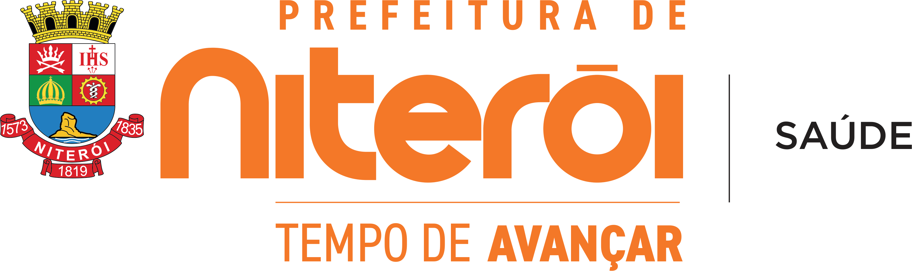

# Contrato para montar as telas simuladas do painel (Niterói)

Cada tela é um fragmento HTML **autocontido** que começa em `<div class="app">` e fecha em `</div>`.
Ela é colocada dentro de `.moldura .palco`, que a escala por `transform: scale(0.83428)`.

## Regra dura de geometria

- A raiz `.app` tem **exatamente 1400 × 630 px**. Nada pode ultrapassar isso — não há rolagem, o que
  passar é **cortado** e o verificador acusa. Prefira menos linhas de tabela a estourar a altura.
- Dentro do `.app`: `.app-side` ocupa 288px à esquerda; `.app-col` ocupa o resto (1112px), com
  `.app-top` de 64px e `.app-main` com o resto (566px) e `padding: 26px 32px` (sobram **1048 × 514 px**
  de área útil de conteúdo).
- **Não** escreva `style="height:..."` no `.app`, nem `position:fixed`, nem `overflow:auto`.
- Use apenas as classes do `estilo.css` (já carregado) e `style="..."` inline só para larguras,
  alturas de barra de gráfico e margens pontuais.

## Esqueleto obrigatório

```html
<div class="app">
  <aside class="app-side">
    <div class="marca"></div>
    <div class="usuario">
      <div class="av">RM</div>
      <div><div class="n">Rita Menezes</div><div class="e">rita.menezes@saude.niteroi.rj.gov.br</div></div>
    </div>
    <nav>
      <div class="grupo aberto">{ICONE_MEGAFONE}<span>Ouvidoria</span>{ICONE_CHEVRON_BAIXO_SETA}</div>
      <!-- 7 itens; marque .ativo no item da tela -->
      <a class="item ativo">{ICONE_MEGAFONE}<span>Fila</span><span class="cont">150</span></a>
      <a class="item">{ICONE_FILEPLUS}<span>Registrar</span></a>
      <a class="item">{ICONE_INBOX}<span>Meu ponto</span><span class="cont">21</span></a>
      <a class="item">{ICONE_NETWORK}<span>Pontos de resposta</span></a>
      <a class="item">{ICONE_LAYERS}<span>Assuntos</span></a>
      <a class="item">{ICONE_CHART}<span>Painel</span></a>
      <a class="item">{ICONE_SETTINGS}<span>Configuração</span></a>
      <div class="grupo">{ICONE_ATIVIDADE}<span>Regulação</span>{ICONE_CHEVRON_SETA}</div>
      <div class="grupo">{ICONE_USERS}<span>Pacientes</span>{ICONE_CHEVRON_SETA}</div>
      <div class="grupo">{ICONE_BUILDING}<span>Unidades</span>{ICONE_CHEVRON_SETA}</div>
      <div class="rodape-nav">{ICONE_LOGOUT}<span>Sair</span></div>
    </nav>
  </aside>
  <div class="app-col">
    <header class="app-top">
      <div class="seletor-unidade">{ICONE_BUILDING}<span>Todas as unidades</span>{ICONE_CHEVRON_BAIXO}</div>
      <div class="ic">{ICONE_SINO}<span class="bola">4</span></div>
      <div class="eu"><div class="av">RM</div><div class="n">Rita Menezes</div>{ICONE_CHEVRON_BAIXO}</div>
    </header>
    <main class="app-main">
      <div class="app-wrap">
        <!-- CONTEÚDO DA TELA -->
      </div>
    </main>
  </div>
</div>
```

O item ativo da sidebar muda por tela. Nas telas de gestão (Pontos, Assuntos, Painel, Configuração)
o usuário do topo continua sendo Rita Menezes (ouvidora). Na tela **Meu ponto** troque para
`Dr. Paulo Rezende` / `paulo.rezende@saude.niteroi.rj.gov.br`, iniciais `PR`, e o seletor de unidade
mostra `Policlínica Regional do Fonseca`.

## Biblioteca de ícones (lucide, 24×24, stroke 2) — copie o `<svg>` inteiro

Todos no formato `<svg viewBox="0 0 24 24" fill="none" stroke="currentColor" stroke-width="2" stroke-linecap="round" stroke-linejoin="round">…</svg>`.

| Marcador | `d` / elementos do path |
|---|---|
| ICONE_MEGAFONE (Megaphone) | `<path d="m3 11 18-5v12L3 14v-3z"/><path d="M11.6 16.8a3 3 0 1 1-5.8-1.6"/>` |
| ICONE_FILEPLUS (FilePlus2) | `<path d="M4 22h14a2 2 0 0 0 2-2V7l-5-5H6a2 2 0 0 0-2 2v4"/><path d="M14 2v4a2 2 0 0 0 2 2h4"/><path d="M3 15h6"/><path d="M6 12v6"/>` |
| ICONE_INBOX (Inbox) | `<polyline points="22 12 16 12 14 15 10 15 8 12 2 12"/><path d="M5.45 5.11 2 12v6a2 2 0 0 0 2 2h16a2 2 0 0 0 2-2v-6l-3.45-6.89A2 2 0 0 0 16.76 4H7.24a2 2 0 0 0-1.79 1.11z"/>` |
| ICONE_NETWORK (Network) | `<rect x="16" y="16" width="6" height="6" rx="1"/><rect x="2" y="16" width="6" height="6" rx="1"/><rect x="9" y="2" width="6" height="6" rx="1"/><path d="M5 16v-3a1 1 0 0 1 1-1h12a1 1 0 0 1 1 1v3"/><path d="M12 12V8"/>` |
| ICONE_LAYERS (Layers) | `<path d="m12.83 2.18a2 2 0 0 0-1.66 0L2.6 6.08a1 1 0 0 0 0 1.83l8.58 3.91a2 2 0 0 0 1.66 0l8.58-3.9a1 1 0 0 0 0-1.83Z"/><path d="m22 17.65-9.17 4.16a2 2 0 0 1-1.66 0L2 17.65"/><path d="m22 12.65-9.17 4.16a2 2 0 0 1-1.66 0L2 12.65"/>` |
| ICONE_TAGS (Tags) | `<path d="m15 5 6.3 6.3a2.4 2.4 0 0 1 0 3.4L17 19"/><path d="M9.586 5.586A2 2 0 0 0 8.172 5H3a1 1 0 0 0-1 1v5.172a2 2 0 0 0 .586 1.414L8.29 18.29a2.426 2.426 0 0 0 3.42 0l3.58-3.58a2.426 2.426 0 0 0 0-3.42z"/><circle cx="6.5" cy="9.5" r=".5" fill="currentColor"/>` |
| ICONE_CHART (BarChart3) | `<path d="M3 3v18h18"/><path d="M18 17V9"/><path d="M13 17V5"/><path d="M8 17v-3"/>` |
| ICONE_SETTINGS (Settings2) | `<path d="M20 7h-9"/><path d="M14 17H5"/><circle cx="17" cy="17" r="3"/><circle cx="7" cy="7" r="3"/>` |
| ICONE_ATIVIDADE (Activity) | `<path d="M22 12h-2.48a2 2 0 0 0-1.93 1.46l-2.35 8.36a.25.25 0 0 1-.48 0L9.24 2.18a.25.25 0 0 0-.48 0l-2.35 8.36A2 2 0 0 1 4.49 12H2"/>` |
| ICONE_USERS (Users) | `<path d="M16 21v-2a4 4 0 0 0-4-4H6a4 4 0 0 0-4 4v2"/><circle cx="9" cy="7" r="4"/><path d="M22 21v-2a4 4 0 0 0-3-3.87"/><path d="M16 3.13a4 4 0 0 1 0 7.75"/>` |
| ICONE_BUILDING (Building2) | `<path d="M6 22V4a2 2 0 0 1 2-2h8a2 2 0 0 1 2 2v18Z"/><path d="M6 12H4a2 2 0 0 0-2 2v6a2 2 0 0 0 2 2h2"/><path d="M18 9h2a2 2 0 0 1 2 2v9a2 2 0 0 1-2 2h-2"/><path d="M10 6h4"/><path d="M10 10h4"/><path d="M10 14h4"/><path d="M10 18h4"/>` |
| ICONE_LOGOUT (LogOut) | `<path d="M9 21H5a2 2 0 0 1-2-2V5a2 2 0 0 1 2-2h4"/><polyline points="16 17 21 12 16 7"/><line x1="21" x2="9" y1="12" y2="12"/>` |
| ICONE_SINO (Bell) | `<path d="M10.268 21a2 2 0 0 0 3.464 0"/><path d="M3.262 15.326A1 1 0 0 0 4 17h16a1 1 0 0 0 .74-1.673C19.41 13.956 18 12.499 18 8A6 6 0 0 0 6 8c0 4.499-1.411 5.956-2.738 7.326"/>` |
| ICONE_CHEVRON_BAIXO (ChevronDown) | `<path d="m6 9 6 6 6-6"/>` |
| ICONE_CHEVRON_SETA (ChevronRight) | `<path d="m9 18 6-6-6-6"/>` (use `class="seta"`) |
| ICONE_CHEVRON_BAIXO_SETA | igual ao ChevronDown, com `class="seta"` |
| ICONE_BUSCA (Search) | `<circle cx="11" cy="11" r="8"/><path d="m21 21-4.3-4.3"/>` |
| ICONE_PLUS (Plus) | `<path d="M5 12h14"/><path d="M12 5v14"/>` |
| ICONE_RELOGIO (CalendarClock) | `<path d="M21 7.5V6a2 2 0 0 0-2-2H5a2 2 0 0 0-2 2v14a2 2 0 0 0 2 2h3.5"/><path d="M16 2v4"/><path d="M8 2v4"/><path d="M3 10h5"/><circle cx="16" cy="16" r="6"/><path d="M16 14v2l1 1"/>` |
| ICONE_SEND (Send) | `<path d="m22 2-7 20-4-9-9-4Z"/><path d="M22 2 11 13"/>` |
| ICONE_CHECK (CheckCircle2) | `<circle cx="12" cy="12" r="10"/><path d="m9 12 2 2 4-4"/>` |
| ICONE_ALERTA (AlertTriangle) | `<path d="m21.73 18-8-14a2 2 0 0 0-3.48 0l-8 14A2 2 0 0 0 4 21h16a2 2 0 0 0 1.73-3Z"/><path d="M12 9v4"/><path d="M12 17h.01"/>` |
| ICONE_ESCUDO (ShieldAlert) | `<path d="M20 13c0 5-3.5 7.5-7.66 8.95a1 1 0 0 1-.67-.01C7.5 20.5 4 18 4 13V6a1 1 0 0 1 1-1c2 0 4.5-1.2 6.24-2.72a1.17 1.17 0 0 1 1.52 0C14.51 3.81 17 5 19 5a1 1 0 0 1 1 1z"/><path d="M12 8v4"/><path d="M12 16h.01"/>` |
| ICONE_CHAVE (KeyRound) | `<path d="M2.586 17.414A2 2 0 0 0 2 18.828V21a1 1 0 0 0 1 1h3a1 1 0 0 0 1-1v-1a1 1 0 0 1 1-1h1a1 1 0 0 0 1-1v-1a1 1 0 0 1 1-1h.172a2 2 0 0 0 1.414-.586l.814-.814a6.5 6.5 0 1 0-4-4z"/><circle cx="16.5" cy="7.5" r=".5" fill="currentColor"/>` |
| ICONE_CLIPBOARD (ClipboardList) | `<rect width="8" height="4" x="8" y="2" rx="1"/><path d="M16 4h2a2 2 0 0 1 2 2v14a2 2 0 0 1-2 2H6a2 2 0 0 1-2-2V6a2 2 0 0 1 2-2h2"/><path d="M12 11h4"/><path d="M12 16h4"/><path d="M8 11h.01"/><path d="M8 16h.01"/>` |
| ICONE_REPLY (Reply) | `<polyline points="9 17 4 12 9 7"/><path d="M20 18v-2a4 4 0 0 0-4-4H4"/>` |
| ICONE_MSG (MessageCircle) | `<path d="M7.9 20A9 9 0 1 0 4 16.1L2 22Z"/>` |
| ICONE_SINO2 (BellRing) | `<path d="M10.268 21a2 2 0 0 0 3.464 0"/><path d="M22 8c0-2.3-.8-4.3-2-6"/><path d="M3.262 15.326A1 1 0 0 0 4 17h16a1 1 0 0 0 .74-1.673C19.41 13.956 18 12.499 18 8A6 6 0 0 0 6 8c0 4.499-1.411 5.956-2.738 7.326"/><path d="M4 2C2.8 3.7 2 5.7 2 8"/>` |
| ICONE_LOCK (Lock) | `<rect width="18" height="11" x="3" y="11" rx="2" ry="2"/><path d="M7 11V7a5 5 0 0 1 10 0v4"/>` |
| ICONE_INFO (Info) | `<circle cx="12" cy="12" r="10"/><path d="M12 16v-4"/><path d="M12 8h.01"/>` |
| ICONE_SAVE (Save) | `<path d="M15.2 3a2 2 0 0 1 1.4.6l3.8 3.8a2 2 0 0 1 .6 1.4V19a2 2 0 0 1-2 2H5a2 2 0 0 1-2-2V5a2 2 0 0 1 2-2z"/><path d="M17 21v-7a1 1 0 0 0-1-1H8a1 1 0 0 0-1 1v7"/><path d="M7 3v4a1 1 0 0 0 1 1h7"/>` |
| ICONE_PENCIL (Pencil) | `<path d="M21.174 6.812a1 1 0 0 0-3.986-3.987L3.842 16.174a2 2 0 0 0-.5.83l-1.321 4.352a.5.5 0 0 0 .623.622l4.353-1.32a2 2 0 0 0 .83-.497z"/><path d="m15 5 4 4"/>` |
| ICONE_ARROWLEFT (ArrowLeft) | `<path d="m12 19-7-7 7-7"/><path d="M19 12H5"/>` |
| ICONE_COPIAR (Copy) | `<rect width="14" height="14" x="8" y="8" rx="2" ry="2"/><path d="M4 16c-1.1 0-2-.9-2-2V4c0-1.1.9-2 2-2h10c1.1 0 2 .9 2 2"/>` |
| ICONE_CADEADO_ABERTO (Unlock) | `<rect width="18" height="11" x="3" y="11" rx="2" ry="2"/><path d="M7 11V7a5 5 0 0 1 9.9-1"/>` |
| ICONE_ARQUIVO (Archive) | `<rect width="20" height="5" x="2" y="3" rx="1"/><path d="M4 8v11a2 2 0 0 0 2 2h12a2 2 0 0 0 2-2V8"/><path d="M10 12h4"/>` |
| ICONE_TIMER (TimerReset) | `<path d="M10 2h4"/><path d="M12 14v-4"/><path d="M4 13a8 8 0 0 1 8-7 8 8 0 1 1-5.3 14L4 17.6"/><path d="M9 17H4v5"/>` |
| ICONE_UNDO (Undo2) | `<path d="M9 14 4 9l5-5"/><path d="M4 9h10.5a5.5 5.5 0 0 1 5.5 5.5a5.5 5.5 0 0 1-5.5 5.5H11"/>` |
| ICONE_GAVEL (Gavel) | `<path d="m14.5 12.5-8 8a2.119 2.119 0 1 1-3-3l8-8"/><path d="m16 16 6-6"/><path d="m8 8 6-6"/><path d="m9 7 8 8"/><path d="m21 11-8-8"/>` |
| ICONE_EXTERNO (ExternalLink) | `<path d="M15 3h6v6"/><path d="M10 14 21 3"/><path d="M18 13v6a2 2 0 0 1-2 2H5a2 2 0 0 1-2-2V8a2 2 0 0 1 2-2h6"/>` |
| ICONE_CADEADO_CHAVE = ICONE_CHAVE | |

Nos ícones de 20/18/16px use as classes já prontas (`.pg-cab h1 svg` = 20px, `.btn svg` = 16px,
`.pill svg` = 11px); quando precisar de tamanho avulso use `style="width:14px;height:14px"`.

---

# O CENÁRIO (use exatamente estes dados em todas as telas)

Instância: **Fundação Municipal de Saúde de Niterói (FMS)** · `smsmais.saude.niteroi.rj.gov.br`
Hoje: **20/09/2026** (sexta-feira). Período padrão do painel: **01/09/2026 a 20/09/2026**.
Ouvidora logada: **Rita Menezes** (perfil Ouvidoria + Gestão + Sigilo).
Respondente de ponto: **Dr. Paulo Rezende**, Policlínica Regional do Fonseca.

## Unidades (nomes reais da rede de Niterói)
- Policlínica Regional do Fonseca — Dr. Guilherme Taylor March
- Policlínica Regional de Itaipu — Assist. Social Maria Aparecida da Costa
- Policlínica Regional do Largo da Batalha — Dr. Francisco da Cruz Nunes
- Policlínica Regional de Santa Rosa — Dr. Sérgio Arouca
- Policlínica Regional do Barreto — Dr. João da Silva Vizella
- Policlínica Regional da Engenhoca — Dr. Renato Silva
- Policlínica Regional de São Lourenço — Dr. Carlos Antônio da Silva
- Policlínica Regional de Piratininga — Dom Luís Orione
- Policlínica de Especialidades — Dr. Sylvio Picanço
- Policlínica de Especialidades em Saúde da Mulher — Malú Sampaio
- Policlínica Comunitária de Jurujuba — Mário Munhoz Monroe
- Hospital Municipal Carlos Tortelly
- Hospital Getúlio Vargas Filho
- Maternidade Municipal Dra. Alzira Reis Vieira Ferreira
- UMAM Dr. Mário Monteiro · SPA Engenhoca · SPA Largo da Batalha
Nas tabelas, encurte para "Policlínica do Fonseca", "Policlínica de Itaipu", "Hospital Carlos
Tortelly" etc. — é assim que a coluna cabe.

## Pontos de resposta
| Nome | Tipo | Unidade | Prazo | Membros | Em aberto |
|---|---|---|---|---|---|
| Central de Regulação — FMS | Área central (secretaria) | — | 10 dias | 6 membros | 34 |
| Coordenação de Assistência Farmacêutica | Área central (secretaria) | — | Padrão | 4 membros | 18 |
| Policlínica Regional do Fonseca | Unidade de saúde | Policlínica do Fonseca | Padrão | 3 membros | 21 |
| Policlínica Regional de Itaipu | Unidade de saúde | Policlínica de Itaipu | Padrão | 2 membros | 12 |
| Policlínica Regional do Largo da Batalha | Unidade de saúde | Policl. Largo da Batalha | Padrão | 3 membros | 9 |
| Hospital Municipal Carlos Tortelly | Unidade de saúde | Hosp. Carlos Tortelly | 15 dias | 4 membros | 15 |
| Coordenação de Atenção Básica | Área central (secretaria) | — | Padrão | 5 membros | 7 |
| Superintendência de Atenção Especializada | Área central (secretaria) | — | Padrão | 3 membros · sem titular | 5 |
| TFD e Transporte Sanitário | Área central (secretaria) | — | 5 dias | 2 membros | 4 |
| Corregedoria da FMS | Unidade apuratória (denúncias) | — | 20 dias | 2 membros | 6 |
| Comissão de Ética | Unidade apuratória (denúncias) | — | Padrão | 3 membros | 2 |
| Policlínica Regional do Barreto | Unidade de saúde | Policlínica do Barreto | Padrão | 2 membros | 0 (Inativo) |

## Assuntos (nível 1 → nível 2), com código OuvidorSUS
- **Assistência à saúde** `OuvidorSUS 01` → Marcação de consulta especializada `01.03`; Marcação de
  exame `01.04`; Demora no atendimento `01.07`; Agendamento na atenção básica `01.01`
- **Assistência farmacêutica** `OuvidorSUS 02` → Falta de medicamento `02.01`; Medicamento do
  componente especializado `02.03`
- **Gestão do SUS** `OuvidorSUS 03` → Rotinas e protocolos da unidade `03.02`; Infraestrutura da
  unidade `03.05`
- **Relacionamento com o usuário** `OuvidorSUS 04` → Conduta de profissional `04.01`; Acolhimento e
  informação `04.02`
- **Vigilância em saúde** `OuvidorSUS 05` → Vacinação `05.01`
- **Transporte em saúde** `OuvidorSUS 06` → Transporte sanitário / TFD `06.01`
Marcadores livres: `recorrente` · `imprensa` · `Ministério Público` · `Conselho de Saúde` ·
`judicializado` · `surto` (inativo)

## Manifestações da fila (aba "Em andamento", ordenadas por última atividade)
| Protocolo | Tipo | Status | Prio | Assunto / resumo | Manifestante | Unidade | Ponto | Prazo cidadão | Últ. atividade |
|---|---|---|---|---|---|---|---|---|---|
| 2026-004417 | Solicitação | Encaminhada à área | Alta | Marcação de consulta especializada · "Aguarda cardiologia desde junho" | Marcelo Tavares Pinho | Policlínica do Fonseca | Central de Regulação | 12/10/2026 · 22 dias | hoje, 14:32 |
| 2026-004415 | Reclamação | Encaminhada à área | Normal | Demora no atendimento · "Chegou 6h e foi atendida 13h" | Rosângela Duarte Lima | Hosp. Carlos Tortelly | Hosp. Carlos Tortelly | 11/10/2026 · 21 dias | hoje, 13:05 |
| 2026-004402 | Denúncia | Encaminhada à área | Urgente | Conduta de profissional · "Cobrança por atendimento" | restrito | Policlínica de Itaipu | Corregedoria da FMS | 08/10/2026 · 18 dias | hoje, 11:48 |
| 2026-004388 | Solicitação | Aguardando complementação | Normal | Medicamento do componente especializado · "Falta receita e laudo" | Adriana Campos Barreto | Policl. Largo da Batalha | Coord. de Assistência Farmacêutica | suspenso | ontem, 17:20 |
| 2026-004361 | Reclamação | Encaminhada à área | Normal | Falta de medicamento · "Losartana em falta há 3 semanas" | Wesley Nogueira de Sá | Policl. Largo da Batalha | Coord. de Assistência Farmacêutica | 02/10/2026 · 12 dias | ontem, 09:12 |
| 2026-004330 | Solicitação | Encaminhada à área | Normal | Marcação de exame · "Ressonância pedida em maio" | Cleide Marques Ferraz | Policlínica Dr. Sylvio Picanço | Central de Regulação | 28/09/2026 · 8 dias | 18/09, 16:40 |
| 2026-004298 | Reclamação | Encaminhada à área | Alta | Rotinas e protocolos da unidade · "Sala de vacina fechada às 15h" | Jorge Antônio Vasconcelos | Policlínica de Piratininga | Policl. de Piratininga | 24/09/2026 · 4 dias | 18/09, 10:02 |
| 2026-004251 | Solicitação | Encaminhada à área | Normal | Transporte sanitário / TFD · "Transporte para hemodiálise" | Simone Rocha Peixoto | Policlínica do Barreto | TFD e Transporte Sanitário | 17/09/2026 · 3 dias em atraso | 17/09, 15:22 |
| 2026-004244 | Elogio | Respondida ao cidadão | Normal | Acolhimento e informação · "Equipe da sala de curativo" | Beatriz Andrade Coelho | Policlínica de Santa Rosa | Policl. de Santa Rosa | encerrado | 17/09, 08:55 |

Contadores das abas da fila: **Triagem 52** · **Em andamento 70** · **Aguardando validação 21** ·
**Atrasadas 14** · **Recurso 7** · **Concluídas 183**.
Paginação: "Mostrar 25", páginas 1 2 3 (1 ativa), "70 manifestações".

## Manifestação aberta no detalhe — **2026-004417**
- Solicitação · Encaminhada à área · Prioridade Alta · Identificada
- Registrada em 12/09/2026 09:41 · WhatsApp · Cidadão · Responsável: Rita Menezes
- Prazo Cidadão: 12/10/2026 · 22 dias · Prazo Área: 22/09/2026 · 2 dias (vencendo)
- Assunto: Assistência à saúde › Marcação de consulta especializada · Marcadores: `recorrente`
- Unidade: Policlínica Regional do Fonseca · Ponto: Central de Regulação — FMS
- Vinculada à solicitação de regulação **REG-2026-19884** (cardiologia adulto, pedido de 03/06/2026)
- Manifestante: Marcelo Tavares Pinho · CPF 072.\*\*\*.\*\*\*-41 · (21) 9 \*\*\*\*-4180 · vinculado ao
  Patient do hub FHIR
- Teor: "Meu pai tem 71 anos, é hipertenso e o médico da Policlínica do Fonseca pediu cardiologista
  em junho. Já liguei três vezes e só dizem que está na fila. Ele passou mal semana passada. Preciso
  saber se tem previsão."
- Linha do tempo (mais recente em cima):
  1. **Cobrança à área** — hoje, 14:32 — interno — "Prazo da área vence em 22/09. Solicito posição
     sobre a fila de cardiologia adulto." — Rita Menezes
  2. **Encaminhamento** — 15/09/2026 10:12 — visível ao cidadão — "Encaminhada à Central de
     Regulação — FMS. Prazo: 22/09/2026." — Rita Menezes
  3. **Triagem** — 15/09/2026 09:58 — interno — "Tipo mantido. Assunto: Marcação de consulta
     especializada. Prioridade elevada para Alta (idoso com comorbidade)." — Rita Menezes
  4. **Resposta intermediária ao cidadão** — 12/09/2026 10:05 — visível ao cidadão — "Recebemos sua
     manifestação. Protocolo 2026-004417. Prazo de resposta: 12/10/2026." — Sistema
  5. **Registro** — 12/09/2026 09:41 — visível ao cidadão — "Manifestação registrada pelo canal
     WhatsApp." — Sistema
- Ações disponíveis na barra: Responder pela área · Encaminhar à área · Pedir complementação ·
  Responder ao cidadão · Prorrogar prazo · Cobrar a área · Escalonar · Anotar · Arquivar

## Painel — período 01/09/2026 a 20/09/2026, todas as unidades
| Cartão | Valor | Detalhe |
|---|---|---|
| Registradas | 412 | |
| Respondidas | 237 | 57,5% do total |
| No prazo | 91,1% | 216 no prazo · 21 fora (verde) |
| Tempo médio de resposta | 11,4 d | área: 6,8 d |
| Estoque (em aberto) | 150 | |
| Resolutividade | 78,5% | 186 resolvidas · 51 não |

**Por tipo** (total 412): Solicitação 214 · Reclamação 126 · Elogio 28 · Denúncia 24 · Informação 14 · Sugestão 6
**Por status** (412): Registrada 18 · Em triagem 34 · Encaminhada 61 · Aguard. complem. 9 ·
Respondida pela área 21 · Respondida 54 · Em recurso 7 · Concluída 183 · Arquivada 22 · Outro órgão 3
**Assuntos mais frequentes (top 10)**: Marcação de consulta especializada 84 · Marcação de exame 61 ·
Demora no atendimento 47 · Falta de medicamento 39 · Rotinas e protocolos da unidade 31 · Conduta de
profissional 26 · Agendamento na atenção básica 22 · Transporte sanitário / TFD 17 · Infraestrutura
da unidade 15 · Vacinação 12
**Tempo até a resposta (faixas)**: Até 30 dias 216 · 31 a 60 dias 17 · Mais de 60 dias 4

## Configuração vigente
Prazo ao cidadão 30 · Prorrogação 30 · Área Normal 20 · Área Alta 10 · Área Urgente 2 (dias úteis) ·
Complementação 20 · Conclusão automática 30. WhatsApp ligado.
Texto do recibo: "Sua manifestação foi registrada na Ouvidoria da Saúde de Niterói. Protocolo
{protocolo}, código de acesso {codigo}. Prazo de resposta: {prazo}."

## Regras de escrita
- Português do Brasil. Datas `dd/mm/aaaa`. Números com vírgula decimal e ponto de milhar.
- CPF e telefone sempre **mascarados** (`072.***.***-41`, `(21) 9 ****-4180`).
- Manifestação sigilosa/denúncia aparece como `restrito`; anônima como `anônimo`.
- **Nunca** invente rótulo: use exatamente os textos do módulo listados no briefing de cada tela.
