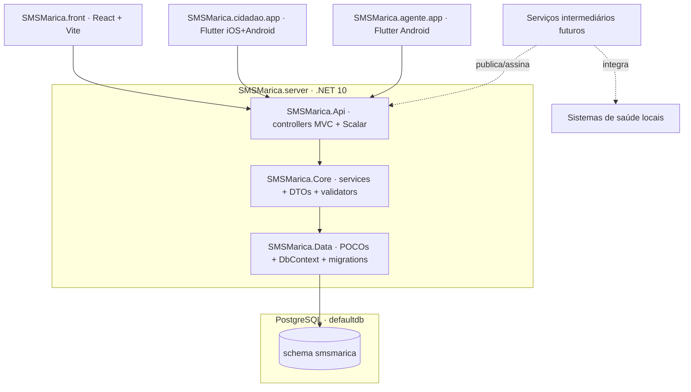

# Arquitetura — SMS Maricá

## 1. Visão do ecossistema

O SMSMarica é composto por quatro produtos independentes que colaboram via uma única API central.



## 2. Responsabilidades por subprojeto

| Subprojeto | Responsabilidade | Não é responsável por |
|------------|------------------|------------------------|
| `SMSMarica.server` | API REST, regras de negócio, persistência, geração de sessões a partir da periodicidade, alocação em assentos, autenticação | UI de qualquer espécie, integração direta com WhatsApp/Waze |
| `SMSMarica.front` | Painel administrativo web (operador + gestor), dashboards | Uso por paciente ou motorista final |
| `SMSMarica.cidadao.app` | App do paciente/acompanhante — cadastro, agenda, confirmação, ETA, avaliação | Cadastros administrativos, edição de rotas |
| `SMSMarica.agente.app` | App do motorista (Android) — rotas do dia, postagem de GPS, geofencing, navegação externa | Cadastros administrativos |

Todos os clientes consomem **exclusivamente** a API do `SMSMarica.server`. Clientes não conversam entre si nem acessam o banco diretamente.

## 3. Arquitetura do backend — 3 projetos (Data + Core + Api)

**Decisão registrada em** [ADR-0004](./adr/0004-arquitetura-tres-projetos.md). Substitui [ADR-0002](./adr/0002-modular-monolith.md) (Modular Monolith — superseded).

### 3.1 Layout

```
SMSMarica.server/
├── src/
│   ├── SMSMarica.Data/    (POCOs + DbContext + Configurations + Migrations)
│   ├── SMSMarica.Core/    (services + DTOs + validators + mappers)
│   └── SMSMarica.Api/     (Program.cs + middleware + 1 controller MVC por entidade)
└── tests/
    └── SMSMarica.Tests/   (xUnit + Testcontainers Postgres)
```

**Referências (travadas por `ProjectReference`):**

- `Data` ← nada (só EF Core)
- `Core` ← `Data`
- `Api` ← `Core` + `Data`
- `Tests` ← `Core` + `Data` + `Api`

### 3.2 Cada projeto

| Projeto | O que vive aqui |
|---------|-----------------|
| `SMSMarica.Data` | POCOs em `Entities/` (sem private setters, sem domain events), `Configurations/<X>Configuration.cs` com mapeamento EF (snake_case, owned `Gps`, índices únicos), `SmsMaricaDbContext` com `HasDefaultSchema("smsmarica")`, `Migrations/` (uma migration `Initial` cobre todas as 16 tabelas), `DependencyInjection.AddData(IConfiguration)` |
| `SMSMarica.Core` | `Common/Excecoes/` (`NaoEncontrado`, `Validacao`, `Conflito`), `Common/ValueObjects/Gps.cs` (helper de validação), uma pasta por entidade (`Pacientes/`, `Tratamentos/`, …) com `IXxxService` + `XxxService` injetando `SmsMaricaDbContext` direto, `Dtos/`, `Validators/` (FluentValidation), `Mapper.cs` (Mapperly), `DependencyInjection.AddCore()` |
| `SMSMarica.Api` | `Program.cs` (Serilog + AddOpenApi + Scalar + AddData/AddCore + ExceptionMiddleware + auto-migrate em dev), `Middleware/ExceptionHandlingMiddleware.cs` (mapeia exceções tipadas para `ProblemDetails`), `Controllers/<X>Controller.cs` (`[ApiController]`, 1 por entidade, CRUD em `HttpGet/Post/Put/Delete`), `appsettings*.json` |

### 3.3 Organização interna por entidade

Cada projeto organiza arquivos por **pasta** (não por csproj). Exemplo Pacientes:

```
src/
├── SMSMarica.Data/
│   ├── Entities/Paciente.cs
│   └── Configurations/PacienteConfiguration.cs
├── SMSMarica.Core/
│   └── Pacientes/
│       ├── IPacientesService.cs
│       ├── PacientesService.cs
│       ├── PacientesMapper.cs
│       ├── Dtos/PacienteDto.cs
│       ├── Dtos/CadastrarPacienteRequest.cs
│       ├── Dtos/AtualizarPacienteRequest.cs
│       └── Validators/CadastrarPacienteValidator.cs
└── SMSMarica.Api/
    └── Controllers/PacientesController.cs
```

### 3.4 Erros e validação

- Validações de **shape de entrada** ficam em `Validators/` (FluentValidation, auto-validating no pipeline MVC) e disparam `ValidationProblem` automaticamente.
- Validações de **regra de negócio** que dependem do estado do banco lançam exceções tipadas no service:
  - `NaoEncontradoException` → 404
  - `ConflitoException` → 409 (ex.: CPF duplicado)
  - `ValidacaoException` → 400
- `ExceptionHandlingMiddleware` em `Api/Middleware/` mapeia para `ProblemDetails` ou `ValidationProblemDetails`.

### 3.5 OpenAPI

- `Microsoft.AspNetCore.OpenApi` (nativo do .NET 10) gera o spec em `/openapi/v1.json`.
- `Scalar.AspNetCore` renderiza UI em `/docs`.
- **Sempre ligado** (dev e prod), conforme decisão do produto. Se um dia ficar atrás de auth, ajustar no `Program.cs`.

### 3.6 Adicionar uma nova entidade — checklist

**Antes do checklist:** se a entidade é uma **pessoa** (Médico, Enfermeiro, Motorista, Recepcionista, Paciente, …), ela **não é** uma entidade de domínio independente — é um **papel profissional de `Usuario`** ([ADR-0005](./adr/0005-usuario-unificado-com-papeis.md)). Nesse caso:

- A nova tabela carrega **apenas** campos específicos do papel (CRM, CNH, COREN…). Nada de nome, CPF, endereço, foto — esses ficam em `usuario`.
- FK `usuario_id` UNIQUE (1:1 estrito) + adicionar valor ao enum `TipoPapel`.
- Endpoint inclui rota `POST /<papel>/promover { usuarioId, ...campos }` para promover usuário existente sem duplicar CPF.
- Listagem usa `INNER JOIN usuario`.

Para qualquer outra entidade de domínio:

1. Criar POCO em `SMSMarica.Data/Entities/<X>.cs`.
2. Criar `IEntityTypeConfiguration` em `SMSMarica.Data/Configurations/<X>Configuration.cs` (tabela snake_case + índices).
3. Adicionar `DbSet<X>` em `SmsMaricaDbContext`.
4. Rodar `dotnet ef migrations add <Nome>` no projeto Data com `--startup-project src/SMSMarica.Api`.
5. Criar pasta `SMSMarica.Core/<X>/` com `I<X>Service` + `<X>Service`, DTOs, Validators e Mapper.
6. Registrar service em `SMSMarica.Core/DependencyInjection.cs`.
7. Criar `SMSMarica.Api/Controllers/<X>Controller.cs` com `[ApiController]` e 5 actions.
8. Adicionar testes em `tests/SMSMarica.Tests/<X>/`.

## 4. Banco de dados

Ver [database.md](./database.md). Resumo: **todas** as tabelas em schema `smsmarica` do banco compartilhado `defaultdb`. Zero cross-schema (ADR-0001).

Um único `SmsMaricaDbContext` aponta para o schema `smsmarica`. Tabelas usam prefixo do "domínio" (`paciente`, `tratamento_periodicidade`, `translado_alocacao`, `rastreamento_ponto_gps`, etc.).

## 5. Stack por subprojeto

| | Stack | Versão alvo |
|---|---|---|
| `SMSMarica.server` | ASP.NET Core + EF Core + PostgreSQL | .NET 10 (LTS) |
| `SMSMarica.front` | React + Vite + TypeScript | Node LTS vigente |
| `SMSMarica.cidadao.app` | Flutter | Stable mais recente |
| `SMSMarica.agente.app` | Flutter, Android only | Stable mais recente |

Decisões específicas (Controllers MVC, FluentValidation, Mapperly, Scalar) estão nos ADRs.

## 6. Futuro

- **Time-series de GPS**: migrar ingestão de pontos para InfluxDB/TimescaleDB quando o volume justificar. Schema administrativo permanece em `smsmarica`.
- **Auth**: ASP.NET Core Identity + JWT entram quando virarem prioridade. Endpoints públicos por enquanto (MVP).
- **Extração de subdomínios**: se um conjunto de pastas (ex.: `Core/Rastreamento` + `Data/Entities/PontoGps`+`Geofence`) crescer ao ponto de pedir ciclo de release independente, criar ADR para extração e mover para serviço próprio.
- **Camada intermediária**: integrações com sistemas legados de saúde municipais ficarão em serviços separados que publicam/assinam no Host, sem acoplar domínio do SMSMarica a legados.
