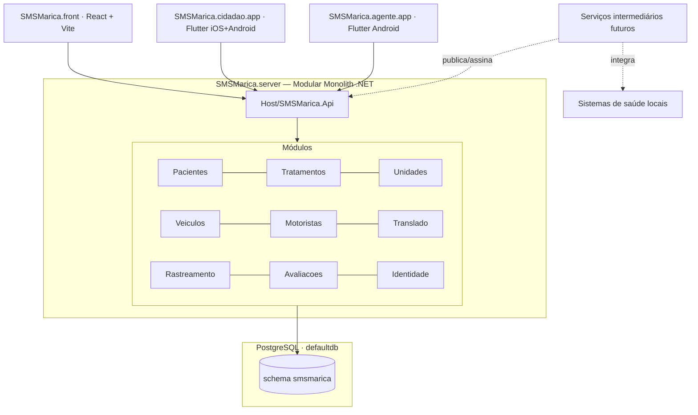

# Arquitetura — SMS Maricá

## 1. Visão do ecossistema

O SMSMarica é composto por quatro produtos independentes que colaboram via uma única API central.



## 2. Responsabilidades por subprojeto

| Subprojeto | Responsabilidade | Não é responsável por |
|------------|------------------|------------------------|
| `SMSMarica.server` | API REST, regras de negócio, persistência, geração de sessões a partir da periodicidade, alocação em assentos, autenticação | UI de qualquer espécie, integração direta com WhatsApp/Waze |
| `SMSMarica.front` | Painel administrativo web (operador + gestor), dashboards | Uso por paciente ou motorista final |
| `SMSMarica.cidadao.app` | App do paciente/acompanhante — cadastro, agenda, confirmação, ETA, avaliação | Cadastros administrativos, edição de rotas |
| `SMSMarica.agente.app` | App do motorista (Android) — rotas do dia, postagem de GPS, geofencing, navegação externa | Cadastros administrativos |

Todos os clientes consomem **exclusivamente** a API do `SMSMarica.server`. Clientes não conversam entre si nem acessam o banco diretamente.

## 3. Arquitetura do backend — Modular Monolith + Clean Architecture por módulo

**Decisão registrada em** [ADR-0002](./adr/0002-modular-monolith.md).

### 3.1 Camadas (dentro de cada módulo)

```
Module.Api              ← endpoints, DTOs de entrada/saída HTTP
    ↓
Module.Application      ← use cases (commands/queries), validators, interfaces
    ↓
Module.Domain           ← agregados, value objects, eventos de domínio, invariantes
    ↑
Module.Infrastructure   ← EF Core, repositórios, integrações externas
```

Regras de dependência (travadas por `ProjectReference`):

- `Domain` depende **apenas** de `BuildingBlocks.Domain`.
- `Application` depende de `Domain` + `BuildingBlocks.Application`.
- `Infrastructure` depende de `Application` + `BuildingBlocks.Infrastructure`. Implementa interfaces declaradas em `Application`.
- `Api` depende de `Application` + `BuildingBlocks.Api`. Nunca de `Infrastructure` (registrado no Host).

### 3.2 BuildingBlocks (código transversal)

| Projeto | O que vive aqui |
|---------|-----------------|
| `BuildingBlocks.Domain` | `Entity`, `AggregateRoot`, `ValueObject`, `IDomainEvent`, `Guard`, tipos comuns (`Gps`, `Cpf`, `Cns`, `Telefone`) |
| `BuildingBlocks.Application` | `Result<T>`, abstrações `ICommand`/`IQuery`, pipeline behaviors (validation, logging, transaction), `IDateTimeProvider`, `IUnitOfWork` |
| `BuildingBlocks.Infrastructure` | `ApplicationDbContextBase` com `HasDefaultSchema("smsmarica")`, Outbox, Clock real, extensões EF comuns |
| `BuildingBlocks.Api` | `ProblemDetails` customizado, `IApiModule` (contrato para módulo registrar seus endpoints), middlewares comuns |

### 3.3 Comunicação entre módulos

**Módulos não referenciam uns aos outros diretamente.** Opções, em ordem de preferência:

1. **Eventos de integração** via Outbox (persistido, confiável) — padrão para coisas como "SessaoDeTranslado criada → Translado precisa saber".
2. **Contratos públicos** (`Module.Contracts` como pasta dentro de Application) — quando um módulo precisa expor um query model minimalista para consumo interno.
3. **HTTP interno** via API — fallback quando as duas opções acima forem desproporcionais.

A proibição é aplicada por não adicionar `ProjectReference` entre módulos. O compilador faz a barreira.

### 3.4 Host

`SMSMarica.Api` é o único projeto "executável". Ele:

- Compõe os módulos via `IApiModule` (cada módulo registra seus endpoints, DbContext, services).
- Expõe Swagger/OpenAPI agregado.
- Aplica migrations de todos os módulos na inicialização (ordem determinística).
- Centraliza autenticação, OpenTelemetry, health checks.

## 4. Banco de dados

Ver [database.md](./database.md). Resumo: **todas** as tabelas em schema `smsmarica` do banco compartilhado `defaultdb`. Zero cross-schema.

Cada módulo tem seu próprio `DbContext`, mas todos apontam para o mesmo schema com prefixo de tabela (`paciente_*`, `veiculo_*`, `rastreamento_*`).

## 5. Stack por subprojeto

| | Stack | Versão alvo |
|---|---|---|
| `SMSMarica.server` | ASP.NET Core + EF Core + PostgreSQL | .NET 10 (LTS) |
| `SMSMarica.front` | React + Vite + TypeScript | Node LTS vigente |
| `SMSMarica.cidadao.app` | Flutter | Stable mais recente |
| `SMSMarica.agente.app` | Flutter, Android only | Stable mais recente |

Decisões específicas (MediatR, Minimal APIs, FluentValidation, etc.) estão nos ADRs.

## 6. Futuro

- **Time-series de GPS**: migrar ingestão de pontos para InfluxDB/TimescaleDB quando o volume justificar. Schema administrativo permanece em `smsmarica`.
- **Extração de módulos**: se `Rastreamento` crescer muito, pode virar serviço autônomo — a arquitetura modular foi escolhida exatamente para essa opção ser barata.
- **Camada intermediária**: integrações com sistemas legados de saúde municipais ficarão em serviços separados que publicam/assinam no Host, sem acoplar domínio do SMSMarica a legados.
