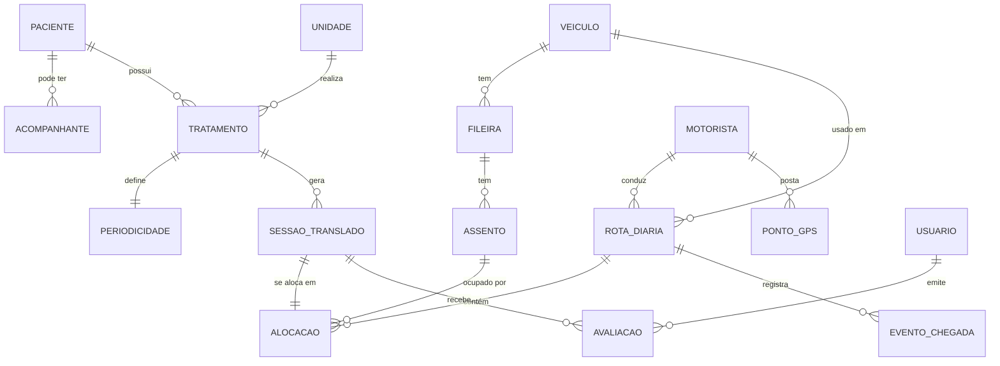
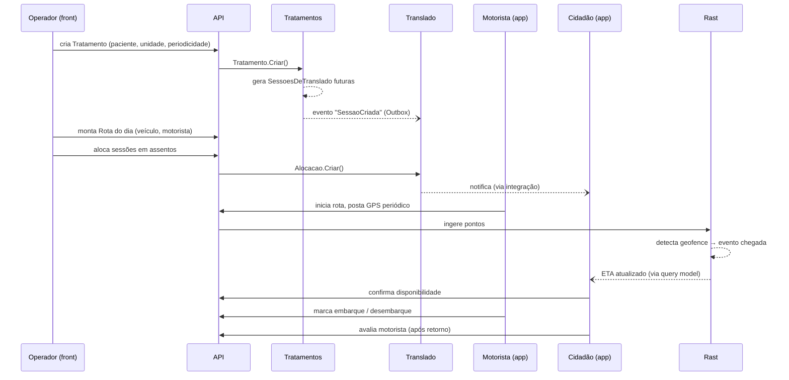

# Modelo de domínio — SMS Maricá

Este documento descreve **conceitos** e **invariantes**, não tabelas. A forma física está nas migrations de cada módulo.

## 1. Glossário

| Termo | Definição |
|-------|-----------|
| **Paciente** | Cidadão cadastrado no programa de transporte sanitário. Tem GPS de residência, documentos (idealmente equivalentes a CNS), contatos. |
| **Acompanhante** | Pessoa autorizada a viajar com o paciente. Pode ter perfil próprio ou ser apenas cadastro atrelado. |
| **Unidade** | Local de saúde que realiza o tratamento. Tem GPS confiável. |
| **Tratamento** | Associação paciente ↔ unidade com uma cadência (**periodicidade**). |
| **Periodicidade** | Regra temporal do tratamento: "todo dia por N sessões", "a cada 2 dias", "1×/semana", etc. |
| **Sessão de translado** | Ocorrência concreta gerada pela periodicidade. Cada sessão vira demanda de translado: ida até a unidade + retorno. |
| **Veículo** | Ônibus/van com layout de assentos não-uniforme (cada fileira declara quantos assentos tem). |
| **Fileira** | Linha de assentos de um veículo. |
| **Assento** | Posição marcada em uma fileira, alocável a paciente ou acompanhante. |
| **Motorista** | Agente de transporte sanitário. Opera o app Android. |
| **Rota diária** | Conjunto de sessões do dia + veículo + motorista. Sequência ordenada de paradas. |
| **Alocação** | Vínculo `sessão ↔ veículo ↔ assento` criado pelo operador. |
| **Ponto GPS** | Coordenada + timestamp postada pelo app do motorista. |
| **Geofence** | Área circular em torno de residência ou unidade; cruzamento dispara evento. |
| **Evento de chegada** | Registro gerado quando o veículo entra em um geofence relevante. |
| **Avaliação** | Nota + comentário do paciente para o motorista ao fim de um translado. |
| **Usuário** | Operador, gestor, paciente ou motorista autenticado no sistema. Diferentes perfis têm diferentes apps. |

## 2. Modelo conceitual (ER simplificado)

## 3. Invariantes-chave

Estes são os pontos onde a regra de negócio "machuca" — o modelo e os use cases precisam proteger cada um deles.

### Paciente

- Paciente não pode ser removido se houver sessão futura pendente (apenas desativado).
- Endereço residencial exige GPS. Sem GPS não há alocação — pelo menos não automática.

### Tratamento e Periodicidade

- A periodicidade é **imutável depois de gerar sessões**. Alterar cadência = encerrar tratamento + criar novo.
- Sessões passadas (já executadas) **nunca** são regeneradas.
- Cancelamento de tratamento cancela sessões futuras não alocadas; sessões alocadas precisam de ação explícita do operador.

### Veículo / Assento

- Fileiras são ordenadas (ordem visível na UI).
- Assentos são numerados **dentro de uma fileira** conforme regra do veículo real (a numeração final pode ser derivada ou explícita — decidir por veículo).
- Um assento não pode estar alocado a duas sessões simultaneamente na mesma rota.
- Remoção de fileira/assento com alocação futura: bloqueada.

### Alocação

- Só ocorre para sessões **futuras** (com tolerância configurável para "o dia de hoje").
- Acompanhante ocupa **1 assento**.
- Alterar alocação após o motorista iniciar a rota: permitido, mas gera evento auditável.

### Rastreamento

- Pontos GPS são append-only. **Nunca** são atualizados.
- Geofence de residência é criado automaticamente a partir do GPS do paciente (raio configurável).
- Evento de chegada é idempotente: reentrar no geofence em curto intervalo não gera evento duplicado (janela de debounce).

### Avaliação

- Paciente só avalia **após** a sessão concluída (evento de chegada no retorno + tempo mínimo).
- Uma avaliação por sessão. Edição permitida por janela configurável.

## 4. Fluxo-chave: Periodicidade → Sessão → Alocação → Translado

## 5. Identificadores e idioma

- **Identificadores de código em português (pt-BR)**: `Paciente`, `Tratamento`, `Periodicidade`, `Veiculo`, `Fileira`, `Assento`, `Alocacao`, `Motorista`, `Rota`, `SessaoDeTranslado`, `PontoGps`, `Geofence`, `EventoDeChegada`, `Avaliacao`.
- Termos **técnicos de infraestrutura** ficam em inglês: `Repository`, `DbContext`, `Handler`, `Command`, `Query`, `Endpoint`, `Middleware`.
- Use `c` no lugar de `ç` em identificadores (ex.: `Alocacao`, não `Alocação`) para evitar problemas com ferramentas que não lidam bem com acentos.

Decisão detalhada em [conventions.md](./conventions.md).
