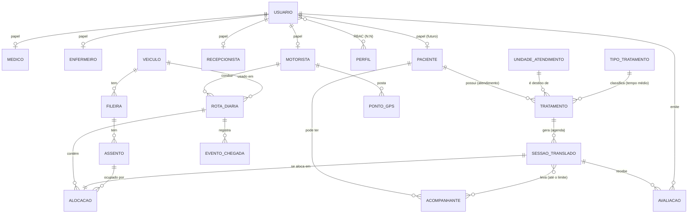
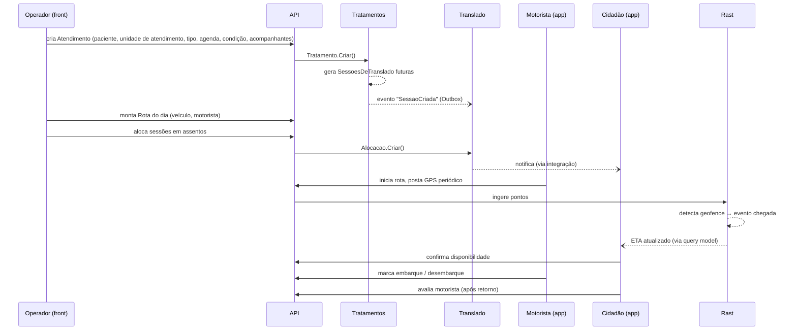

# Modelo de domínio — SMS Maricá

Este documento descreve **conceitos** e **invariantes**, não tabelas. A forma física está nas migrations de cada módulo.

## 1. Glossário

| Termo | Definição |
|-------|-----------|
| **Paciente** | Cidadão cadastrado no programa de transporte sanitário. Tem GPS de residência, documentos (idealmente equivalentes a CNS), contatos. |
| **Acompanhante** | Pessoa que pode viajar com o paciente no transporte. A lista é **do paciente** (vale para todos os atendimentos dele) e fica no `smsmarica` — o domínio de transporte é operacional. Entra pelo par **CPF + data de nascimento**, e o nome é conferido (base de pacientes ou consulta de CPF), nunca digitado. Se a pessoa também é paciente, guarda-se o vínculo; nunca se cria paciente só por ser acompanhante. |
| **Unidade** | Unidade de saúde da rede (CNES/SISREG): equipamentos, usuários que entram por ela, perfis, integrações. **Não** é o destino do transporte. |
| **Unidade de atendimento** | Destino do transporte: onde o paciente faz o tratamento (clínica, hospital de referência), quase sempre fora do município (TFD). Cadastro manual e próprio do transporte — nome (sempre em maiúsculas), endereço e **ponto no mapa obrigatório**, que é o fim da rota da van. Sem SISREG, equipamentos, login ou perfil. |
| **Atendimento** (código: `Tratamento`) | Associação paciente ↔ unidade de atendimento, com **tipo de tratamento** (obrigatório), **agenda**, **condição do paciente** para a viagem (mobilidade, carro alto, isolamento, oxigênio, ajuda) e o **limite de acompanhantes** por viagem (1 por direito; 2 só com liberação justificada). Na tela se chama "Atendimento"; no código e no banco segue `tratamento`. |
| **Tipo de tratamento** | Catálogo do transporte (Hemodiálise, Radioterapia…). Carrega o **tempo médio** que o paciente fica no tratamento — base para prever a volta; o atendimento não tem tempo próprio. |
| **Agenda do atendimento** | Dias da semana (bitmask, bit 0 = domingo) a partir de uma data de início, com **N sessões** (até 365) **ou contínuo**. Contínuo gera de mês em mês: as sessões existem sempre até o fim do mês seguinte, e a renovação diária para quando o atendimento é encerrado ou há óbito no cadastro. |
| **Sessão de translado** | Ocorrência concreta gerada pela agenda (só a data; o horário de busca vem da rota). Cada sessão vira demanda de translado: ida até a unidade + retorno. Guarda quem vai acompanhar naquela viagem. |
| **Veículo** | Ônibus/van com layout de assentos não-uniforme (cada fileira declara quantos assentos tem). |
| **Fileira** | Linha de assentos de um veículo. |
| **Assento** | Posição marcada em uma fileira, alocável a paciente ou acompanhante. |
| **Motorista** | Agente de transporte sanitário. Opera o app Android. |
| **Rota diária** | Conjunto de sessões do dia + veículo + motorista. Sequência ordenada de paradas. |
| **Alocação** | Vínculo `sessão ↔ veículo ↔ assento` criado pelo operador. |
| **Ponto GPS** | Coordenada + timestamp postada pelo app do motorista. |
| **Geofence** | Área circular em torno de residência ou unidade; cruzamento dispara evento. |
| **Evento de chegada** | Registro gerado quando o veículo entra em um geofence relevante. |
| **Avaliação** | Nota + comentário do paciente para o motorista ao fim de um translado. |
| **Usuário** | Núcleo de identidade de toda pessoa autenticável: paciente, médico, motorista, enfermeiro, recepcionista, admin. Carrega dados pessoais base (nome, CPF, RG, nascimento, endereço, foto) e credenciais. Ver §6. |
| **Papel** | Profissão impositiva do usuário (Médico, Motorista, Enfermeiro, Recepcionista, Paciente). Cada papel é uma tabela 1:1 com `usuario` carregando apenas campos específicos (CRM, CNH, COREN…). Um usuário tem no máximo 1 papel. Ver [ADR-0005](./adr/0005-usuario-unificado-com-papeis.md). |
| **Perfil** | Bag de permissões RBAC (não confundir com Papel). Um usuário pode estar em N perfis simultaneamente, e as permissões resolvidas são a união dos perfis + overrides individuais. |

## 2. Modelo conceitual (ER simplificado)

```mermaid
erDiagram
  USUARIO ||--o| MEDICO        : "papel"
  USUARIO ||--o| ENFERMEIRO    : "papel"
  USUARIO ||--o| MOTORISTA     : "papel"
  USUARIO ||--o| RECEPCIONISTA : "papel"
  USUARIO ||--o| PACIENTE      : "papel (futuro)"
  USUARIO }o--o{ PERFIL        : "RBAC (N:N)"

  PACIENTE ||--o{ ACOMPANHANTE : "pode ter"
  PACIENTE ||--o{ TRATAMENTO : "possui (atendimento)"
  UNIDADE_ATENDIMENTO ||--o{ TRATAMENTO : "é destino de"
  TIPO_TRATAMENTO ||--o{ TRATAMENTO : "classifica (tempo médio)"
  TRATAMENTO ||--o{ SESSAO_TRANSLADO : "gera (agenda)"
  SESSAO_TRANSLADO }o--o{ ACOMPANHANTE : "leva (até o limite)"

  VEICULO ||--o{ FILEIRA : "tem"
  FILEIRA ||--o{ ASSENTO : "tem"

  MOTORISTA ||--o{ ROTA_DIARIA : "conduz"
  VEICULO   ||--o{ ROTA_DIARIA : "usado em"
  ROTA_DIARIA ||--o{ ALOCACAO : "contém"
  SESSAO_TRANSLADO ||--|| ALOCACAO : "se aloca em"
  ASSENTO ||--o{ ALOCACAO : "ocupado por"

  MOTORISTA ||--o{ PONTO_GPS : "posta"
  ROTA_DIARIA ||--o{ EVENTO_CHEGADA : "registra"
  SESSAO_TRANSLADO ||--o{ AVALIACAO : "recebe"
  USUARIO ||--o{ AVALIACAO : "emite"
```

> Linhas `USUARIO ||--o| <Papel>` representam relação 1:1 opcional: cada Usuario tem **no máximo** um papel profissional ativo. Detalhes na §6.

## 3. Invariantes-chave

Estes são os pontos onde a regra de negócio "machuca" — o modelo e os use cases precisam proteger cada um deles.

### Paciente

- Paciente não pode ser removido se houver sessão futura pendente (apenas desativado).
- Endereço residencial exige GPS. Sem GPS não há alocação — pelo menos não automática.

### Atendimento (Tratamento) e agenda

- O destino é uma **unidade de atendimento ativa** e o **tipo de tratamento** é obrigatório (é dele que vem o tempo médio, 1 min a 24 h). Trocar o destino vale para as próximas rotas geradas; rota já montada não se refaz.
- Unidade de atendimento com atendimento ativo **não pode ser desativada** — a rota continuaria indo a um destino fora das opções.
- **Trocar a agenda** vale de uma data em diante (hoje ou depois): só as sessões **pendentes e sem rota** daquele dia em diante são refeitas; realizadas, confirmadas e alocadas ficam. No modo N, o total é do atendimento inteiro — as que ficaram contam.
- Sessões passadas (já executadas) **nunca** são regeneradas.
- **Contínuo nunca é infinito**: horizonte = fim do mês seguinte; a renovação é idempotente e para com o atendimento encerrado ou com óbito no cadastro.
- **Encerrar** cancela as sessões futuras não alocadas; sessões alocadas precisam de ação explícita do operador.
- **Acompanhantes**: no máximo o limite do atendimento por viagem (1; 2 só com justificativa, carimbando quem liberou e quando), e só gente da lista do paciente. Acompanhante escolhido para viagem futura não sai da lista; pelo app o paciente só tira quem ele mesmo cadastrou.
- A **condição do paciente** é registro para quem monta a rota; o gerador automático ainda não escolhe veículo por ela.

### Veículo / Assento

- Fileiras são ordenadas (ordem visível na UI).
- Assentos são numerados **dentro de uma fileira** conforme regra do veículo real (a numeração final pode ser derivada ou explícita — decidir por veículo).
- Um assento não pode estar alocado a duas sessões simultaneamente na mesma rota.
- Remoção de fileira/assento com alocação futura: bloqueada.

### Alocação

- Só ocorre para sessões **futuras** (com tolerância configurável para "o dia de hoje").
- Cada acompanhante ocupa **1 assento** (o gerador automático ainda reserva no máximo 1 por sessão).
- Alterar alocação após o motorista iniciar a rota: permitido, mas gera evento auditável.

### Rastreamento

- Pontos GPS são append-only. **Nunca** são atualizados.
- Geofence de residência é criado automaticamente a partir do GPS do paciente (raio configurável).
- Evento de chegada é idempotente: reentrar no geofence em curto intervalo não gera evento duplicado (janela de debounce).

### Avaliação

- Paciente só avalia **após** a sessão concluída (evento de chegada no retorno + tempo mínimo).
- Uma avaliação por sessão. Edição permitida por janela configurável.

## 4. Fluxo-chave: Agenda → Sessão → Alocação → Translado

```mermaid
sequenceDiagram
  participant Op as Operador (front)
  participant API
  participant Trat as Tratamentos
  participant Trans as Translado
  participant Mot as Motorista (app)
  participant Cid as Cidadão (app)

  Op->>API: cria Atendimento (paciente, unidade de atendimento, tipo, agenda, condição, acompanhantes)
  API->>Trat: Tratamento.Criar()
  Trat-->>Trat: gera SessoesDeTranslado futuras
  Trat--)Trans: evento "SessaoCriada" (Outbox)

  Op->>API: monta Rota do dia (veículo, motorista)
  Op->>API: aloca sessões em assentos
  API->>Trans: Alocacao.Criar()
  Trans--)Cid: notifica (via integração)

  Mot->>API: inicia rota, posta GPS periódico
  API->>Rast: ingere pontos
  Rast-->>Rast: detecta geofence → evento chegada
  Rast--)Cid: ETA atualizado (via query model)

  Cid->>API: confirma disponibilidade
  Mot->>API: marca embarque / desembarque
  Cid->>API: avalia motorista (após retorno)
```

## 5. Usuário e papéis profissionais

Decisão arquitetural completa: [ADR-0005](./adr/0005-usuario-unificado-com-papeis.md). Este resumo é o que precisa estar na cabeça de quem modela uma entidade de pessoa.

### 5.1 Estrutura

- `Usuario` é o **núcleo de identidade** de qualquer pessoa autenticável. Carrega: dados pessoais base (nome, CPF, RG, data de nascimento, sexo, telefone, endereço, foto), e-mail, credenciais (`senha_hash`, `deve_trocar_senha`, `ultimo_acesso_em`).
- Cada **papel profissional** é uma tabela própria com FK `usuario_id` UNIQUE (1:1 estrito): `medico` (CRM, especialidade…), `motorista` (CNH, categoria…), `enfermeiro` (COREN, nível…), `recepcionista`, `paciente`.
- O discriminador `usuario.tipo_papel` (enum) marca qual papel — `NULL` significa "operador genérico sem papel" (aparece na tela "Usuários").

### 5.2 Invariantes

- **1 papel por usuário.** Impositivo: médico não é motorista. Validado em `UsuarioService.PromoverAsync`. Hardening por DB: `CHECK (tipo_papel IS NULL OR cpf IS NOT NULL)`.
- **CPF único globalmente em `usuario`** (`UNIQUE INDEX cpf WHERE NOT NULL`). Documentos do papel (CRM, CNH, COREN) são únicos dentro da própria tabela do papel.
- **Promoção nunca duplica.** Se ao criar Médico o CPF já existe em `usuario`, o endpoint retorna `409 Conflict` com o usuário existente; o operador confirma e usa `POST /medicos/promover { usuarioId, ...campos }`.
- **Demoção é condicional.** Hard-delete da linha do papel só se não houver dependências históricas (ex: motorista que conduziu rota → soft-delete via `motorista.ativo = false`). Decisão é por papel.

### 5.3 Listagens (telas)

| Tela | Filtro |
|------|--------|
| Usuários | `usuario WHERE tipo_papel IS NULL AND ativo` |
| Médicos | `usuario INNER JOIN medico WHERE medico.ativo` |
| Motoristas | `usuario INNER JOIN motorista WHERE motorista.ativo` |
| Enfermeiros | `usuario INNER JOIN enfermeiro WHERE enfermeiro.ativo` |
| Pacientes | `usuario INNER JOIN paciente` (fase futura) |

Ao promover um Usuario a Médico, ele **sai** da tela "Usuários" e passa a aparecer **só** em "Médicos". Ao eliminar o papel de Médico (hard-delete), volta para "Usuários".

### 5.4 `Perfil` (RBAC) **não é** `Papel`

São dimensões ortogonais:
- **Papel** = profissão impositiva, 1 por usuário, define os campos específicos e a tela onde aparece.
- **Perfil** = bag de permissões RBAC, N por usuário, define o que pode fazer no sistema.

Um motorista pode ter Perfis `Padrão` + `Auditor`. Um médico pode ter Perfil `Padrão` apenas. Os perfis são gerenciados separadamente em `usuario_perfil`.

## 6. Identificadores e idioma

- **Identificadores de código em português (pt-BR)**: `Paciente`, `Tratamento`, `Periodicidade`, `Veiculo`, `Fileira`, `Assento`, `Alocacao`, `Motorista`, `Rota`, `SessaoDeTranslado`, `PontoGps`, `Geofence`, `EventoDeChegada`, `Avaliacao`.
- Termos **técnicos de infraestrutura** ficam em inglês: `Repository`, `DbContext`, `Handler`, `Command`, `Query`, `Endpoint`, `Middleware`.
- Use `c` no lugar de `ç` em identificadores (ex.: `Alocacao`, não `Alocação`) para evitar problemas com ferramentas que não lidam bem com acentos.

Decisão detalhada em [conventions.md](./conventions.md).
