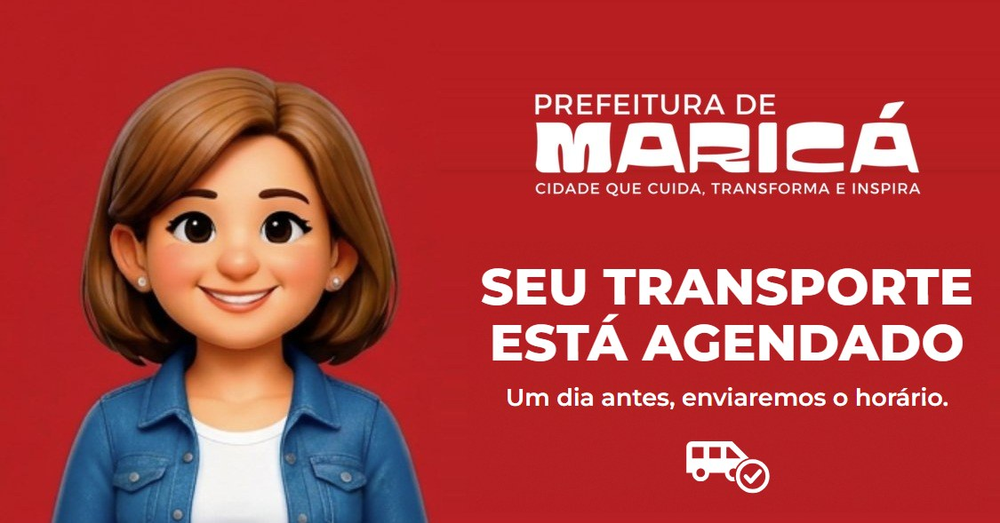
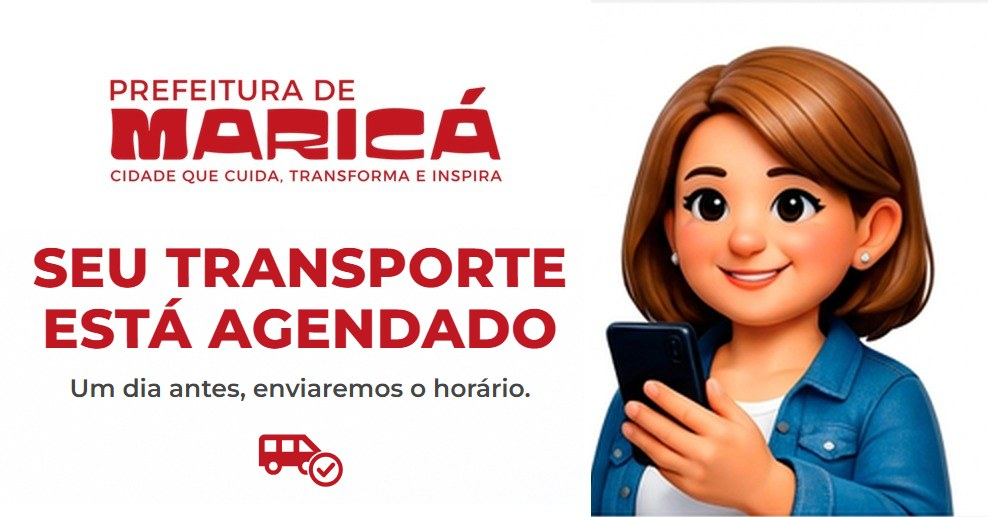
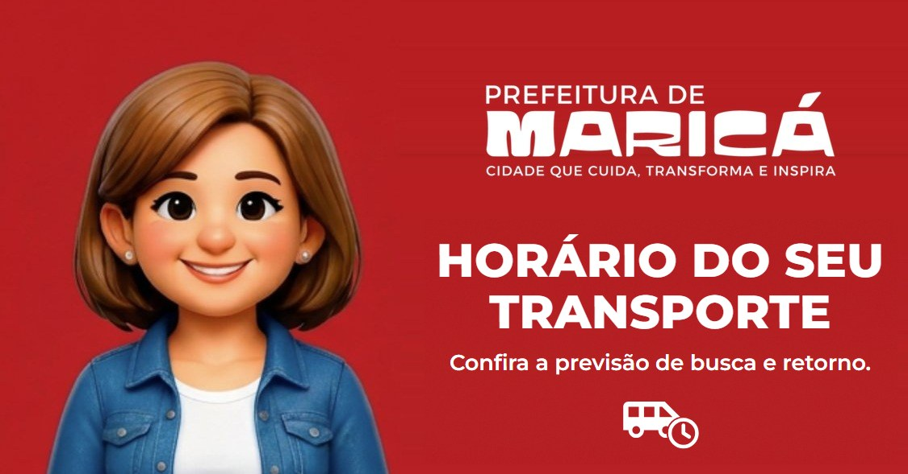
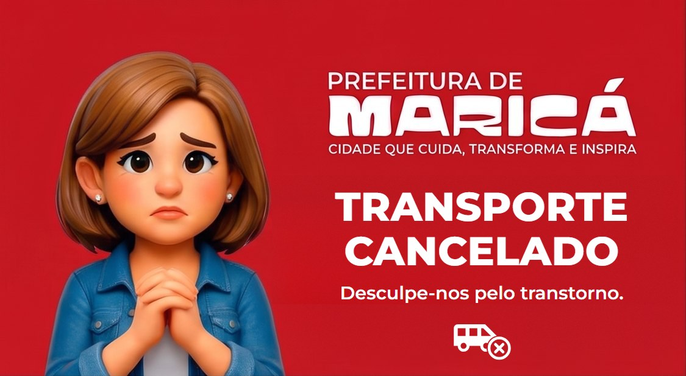
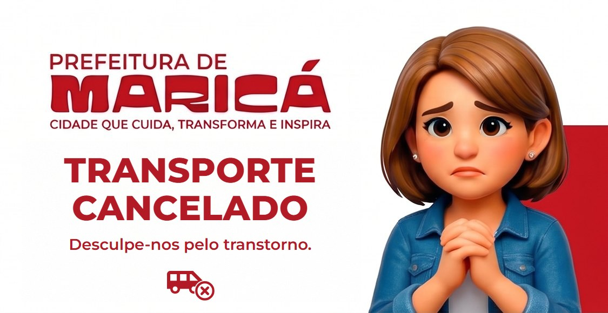

# Transporte de Pacientes — modelos de mensagem do WhatsApp

Seis modelos cadastrados e **aprovados** na Meta em 29/09/2026 (WABA da Secretaria de Saúde de Maricá): três momentos
do transporte, cada um em duas versões — **completa** (número já verificado) e **sem dados do
paciente** (número ainda não verificado). O envio automático ainda não está ligado no sistema; este
documento é a referência do que foi cadastrado, para a implementação.

## Situação na Meta

| Modelo | Status | Arte cadastrada | Rodapé |
|---|---|---|---|
| `transporte_agendado_anonimo` | aprovado | vermelha | sim |
| `transporte_agendado` | aprovado | branca | sim |
| `transporte_horario_anonimo` | aprovado | vermelha | não |
| `transporte_horario` | aprovado | branca | sim |
| `transporte_cancelado_anonimo` | aprovado | branca | sim |
| `transporte_cancelado` | aprovado | vermelha | sim |

Todos: categoria **Utilidade**, idioma **Português (BR)**, cabeçalho de **imagem**, botões de
**resposta rápida**. Rodapé (quando há): `Para mais informações acesse: https://app.smsmarica.online`.

## Quem recebe o quê

| Momento | Número verificado | Número não verificado |
|---|---|---|
| Transporte agendado | `transporte_agendado` | `transporte_agendado_anonimo` |
| Véspera — horário definido | `transporte_horario` | `transporte_horario_anonimo` |
| Transporte cancelado pela Secretaria | `transporte_cancelado` | `transporte_cancelado_anonimo` |

- **Sem dados do paciente** segue a mesma regra das consultas e exames ([ADR-0057](../../adr/0057-destinatario-correto-e-contato-negado.md)): o número ainda não foi provado, então a mensagem diz só que existe um transporte — sem tratamento, data, unidade ou horário. O toque em **Quero mais informações** abre a verificação (4 primeiros dígitos do CPF + nascimento); verificado, a pessoa recebe os dados completos e os botões de confirmar e cancelar.
- **Em todos os casos a confirmação é pedida.** Nas versões completas de agendamento e véspera, pelos botões *Sim!* / *Não! Não quero o transporte*; no cancelamento, por *Estou ciente* (a equipe sabe que a pessoa viu e não vai ficar esperando o carro na porta).
- `{{1}}` é sempre o tratamento com o primeiro nome, como nos outros modelos: **"Sr. João"** / **"Sra. Maria"**. Nenhuma variável pode conter quebra de linha (a Meta recusa o envio).

---

## 1. `transporte_agendado_anonimo` — agendado, sem dados do paciente

Quando o transporte é marcado e o número **não** é verificado. **Aprovado.**

**Cabeçalho (imagem):** `transporte-agendado-vermelho.jpg`

**Corpo:**

```
Olá *{{1}}*, esse é o canal oficial do *Alô Maricá* da Secretaria Municipal de Saúde.

*Seu transporte foi agendado!* 🚐

Um dia antes da viagem, enviaremos por aqui o horário previsto para o carro buscar você.

Para ver os detalhes e confirmar se você vai utilizar o transporte, toque em *Quero mais informações*.
```

**Rodapé:** `Para mais informações acesse: https://app.smsmarica.online`

| Variável | Conteúdo | Exemplo |
|---|---|---|
| `{{1}}` | Tratamento + primeiro nome | Sr. João |

**Botões (resposta rápida):** `Quero mais informações` · `Não sou essa pessoa`

---

## 2. `transporte_agendado` — agendado, completo

Quando o transporte é marcado e o número **é** verificado (ou logo depois que a pessoa se verifica). **Aprovado.**

**Cabeçalho (imagem):** `transporte-agendado-branco.jpg`

**Corpo:**

```
Olá *{{1}}*, esse é o canal oficial do *Alô Maricá* da Secretaria Municipal de Saúde.

Seu transporte para realizar *{{2}}* na unidade *{{3}}*, em *{{4}}*, está agendado para *{{5}}*. 🚐

Um dia antes da viagem, enviaremos por aqui o horário previsto para o carro buscar você e a previsão de retorno.

Você vai utilizar o transporte? Toque em um dos botões abaixo.
```

**Rodapé:** `Para mais informações acesse: https://app.smsmarica.online`

| Variável | Conteúdo | Exemplo |
|---|---|---|
| `{{1}}` | Tratamento + primeiro nome | Sr. João |
| `{{2}}` | Tratamento / atendimento | Consulta em Oftalmologia |
| `{{3}}` | Unidade de atendimento (destino) | HOSPITAL DO OLHO |
| `{{4}}` | Cidade da unidade | Rio de Janeiro |
| `{{5}}` | Data (com dia da semana) | quinta-feira, 02/10/2026 |

**Botões (resposta rápida):** `Sim! Confirmo a utilização` · `Não! Não quero o transporte`

---

## 3. `transporte_horario_anonimo` — véspera, sem dados do paciente

Um dia antes, com a rota gerada, quando o número **ainda não** é verificado. **Aprovado.**

**Cabeçalho (imagem):** `transporte-horario-vermelho.jpg`

**Corpo:**

```
Olá *{{1}}*, esse é o canal oficial do *Alô Maricá* da Secretaria Municipal de Saúde.

*O horário do seu transporte já está definido!* 🚐

Para ver a previsão de busca e de retorno e confirmar se você vai utilizar o transporte, toque em *Quero mais informações*.
```

**Rodapé:** nenhum.

| Variável | Conteúdo | Exemplo |
|---|---|---|
| `{{1}}` | Tratamento + primeiro nome | Sra. Maria |

**Botões (resposta rápida):** `Quero mais informações` · `Não sou essa pessoa`

---

## 4. `transporte_horario` — véspera, completo

Um dia antes, com a rota gerada, para número verificado. **Aprovado.**

**Cabeçalho (imagem):** `transporte-horario-branco.jpg`

**Corpo:**

```
Olá *{{1}}*, esse é o canal oficial do *Alô Maricá* da Secretaria Municipal de Saúde.

Estas são as informações do seu transporte de *{{2}}* para realizar *{{3}}* na unidade *{{4}}*, em *{{5}}*:

🚐 A previsão do carro buscar você é às *{{6}}*.
⏱️ O tempo estimado do trajeto até o local do atendimento é de aproximadamente *{{7}}*.
🏠 O horário previsto para o retorno até sua residência é às *{{8}}*.
🚘 Veículo: *{{9}}*.
🧑‍✈️Motorista: *{{10}}*.

Lembramos que este é um *transporte comunitário*: os horários de chegada e de retorno consideram outras pessoas que também dependem deste serviço gratuito da Prefeitura de Maricá.

Você vai utilizar o transporte? Toque em um dos botões abaixo.
```

**Rodapé:** `Para mais informações acesse: https://app.smsmarica.online`

| Variável | Conteúdo | Exemplo cadastrado |
|---|---|---|
| `{{1}}` | Tratamento + primeiro nome | Sra. Maria |
| `{{2}}` | Data (com dia da semana) | quinta-feira, 02/10/2026 |
| `{{3}}` | Tratamento / atendimento | Consulta em Oftalmologia |
| `{{4}}` | Unidade de atendimento (destino) | HOSPITAL DO OLHO |
| `{{5}}` | Cidade da unidade | Rio de Janeiro |
| `{{6}}` | Horário previsto de busca | 09:30h |
| `{{7}}` | Tempo estimado do trajeto | 1:30h |
| `{{8}}` | Horário previsto de retorno à residência | 16:00h |
| `{{9}}` | Veículo (modelo, cor, placa) | Van Sprinter branca, placa ABC1D23 |
| `{{10}}` | Nome do motorista | José Vicente |

**Botões (resposta rápida):** `Sim! Quero o transporte` · `Não! Não quero o transporte`

---

## 5. `transporte_cancelado_anonimo` — cancelado, sem dados do paciente

Quando a Secretaria cancela o transporte e o número **não** é verificado. **Aprovado.**

**Cabeçalho (imagem):** `transporte-cancelado-branco.jpg`

**Corpo:**

```
Olá *{{1}}*, esse é o canal oficial do *Alô Maricá* da Secretaria Municipal de Saúde.

Comunicamos que *o seu transporte foi cancelado*. Pedimos desculpas pelo transtorno.

Para ver os detalhes, toque em *Quero mais informações*.
```

**Rodapé:** `Para mais informações acesse: https://app.smsmarica.online`

| Variável | Conteúdo | Exemplo |
|---|---|---|
| `{{1}}` | Tratamento + primeiro nome | Sr. João |

**Botões (resposta rápida):** `Quero mais informações` · `Não sou essa pessoa`

---

## 6. `transporte_cancelado` — cancelado, completo

Quando a Secretaria cancela o transporte e o número **é** verificado. **Aprovado.**

**Cabeçalho (imagem):** `transporte-cancelado-vermelho.jpg`

**Corpo:**

```
Olá *{{1}}*, esse é o canal oficial do *Alô Maricá* da Secretaria Municipal de Saúde.

Comunicamos que o seu transporte de *{{2}}* para realizar *{{3}}* na unidade *{{4}}*, em *{{5}}*, foi *cancelado*. Pedimos desculpas pelo transtorno.
```

**Rodapé:** `Para mais informações acesse: https://app.smsmarica.online`

| Variável | Conteúdo | Exemplo |
|---|---|---|
| `{{1}}` | Tratamento + primeiro nome | Sra. Maria |
| `{{2}}` | Data (com dia da semana) | quinta-feira, 02/10/2026 |
| `{{3}}` | Tratamento / atendimento | Consulta em Oftalmologia |
| `{{4}}` | Unidade de atendimento (destino) | HOSPITAL DO OLHO |
| `{{5}}` | Cidade da unidade | Rio de Janeiro |

**Botões (resposta rápida):** `Estou ciente` · `Quero mais informações`

---

## Artes do cabeçalho

Ficam em `SMSMais.cidadao.pwa/public/mensagens/`, junto das artes das consultas e exames (mesma
personagem, mesma logo, mesma fonte). JPEG, 90–100 KB cada. Cada momento tem versão vermelha e
branca; a tabela do início diz qual foi usada no cadastro de cada modelo.

⚠️ **A arte do cadastro é só amostra.** Modelo com foto no cabeçalho exige a imagem em **cada
envio** (sem ela a Meta recusa com `(#132012)`), e o paciente vê a imagem que foi **enviada**, não a
do cadastro. A cor que chega ao celular é decidida no envio — dá para padronizar sem recadastrar.

**Transporte agendado** — `transporte-agendado-vermelho.jpg` · `transporte-agendado-branco.jpg`




**Véspera — horário** — `transporte-horario-vermelho.jpg` · `transporte-horario-branco.jpg`




**Transporte cancelado** — `transporte-cancelado-vermelho.jpg` · `transporte-cancelado-branco.jpg`




## Escolhas de texto

- **"agendado", não "confirmado", na primeira mensagem.** "Seu transporte está confirmado" seguido de "confirme se vai utilizar" leva a pessoa a achar que não precisa responder. "Agendado" pede a confirmação com naturalidade — é o mesmo desenho do "Seu exame foi agendado!".
- **"local do atendimento" em vez de "exame/consulta".** O transporte leva também para hemodiálise, radioterapia e fisioterapia, que não são nem exame nem consulta.
- **Veículo e motorista na véspera** (`{{9}}`, `{{10}}`): ajudam a pessoa a reconhecer o carro e quem vai buscá-la.
- **Formato da duração** (`{{7}}`): o exemplo cadastrado foi "1:30h"; o formato real é decidido no envio. "1:30h" pode ser lido como horário (uma e meia); "1h30min" não tem essa ambiguidade.

## Para a implementação

- **A imagem de cada modelo tem de estar no mapa `ComunicacaoPaciente:ImagensCabecalho`** (appsettings). O catálogo do relay (`GET /comunicacoes-paciente/modelos`) não informa o cabeçalho de nenhum modelo hoje — os de consulta e exame só funcionam porque estão nesse mapa. Sem a entrada, o envio volta `(#132012)`.
- **De onde vem cada dado:** busca = `SessaoDeTratamento.HoraPrevistaBusca` / `Alocacao.EtaPrevisto` (o atendimento não tem horário: vem do arranjo do carro); trajeto = duração da rota até a unidade; retorno = chegada + `TipoTratamento.TempoMedioMinutos` (o tempo médio é do tipo) + trajeto de volta; unidade e cidade = `UnidadeAtendimento`; veículo = `Veiculo` (modelo, cor, placa); motorista = `RotaDiaria.Motorista`; acompanhantes = `SessaoDeTratamento.Acompanhantes` (lista do paciente).
- **Botões chegam como TEXTO** (resposta rápida sem payload), casados pelo contexto da mensagem respondida:
  - *Sim! Confirmo a utilização* (agendado) e *Sim! Quero o transporte* (véspera) → confirma o transporte;
  - *Não! Não quero o transporte* → pede a dupla checagem, como nas confirmações ("Você quer CANCELAR o transporte do dia …?" · *Quero cancelar* / *Não quero cancelar*). Cancelar o **transporte** não cancela a consulta nem o tratamento, e a resposta tem de dizer isso;
  - *Estou ciente* → registra que a pessoa viu o cancelamento;
  - *Quero mais informações* e *Não sou essa pessoa* → a máquina de verificação cadastral das consultas e exames, sabendo que o aviso é de transporte. Em `transporte_cancelado` o número já é verificado: o toque em *Quero mais informações* entrega os detalhes direto (o comportamento que a máquina já tem para número verificado).
- **Atendimento recorrente** (hemodiálise três vezes por semana, ou contínuo): falta decidir se o "agendado" sai a cada sessão ou uma vez por atendimento. O `{{5}}` aceita as duas formas — "sexta-feira, 02/10/2026" ou "segundas, quartas e sextas, a partir de 05/10/2026".
