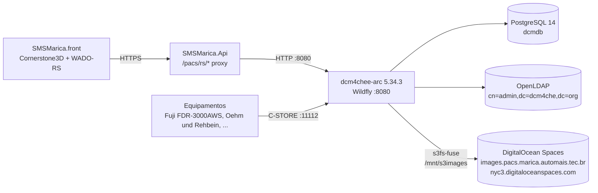

# PACS — Imagens DICOM (dcm4chee-arc)

Documentação operacional do servidor de imagens médicas que abastece o visualizador
`SMSMarica.front > /features/pacs`. Documenta o que está em produção hoje
(2026-05-23): topologia, configuração, integrações, problemas conhecidos e ações
recomendadas.

## 1. Visão geral

O backend de imagens é um **dcm4chee-arc-light 5.34.3** (open-source DICOM
archive sobre Wildfly/Java) hospedado em DigitalOcean. O frontend `SMSMarica.front`
fala **DICOMweb (QIDO-RS + WADO-RS)** com ele através do proxy `/pacs/rs/*` do
backend `SMSMarica.Api`, que apenas encaminha as requisições HTTP sem reescrever
payload — ver [`PacsProxyService`](../SMSMarica.server/src/SMSMarica.Core/Pacs/PacsProxyService.cs).



## 2. Host

| Item | Valor |
|------|-------|
| Hostname | `pacs.marica.automais.cloud` |
| IP | `104.236.203.40` (DigitalOcean Droplet) |
| SO | Ubuntu 22.04.4 LTS (kernel 5.15) |
| Acesso | SSH `root@pacs.marica.automais.cloud:22` (OpenSSH 8.9p1) — credenciais fora deste repositório |
| Host key | `ssh-ed25519 SHA256:qma4J9CyGhuOHPoGwXtspfXncTN+nhCFDPmSh4RvXCo` |

> Não documentar senhas neste repositório. SSH é por chave/senha mantidas no
> cofre da equipe.

### Outros serviços no mesmo host (não relacionados ao PACS)

| Porta | Processo | Domínio | Finalidade |
|-------|----------|---------|------------|
| 5000 | `dotnet` (**parado**) | `api.pegaph.automais.app` | API do Colégio pH — outro produto. **Parado e desabilitado em 2026-07-22** para liberar RAM (a VM tem 2 GB). Reverter: `systemctl enable --now pegaph`. |
| 80/443 | nginx | `pegaph.automais.app` / `api.pegaph.automais.app` | Frontend e API do produto acima. |

> O PostgreSQL local **não** é do pegaph: hospeda o `dcmdb`. O pegaph apontava para
> `ph_saida_escolar`, que não existe neste cluster.
>
> **Swap de 4 GB criado em 2026-07-22** (`/swapfile`, `vm.swappiness=10`, persistente em
> `/etc/fstab`). A VM tem 2 GB de RAM e rodava **sem swap nenhum**, com ~140 MB livres —
> qualquer pico deixava o OOM killer escolher a vítima, possivelmente o PostgreSQL.

O PACS **não** está atrás do nginx local — fica direto em `:8080` (plain HTTP).
Ver §10 (problemas conhecidos).

## 3. dcm4chee — instalação

| Item | Valor |
|------|-------|
| Versão | `dcm4chee-arc-ear-5.34.3-psql` — **atualizado de 5.32.0 em 2026-07-22** (ver §13) |
| Container | WildFly Full 32.0.1 nativo (sem Docker), config `dcm4chee-arc.xml`; Java 17 |
| Service | `systemd: dcm4chee.service` (User=root, ExecStart=`/opt/wildfly/bin/standalone.sh -c dcm4chee-arc.xml -b 0.0.0.0`) |
| Dir base | `/opt/wildfly/` (owner `dcm:dcm`) |
| Config dir | `/opt/wildfly/standalone/configuration/dcm4chee-arc/ldap.properties` |
| Deploy mode | **unsecure** (`dcm4chee-arc-war-5.34.3-unsecure.war` — Keycloak instalado como módulo mas **não ativo**) |
| Logs | `/opt/wildfly/standalone/log/server.log` (rotação diária) |
| UI admin | http://pacs.marica.automais.cloud:8080/dcm4chee-arc/ui2/ |

### Portas expostas

| Porta | Protocolo | Finalidade |
|-------|-----------|------------|
| `8080` | HTTP | DICOMweb (QIDO-RS, WADO-RS, STOW-RS) + UI Arc Light — **plain, internet-facing** |
| `8443` | HTTPS | Mesmo conteúdo do 8080 sobre TLS (cert self-signed) |
| `9990` | HTTP | Wildfly mgmt console (bind `127.0.0.1` apenas) |
| `11112` | DICOM | C-STORE/C-FIND/C-MOVE plain — entrada dos equipamentos |
| `2762` | DICOM TLS | Mesmo do 11112 sobre TLS |
| `2575` | HL7 | MLLP plain |
| `12575` | HL7 TLS | MLLP sobre TLS |

## 4. Storage

| Item | Valor |
|------|-------|
| `dcmStorageID` | `fs1` |
| URI | `file:///mnt/s3images/` |
| Backing | DigitalOcean Spaces (S3-compatível) via **s3fs-fuse** |
| Bucket | `images.pacs.marica.automais.tec.br` |
| Endpoint | `https://nyc3.digitaloceanspaces.com` |
| Path format | `{now,date,yyyy/MM/dd}/{0020000D,hash}/{0020000E,hash}/{00080018,hash}` |
| `dcmCheckMountFilePath` | `NO_MOUNT` (não valida a montagem) |
| `dcmDigestAlgorithm` | `MD5` |
| Credenciais | `/root/.passwd-s3fs` (chmod 600, AWS-style `key:secret`) |

s3fs mount (linha em `mount` no host):

```
s3fs images.pacs.marica.automais.tec.br /mnt/s3images
  -o rw,allow_other,passwd_file=/root/.passwd-s3fs,
     url=https://nyc3.digitaloceanspaces.com,use_path_request_style,
     uid=1000,gid=1000,umask=0022,dev,suid
```

> **Não há `MetadataStorageID` configurado.** Toda chamada `/metadata` precisa
> abrir o DICOM original no S3 — se o objeto sumir, o endpoint volta 500
> (ver §10.1).

## 5. Banco PostgreSQL

| Item | Valor |
|------|-------|
| Cluster | PostgreSQL 14 (Ubuntu, bind `127.0.0.1:5432`) |
| Database | `dcmdb` (owner `dcmadmin`) |
| Migrations | gerenciadas pelo próprio dcm4chee (EAR já traz scripts) |

**Volume atual (2026-05-23):**

| Tabela | Linhas |
|--------|--------|
| `patient` | 2.491 |
| `study` | 2.493 |
| `series` | 10.968 |
| `instance` | 10.968 |
| `location` | 10.968 (todas em `storage_id='fs1'`) |

## 6. LDAP (configuração do dcm4chee)

O dcm4chee-arc guarda **toda a configuração** (devices, AEs, storage, regras de
exportação, retenção, etc.) num diretório LDAP — não em arquivo XML.

| Item | Valor |
|------|-------|
| Daemon | `slapd` (`systemd: slapd.service`) |
| URL | `ldap://localhost:389/dc=dcm4che,dc=org` |
| DN admin | `cn=admin,dc=dcm4che,dc=org` |
| Senha | **padrão de instalação `dcmsecret`** — ver §10.4 |
| Cliente CLI | `ldapsearch -x -D 'cn=admin,dc=dcm4che,dc=org' -W -b 'dc=dcm4che,dc=org'` |

Também é possível editar tudo via REST do dcm4chee (`/dcm4chee-arc/devices/...`)
ou pela UI Arc Light (`Configuration > Devices`).

## 7. AE titles (Application Entities)

Desde **2026-06-16**, os AEs canônicos do CDT são **`PACS-CDT`** (imagens) e
**`WORK-CDT`** (worklist). Os antigos **`DCM4CHEE`** e **`WORKLIST`** continuam
ativos como **alias do mesmo acervo** (clones com storage `fs1` + QR view
`hideRejected` idênticos), para não quebrar equipamentos ainda apontados aos nomes
antigos. Parâmetros para o técnico do equipamento: [`pacs-cdt-mamografo.md`](./pacs-cdt-mamografo.md).

| AE Title | Papel | Descrição |
|----------|-------|-----------|
| **`PACS-CDT`** | **Imagens (canônico)** | Recebe C-STORE + serve QIDO/WADO/STOW. **Usado pelo SMSMarica.** |
| **`WORK-CDT`** | **Worklist (canônico)** | Modality Worklist (MWL) + Unified Worklist (UPS). |
| `DCM4CHEE` | Imagens (alias legado) | Mesmo acervo que `PACS-CDT` — esconde instâncias rejeitadas. |
| `WORKLIST` | Worklist (alias legado) | Mesmo que `WORK-CDT` — MWL + UPS. |
| `AS_RECEIVED` | Visão | Retrieve instâncias exatamente como recebidas (sem filtro de rejeição). |
| `IOCM_EXPIRED` | Visão | Mostra só instâncias rejeitadas por *Data Retention Expired*. |
| `IOCM_PAT_SAFETY` | Visão | Mostra só instâncias rejeitadas por *Patient Safety*. |
| `IOCM_QUALITY` | Visão | Mostra só instâncias rejeitadas por *Quality Reasons*. |
| `IOCM_REGULAR_USE` | Visão | Mostra inclusive instâncias rejeitadas por *Quality*. |
| `IOCM_WRONG_MWL` | Visão | Mostra só instâncias rejeitadas por *Incorrect MWL Entry*. |

A regra `dcmAllowDeleteStudyPermanently = REJECTED` está em todas — só estudos
explicitamente rejeitados podem ser apagados permanentemente.

> **`PACS-CDT` e `WORK-CDT` escutam na MESMA porta DICOM (11112 plain / 2762 TLS).**
> O que separa "enviar imagem" de "consultar worklist" é o **AE Title**, não a porta.
> `PACS-CDT` recebe/serve imagens e **não** responde MWL; `WORK-CDT` serve worklist
> (MWL clássico + UPS) e aceita associação MWL — confirmado por C-ECHO/C-FIND em
> 2026-06-16.

### Conexões DICOM (`dicomNetworkConnection`)

| `cn` | host | porta | TLS |
|------|------|-------|-----|
| `dicom` | localhost | 11112 | — |
| `dicom-tls` | localhost | 2762 | sim |
| `hl7` | localhost | 2575 | — |
| `hl7-tls` | localhost | 12575 | sim |
| `syslog` | localhost | — | — |
| `syslog-tls` | localhost | — | sim |

## 8. Equipamentos emissores (modalidades)

Inferido dos `Manufacturer` / `ManufacturerModelName` dos estudos armazenados:

| Fabricante | Modelo | Modalidade observada | PixelSpacing típico |
|-----------|--------|----------------------|----------------------|
| FUJIFILM Corporation | FDR-3000AWS | MG (mamografia digital) | `0.05 mm` (50 µm) |
| Oehm und Rehbein GmbH | (sem `ManufacturerModelName`) | MG | (estudos de 2024 — arquivo sumiu) |

Equipamentos enviam via **C-STORE para `PACS-CDT@pacs.marica.automais.cloud:11112`**
(plain; `DCM4CHEE` ainda aceita pelo alias legado). Lembrar: a porta 11112 está
aberta para internet — qualquer modalidade configurada pode pushar.

### Estação por equipamento na worklist (AE Title)

O `ScheduledStationAETitle` (0040,0001) de cada item MWL vem do **equipamento
cadastrado** no painel (*Exames de Imagem → Equipamentos*): casa a **unidade
executante** da solicitação com a **modalidade** do tipo de exame e usa o
`IdentificadorDicom` do equipamento — ver `Core/Worklist/ResolvedorEstacaoWorklist.cs`.

**Não há AE de fallback, e o sistema nunca sorteia estação.** A régua, aplicada
na autorização da recepção e de novo no envio:

| Equipamentos ativos na unidade+modalidade | O que acontece |
|---|---|
| **nenhum** | autorização **passa** (cadastrar equipamento é tarefa de administrador — travar a recepção deixaria o paciente parado no balcão); o envio falha com `worklist.sem_equipamento`, visível no exame |
| **um** | usado automaticamente e **gravado** em `exame_imagem.equipamento_id` — a decisão fica explícita, e equipamento cadastrado depois não muda o destino deste pedido |
| **dois ou mais** | a autorização **recusa** com `autorizacao.equipamento_obrigatorio` até a recepção escolher a sala (`POST /solicitacoes-exame/{id}/autorizar` aceita `equipamentoId`; as opções vêm de `GET /solicitacoes-exame/{id}/equipamentos`) |

A escolha é exigida **na autorização** porque é o último ponto do fluxo com uma
pessoa presente que sabe em qual sala o paciente vai entrar — depois disso o envio
é do worker. Se o equipamento escolhido for desativado antes do envio, o resolvedor
volta a deduzir: com um substituto único segue, com dois para e pede escolha nova.

O erro fica em `erro_integracao_pacs` e o worker retenta com backoff — cadastrar ou
escolher o equipamento resolve sozinho, sem reprocessar nada. Carimbar um AE
genérico mandaria o exame de uma unidade para a estação de outra. Os equipamentos
que já operavam entraram pela migration `SeedEquipamentosCdtCmi`, ancorada no CNES.

### Isolamento por unidade no servidor (Worklist Label) — ATIVO

Filtrar por `ScheduledStationAETitle` é decisão do **equipamento**: se o técnico não
configurar o filtro, a máquina recebe todos os itens da modalidade — inclusive de
outra unidade. Por isso a separação **não** pode depender só do aparelho.

O dcm4chee não filtra pelo Calling AE de quem consulta (pedido antigo da comunidade,
inexistente), mas honra o **Worklist Label** `(0074,1202)`: um Archive AE com
`dcmMWLWorklistLabel` só devolve, no C-FIND MWL, os itens daquele label. **Ativo em
produção desde 2026-07-22 — funcionava já na 5.32.0, não exigiu upgrade** (o upgrade
para 5.34.3 veio depois, por outros motivos).

| AE | Label | Quem usa |
|---|---|---|
| `WORK-CDT` | `FDR-MAMO` | mamógrafo do CDT |
| `WORK-CMI` | `US_CMI` | ultrassom do CMI |
| **`WORKLIST`** | **nenhum** (enxerga tudo) | **o backend** — `Pacs:Dcm4chee:WorklistBaseUrl` |

Prova (C-FIND **sem** filtro de modalidade — o pior caso, equipamento mal configurado):
`WORK-CDT` devolveu só o exame do CDT, `WORK-CMI` só o do CMI, `WORKLIST` os dois.

> ⚠️ **O atributo só entra por LDAP, não pela API REST.** O `PUT /devices/dcm4chee-arc`
> **descarta** `dcmMWLWorklistLabel` em silêncio (responde 204 e não grava) —
> a API não mapeia o campo, embora o schema LDAP e o MWL SCP o suportem. Use
> `ldapmodify` + `POST /ctrl/reload`:
>
> ```ldif
> dn: dicomAETitle=WORK-CMI,dicomDeviceName=dcm4chee-arc,cn=Devices,cn=DICOM Configuration,dc=dcm4che,dc=org
> changetype: modify
> add: dcmMWLWorklistLabel
> dcmMWLWorklistLabel: US_CMI
> ```

> **Item sem label é devolvido a TODOS os AEs** (regra: "com este label ou sem
> label"). Por isso o `ConstrutorMwlItem` carimba sempre, e os itens legados foram
> nomeados — item não marcado fura o isolamento. Atenção: item criado por um sistema
> externo, sem label, apareceria em todos os equipamentos.

O backend usa o AE administrativo de propósito: se falasse por um AE com label,
deixaria de enxergar itens das outras unidades e quebraria a confirmação
`Enviada → Recebida` e a limpeza pós-exame.

**Ao cadastrar um equipamento novo:** criar o Archive AE correspondente (clone de um
existente) e setar o label = AE Title do equipamento. Sem isso, o aparelho novo ou não
recebe nada, ou recebe a lista de todos.

### Ciclo de vida do item de worklist (sem MPPS)

Nenhum equipamento aqui manda MPPS, então nada avisa o arquivo que o exame acabou —
item criado ficaria na lista do aparelho para sempre. Quem fecha esse ciclo é o
**nosso sistema**: quando o exame chega ao PACS e a conciliação o promove a
*Realizada*, o `EnviadorWorklistService` remove o item no dcm4chee e zera
`exame_imagem.worklist_item_uid`. **O campo é o espelho do que está na worklist** —
preenchido significa "tem item lá"; e é por ele que a fila de limpeza do worker
seleciona o que remover (`ProcessarLimpezaWorklistAsync`).

| Situação do exame | Item na worklist |
|---|---|
| Solicitada (sem autorização da recepção) | nunca entrou |
| Recebida (aguardando execução) | **fica** |
| Recebida e o paciente faltou | **fica** — só sai por cancelamento/exclusão (decisão humana) |
| Realizada / Laudada | sai (worker) |
| Cancelada / excluída | sai na hora; se o PACS falhar, o worker retenta |

Falha na remoção não perde o item: o campo continua preenchido, e o exame volta à
fila na passagem seguinte (backoff de 5 min). Para recolocar um item removido —
segunda aquisição do mesmo pedido, por exemplo — existe *Reenviar worklist* na tela
do exame (`POST /solicitacoes-exame/{id}/reenviar-worklist`).

> **Itens órfãos** (na worklist do dcm4chee sem exame correspondente aqui) **não**
> são removidos automaticamente: o PACS pode um dia atender outro sistema, e o nosso
> não é dono absoluto da lista. Auditar comparando o C-FIND MWL com
> `smsmarica.exame_imagem` e remover à mão.

Parâmetros por equipamento (entregáveis ao técnico):

| Equipamento | Unidade | Modalidade | AE Title | Doc |
|---|---|---|---|---|
| Fuji FDR-3000AWS | CDT | MG | `FDR-MAMO` | [`pacs-cdt-mamografo.md`](./pacs-cdt-mamografo.md) |
| Ultrassom | Centro Materno Infantil | US | `US_CMI` | [`pacs-us-cmi.md`](./pacs-us-cmi.md) |

O AE Title do equipamento **não** precisa ser cadastrado no dcm4chee — o servidor
aceita qualquer Calling AE (§10.4). O cadastro no painel serve à worklist.

## 9. Endpoints DICOMweb (consumidos pelo SMSMarica)

Base RS: `http://pacs.marica.automais.cloud:8080/dcm4chee-arc/aets/PACS-CDT/rs/`
(o alias legado `.../aets/DCM4CHEE/rs/` aponta para o mesmo acervo)

Configurado em [`appsettings.json`](../SMSMarica.server/src/SMSMarica.Api/appsettings.json)
sob `Pacs.Dcm4chee.RsBaseUrl`, sobrescritível por `Pacs__Dcm4chee__RsBaseUrl` em prod.

| Operação | Caminho |
|----------|---------|
| QIDO — estudos | `GET /studies` (params: `PatientName`, `StudyDate`, `limit`, `includefield=all`, `fuzzymatching=true`, `orderby`) |
| QIDO — séries | `GET /studies/{StudyInstanceUID}/series?includefield=all` |
| QIDO — instâncias | `GET /studies/{study}/series/{series}/instances?includefield=all` |
| WADO — metadados | `GET /studies/{study}/series/{series}/metadata` (`Accept: application/dicom+json`) ⚠ atualmente quebrado para estudos de 2024 — ver §10.1 |
| WADO — instância (metadata) | `GET /studies/{study}/series/{series}/instances/{sop}/metadata` |
| WADO — pixel frame | `GET /studies/{study}/series/{series}/instances/{sop}/frames/{n}` (`Accept: multipart/related; type="application/octet-stream"; transfer-syntax=*`) — chamado pelo Cornerstone `dicom-image-loader` |

Header obrigatório nos QIDO/metadata: `Accept: application/dicom+json`. STOW-RS
(upload via HTTP) também existe mas hoje não é usado pelo SMSMarica — os
equipamentos enviam via DICOM C-STORE direto.

### Integração no `SMSMarica.front`

Cornerstone3D (`@cornerstonejs/core` + `tools` + `dicom-image-loader`) consome
o WADO-RS via os helpers em [`features/pacs/lib/cornerstone.ts`](../SMSMarica.front/src/features/pacs/lib/cornerstone.ts):

- `wadoRsRoot()` aponta para `${baseURL}/pacs/rs` (passa pelo proxy).
- `construirImageId(study, series, sop, frame)` monta `wadors:.../frames/1`.
- `registrarMetadados(imageId, dicomJsonDataset)` registra em
  `wadors.metaDataManager` — é daí que o Cornerstone deriva `PixelSpacing` para
  a `LengthTool` mostrar mm em vez de px.

Resumo do fluxo no `PacsViewerPage.tsx`:

```
1. Usuário busca estudo (PacsBuscaModal) → QIDO /studies
2. Sidebar lista séries → QIDO /studies/{}/series
3. Selecionar série → /studies/{}/series/{}/metadata (todas instâncias)
   → registrarMetadados(imageId, inst) para cada uma
   → setStack(imageIds) no viewport
4. LengthTool mede em mm se PixelSpacing chegou no metadado
```

## 10. Problemas conhecidos e ações recomendadas

### 10.1. **Arquivos de 2024 sumiram do bucket S3 — `/metadata` retorna 500**

`/mnt/s3images/` hoje só tem `2025/` e `2026/`. **Toda a árvore `2024/`
desapareceu.** O Postgres ainda referencia 10.968 instâncias em `storage_id=fs1`,
e ~25–30% delas têm `storage_path` começando com `2024/...` — os equipamentos
de mamografia "Oehm und Rehbein" colocaram tudo entre 2024-07 e 2024-08.

Stack trace típico no `server.log` ao tentar abrir um estudo de 2024:

```
WARN [org.dcm4chee.arc.wado.WadoRS] Response Internal Server Error caused by
java.nio.file.NoSuchFileException: /mnt/s3images/2024/08/12/D073D656/A464541B/32286057
  at org.dcm4chee.arc.storage.filesystem.FileSystemStorage.openInputStreamA(FileSystemStorage.java:209)
  at ...RetrieveServiceImpl.loadMetadataFromDicomFile(RetrieveServiceImpl.java:1094)
```

QIDO funciona (catálogo no Postgres), mas `/metadata` precisa abrir o arquivo
físico → 500.

**Investigar urgente:**
- Os objetos foram realmente apagados do bucket no DigitalOcean Spaces? (Console
  Spaces → bucket → procurar prefixo `2024/`).
- Existe lifecycle policy no bucket? Versioning está habilitado? Se sim, dá
  pra restaurar.
- Há backup externo dos exames de 2024? Mamografia tem requisito legal de
  retenção (CFM/CRM exige 20 anos).

**Mitigação imediata no frontend** (não resolve o sumiço, mas evita o crash):
- Marcar série como indisponível quando `/metadata` retorna 500.
- Mensagem clara para o usuário: "Imagens deste exame não estão mais disponíveis
  no storage".

### 10.2. **Sem `MetadataStorageID` configurado**

Sem cache de metadados, `/metadata` sempre vai ao arquivo DICOM cru. Isso:

1. Torna o sistema refém do S3 (latência + falha mata o endpoint).
2. Faz com que sumiço de arquivo derrube o catálogo, mesmo que só o
   metadado bastasse para o visualizador.

Recomendado: configurar um **segundo storage** (`dcmStorageID=meta`) só com
JSON de metadados (ex.: outro bucket ou disco local), e setar
`dcmMetadataStorageID=meta` no `dcmArchiveDevice`. dcm4chee passa a gravar
um JSON por instância nesse storage no momento do C-STORE, e o `/metadata`
serve do JSON sem tocar o arquivo DICOM. Doc: `https://dcm4che.atlassian.net/wiki/spaces/ee2/pages/4292935747/Metadata+Storage`.

### 10.3. **Régua em pixels para estudos antigos** (origem da investigação)

Causa direta: como `/metadata` falha em estudos de 2024 (§10.1), o frontend
não consegue registrar `PixelSpacing` no `wadors.metaDataManager` → a
`LengthTool` cai em pixels. Para estudos de 2025/2026 (FUJIFILM), o
`PixelSpacing = 0.05 mm` chega corretamente e a régua mostra mm.

Mesmo assim vale defender o frontend contra duas variantes:

a) **Modalidade DX/CR/MG sem `PixelSpacing` (00280030) mas com
`ImagerPixelSpacing` (00181164)** — promover `ImagerPixelSpacing` para
`PixelSpacing` em `lib/dicomJson.ts` antes do `registrarMetadados`. Para
mamografia (placa colada na mama), os dois são equivalentes
(`EstimatedRadiographicMagnificationFactor=1`).

b) **Imagens sem nenhum spacing** (US, SC) — adicionar
`CalibrationLineTool` do Cornerstone como fallback (usuário calibra
clicando em dois pontos com distância conhecida).

### 10.4. **Segurança — deploy `unsecure`**

- `dcm4chee-arc-war-5.34.3-unsecure.war`: **sem autenticação** em nenhum
  endpoint REST. Keycloak está instalado como módulo do Wildfly mas não
  está em uso.
- LDAP admin com senha **`dcmsecret`** (default público da imagem upstream).
  Qualquer pessoa com acesso ao host pode reconfigurar AEs, storage,
  exportar/apagar estudos.
- `:8080` plain HTTP **exposto à internet pública** (não está atrás do
  nginx). Tráfego DICOMweb inclui dados de paciente em claro.
- `:11112` (C-STORE) também exposto sem TLS — qualquer modalidade
  configurada pode pushar para `DCM4CHEE`.

**Recomendado para LGPD/CFM:**
1. Trocar `dcmsecret` (LDAP) por senha forte; atualizar `ldap.properties` e
   reiniciar `dcm4chee.service`.
2. Colocar o `:8080` atrás do nginx local com TLS (Certbot) e fechar 8080
   no firewall do Droplet — manter só `127.0.0.1:8080` ouvido.
3. Avaliar habilitar Keycloak (deploy `secure`) ou ao menos basic-auth no
   nginx para os endpoints REST.
4. Restringir `:11112` por firewall às modalidades conhecidas (allowlist
   de IP da unidade).

### 10.5. **`MahatmaFS` em `/mnt/s3images/` retorna I/O error**

Arquivo `MahatmaFS` (15 bytes) na raiz do bucket dá `Input/output error` ao
ser lido. Provavelmente um artefato deixado por alguma migração antiga.
Inofensivo, mas convém limpar (`rm /mnt/s3images/MahatmaFS` via s3fs ou
direto pelo console do Spaces).

### 10.6. **Aposentar os AEs legados `DCM4CHEE` / `WORKLIST`** (planejado)

Os AEs canônicos passaram a ser `PACS-CDT`/`WORK-CDT` (§7). Os legados continuam
ativos só para não quebrar quem ainda aponta pros nomes antigos. **Quando remover:**
só depois de certificar que (a) o mamógrafo do CDT envia/lê de `PACS-CDT`/`WORK-CDT`,
(b) a plataforma SMSMarica em **produção** está nos novos AEs — conferir eventuais
overrides de ambiente `Pacs__Dcm4chee__RsBaseUrl` / `Pacs__Dcm4chee__UpsBaseUrl`, que
**têm precedência** sobre o `appsettings.json` — e (c) nenhuma outra modalidade
aponta pra `DCM4CHEE`.

> **Remover o AE não apaga estudo nenhum.** O acervo vive no PostgreSQL (`dcmdb`) +
> storage `fs1`; o AE é só um ponto de acesso/visão. Mas há um pré-requisito técnico.

**Pré-requisito — antes de remover o AE `DCM4CHEE`, repontar as 5 referências
internas do `dcmArchiveDevice` que hoje apontam pra ele → `PACS-CDT`:**

- `dcmRejectExpiredStudiesAETitle`
- `dcmXDSiImagingDocumentSourceAETitle`
- `dcmStorageVerificationAETitle`
- `dcmRejectionNoteStorageAET`
- `dcmCompressionAETitle`

Se removê-lo sem repontar, quebram compressão, nota de rejeição, storage
verification e reject-expired. Remover também os `dcmWebApp` correspondentes
(`DCM4CHEE`, `DCM4CHEE-WADO`, `WORKLIST`).

> **Não** trocar o literal `DCM4CHEE` que aparece na coerção
> `IssuerOfPatientID=DCM4CHEE.{...}` — ali é só um rótulo de *namespace* de paciente
> (não é referência ao AE). Mantê-lo preserva a identidade dos pacientes já
> cadastrados; trocá-lo fragmentaria os cadastros.

Procedimento: backup do device config (`GET /devices/dcm4chee-arc`), aplicar a
remoção + repontes via `PUT` + `POST /ctrl/reload`. Totalmente reversível pelo
backup. (Os AEs `PACS-CDT`/`WORK-CDT` foram criados exatamente assim em 2026-06-16.)

## 11. Operação — receitas curtas

> Todos os comandos assumem SSH como `root@pacs.marica.automais.cloud`.

```bash
# Status do PACS
systemctl status dcm4chee

# Logs
tail -f /opt/wildfly/standalone/log/server.log
journalctl -u dcm4chee -f

# Reiniciar PACS (~40s de downtime)
systemctl restart dcm4chee

# Storage — checar montagem
df -h /mnt/s3images && mount | grep s3fs
ls /mnt/s3images/ | head -5

# Postgres
sudo -u postgres psql dcmdb -c "SELECT count(*) FROM study;"

# UI Arc Light (admin)
# http://pacs.marica.automais.cloud:8080/dcm4chee-arc/ui2/
```

## 12. Referências

- dcm4chee-arc-light docs: https://dcm4che.atlassian.net/wiki/spaces/ee2/
- DICOMweb specs: https://www.dicomstandard.org/dicomweb
- Cornerstone3D + WADO-RS: https://www.cornerstonejs.org/docs/concepts/cornerstone-core/imageId
- s3fs-fuse: https://github.com/s3fs-fuse/s3fs-fuse
- ADR-0004 (arquitetura 3-projetos do backend): [`adr/0004-arquitetura-tres-projetos.md`](./adr/0004-arquitetura-tres-projetos.md)

## 13. Upgrade 5.32.0 → 5.34.3 (2026-07-22)

Feito com o PACS fora de operação, ~25 min de indisponibilidade. Motivação: dois anos
de correções (a 5.32.0 é de abr/2024). **Não** era pré-requisito do isolamento de
worklist — esse já funcionava na 5.32 (§8).

**Ordem executada** (upgrades são sequenciais por segundo componente da versão):

1. Backups em `/root/pacs-backups/upgrade-2026-07-22-1810/`: `pg_dump -Fc` do `dcmdb`,
   `slapcat` (dados + config do slapd), `configuration/` + `data/content` do WildFly e
   os módulos `org/dcm4che` antigos.
2. `systemctl stop dcm4chee`.
3. Banco: `sql/psql/update-5.33-psql.sql` e `update-5.34-psql.sql` (copiar para fora de
   `/root` — o usuário `postgres` não lê lá).
4. Schema LDAP: os quatro `ldap/slapd/*-modify.ldif` via `ldapmodify -Y EXTERNAL`.
5. Config LDAP: `ldap/<versão>/*.ldif` de 5.33.1 → 5.34.3, em ordem.
6. **Clones precisam do mesmo tratamento**: os LDIFs de AE tocam só `DCM4CHEE`,
   `AS_RECEIVED`, `IOCM_REGULAR_USE`, `storescp`. `PACS-CDT` é clone e ficou 8 entradas
   atrás (a 5.34.2 adiciona JPEG XL) — replicado com
   `sed 's/dicomAETitle=DCM4CHEE,/dicomAETitle=PACS-CDT,/g'`.
7. Módulos: remover `/opt/wildfly/modules/org/dcm4che` e descompactar os quatro zips de
   `jboss-modules/` em `/opt/wildfly/modules/`.
8. Deployments (são *managed*, referenciados por sha1 no `dcm4chee-arc.xml` — não basta
   copiar arquivo), trocados offline:
   `jboss-cli.sh --commands="embed-server --server-config=dcm4chee-arc.xml,undeploy <velho>,deploy <novo>,stop-embedded-server"`.
9. `systemctl start dcm4chee` — subiu em 12 s, 0 erros.

**Verificado depois:** acervo idêntico (1.716 estudos / 7.377 séries / 2.996 pacientes),
C-ECHO nos 4 AEs, isolamento por label preservado, QIDO/WADO (metadata e frames) OK,
worklist do backend intacta, 0 erros de integração.

**Pré-requisitos que valem para o próximo upgrade:** a 5.34.3 ainda é Jakarta EE 8
(namespace `javaee`), então roda no WildFly atual — conferir isso antes, porque uma
versão que migre para `jakarta.*` exige trocar o WildFly junto.

> **O compressor lossless continua não transcodificando.** Deixou de responder 500, mas
> pedir `transfer-syntax=1.2.840.10008.1.2.4.90` devolve o frame do mesmo tamanho
> (16,3 MB) — ou seja, sem compressão. A transcodificação no nosso proxy segue
> necessária (§10.2 e `Pacs:Compressao` no appsettings).
