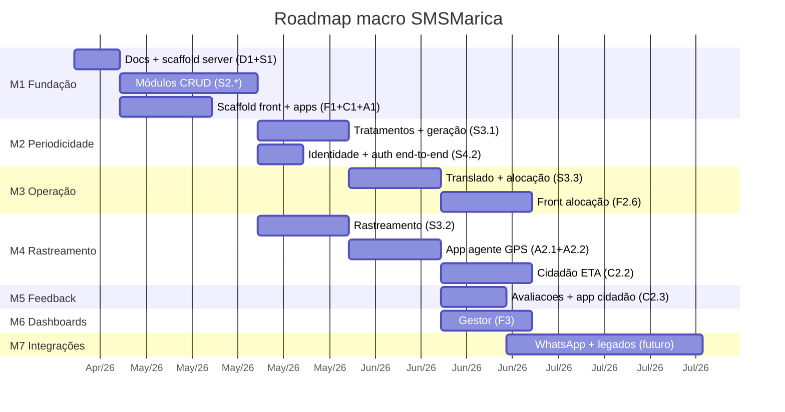

# Roadmap — SMS Maricá

Este roadmap organiza o desenvolvimento em marcos (`M#`). Cada marco entrega valor observável. Dentro de um marco, as entregas (`E#`) vêm do plano de implementação em `~/.claude/plans/deep-gathering-kahn.md`.

Dependências entre marcos são **duras** — M2 não começa sem M1 mínimo. Paralelismo dentro do marco é explícito.

## Visão geral

## M1 — Fundação (em curso)

**Objetivo:** ter a solution do backend compilando, testada, com um módulo ponta-a-ponta + clients scaffoldeados e plugáveis.

**Entregas:** D1, S1, S2.1..S2.5, F1, C1, A1 (ver plano).

**Critério de pronto:**
- `SMSMarica.server` sobe e expõe Swagger com CRUDs de: Pacientes, Unidades, Veículos, Motoristas, Avaliações, Identidade.
- Auth JWT operando para os 4 perfis.
- `SMSMarica.front` conecta, autentica, lista pacientes.
- Cada app Flutter buildando e logando com mock/real.
- Pipeline CI rodando build+test (S4.4).

**Paralelismo:** até 8 instâncias simultâneas após S1.

## M2 — Periodicidade e geração de sessões

**Objetivo:** operador cadastra tratamento com periodicidade → sistema gera automaticamente as sessões de translado futuras.

**Entregas:** S3.1 (Tratamentos), S4.1 (Outbox publisher), S4.2 (auth end-to-end), F2.5 (front tratamentos).

**Dependência:** M1 completo (precisa de Pacientes + Unidades + Identidade).

**Risco:** algoritmo de expansão de periodicidade — recorrências compostas, feriados, exceções. Dedicar sessão.

## M3 — Operação (alocação)

**Objetivo:** operador monta rota diária, aloca pacientes em assentos dos veículos.

**Entregas:** S3.3 (Translado), F2.2 (editor de layout de veículo), F2.6 (mapa de alocação diária).

**Dependência:** M2 (precisa das sessões geradas) + Veículos (M1).

**Risco:** UX da tela de alocação — desenho do veículo + drag-and-drop de pacientes em assentos. Dedicar sessão(ões).

## M4 — Rastreamento

**Objetivo:** motorista posta GPS; geofences disparam eventos de chegada; cidadão vê ETA.

**Entregas:** S3.2 (Rastreamento), A2.1 (postagem GPS), A2.2 (geofencing local), C2.2 (ETA no app cidadão).

**Dependência:** M1 (Motoristas, Veículos); M3 para ETA plenamente útil.

**Risco:** permissões de localização em background no Android; bateria; throttling. LGPD de GPS.

## M5 — Avaliação e feedback

**Objetivo:** fechar o ciclo de jornada do cidadão — ele avalia o motorista ao final do translado.

**Entregas:** C2.3 (tela de avaliação), integração via evento de "sessão encerrada" → janela de avaliação.

**Dependência:** M3 (translado concluído).

## M6 — Dashboards (gestor)

**Objetivo:** visão gerencial agregada.

**Entregas:** F3.1 (indicadores operacionais), F3.2 (mapa ao vivo).

**Dependência:** M3 (dados operacionais), M4 (dados de GPS).

## M7 — Integrações externas

**Objetivo:** conectar com sistemas de saúde legados do município + canal WhatsApp.

**Entregas:** camada intermediária (novo subprojeto a definir), adaptadores, WhatsApp Business.

**Dependência:** M1..M5 estáveis; decisões regulatórias (LGPD, CNS) com a Secretaria.

**Bloqueadores conhecidos:** ainda não há definição de quais sistemas legados integrar nem as APIs deles.

## M8 — Módulo IA (consulta em linguagem natural)

**Objetivo:** gestor da Secretaria pergunta em pt-BR ("quantos pacientes faltaram à hemodiálise esta semana?") e recebe a resposta abstraída (número/lista/tabela/gráfico) sem depender da TI nem ver SQL. Ver [ADR-0011](./adr/0011-modulo-ia-consulta-linguagem-natural.md).

**Entregas:**
- **IA-1 (Configuração)** — menu de Configuração atrás do módulo `InteligenciaConfiguracao`: token genérico de IA (Anthropic) + token de embeddings (Voyage AI) cifrados via `IDataProtector`; CRUD de bases (`host`, `ambiente` PRODUCAO/TREINAMENTO, tipo de fonte) em `smsmarica.ia_base`.
- **IA-2 (Fonte Salux Oracle)** — abstração `IFonteDados` + primeiro alvo Salux Oracle conectado **direto** pelo server (conta read-only, guard de único `SELECT`, timeout, cap de linhas; preferir TREINAMENTO).
- **IA-3 (Perguntar)** — menu IA atrás do módulo `Inteligencia`: dropdown multi-seleção de bases, geração de query via Messages API (saída estruturada + prompt caching), resposta abstraída.
- **IA-4 (Conhecimento + RAG)** — base de conhecimento `.md` versionada no repo, espelhada em `smsmarica.ia_conhecimento*` (chunks + embeddings em pgvector).
- **IA-5 (Governança/aprendizado)** — auto-correção de query falha → `ia_aprendizado` (Origem=Auto, ativo) + histórico em `ia_correcao`, rastreável e removível pela Configuração.

**Dependência:** M1 estável (RBAC/`ModuloPermissao`, infra do `SMSMarica.server`). Independente de M2..M7 — pode rodar em paralelo. Acesso de rede ao Oracle Salux a partir do server é pré-requisito de IA-2.

**Risco:** LGPD de PII em perguntas que viram embeddings na Voyage (alternativa: embeddings locais); garantia read-only absoluta no Salux PRODUCAO.

## Regras de governança

- **Não antecipar marco**. Se um item de M3 for tentador durante M1, abrir issue e deixar no backlog.
- **Dívida técnica** visível via comentários `// TODO(M3)` ou issue no GitHub. Silencioso é proibido.
- **Descoberta tardia** de invariante ou regra: atualiza `docs/domain.md` no mesmo PR que implementa.
- **Mudança de arquitetura** exige novo ADR em `docs/adr/`.

## Próximos passos imediatos (checklist)

- [x] D1 (docs base + ADR-0004)
- [x] **Refator R1** — `SMSMarica.server` reescrito como 3 projetos (Data + Core + Api + Tests).
- [x] **R2 — CRUD completo das 9 entidades** (Pacientes, Unidades, Motoristas, Avaliacoes, Usuarios, Veiculos+Fileiras, Tratamentos+Periodicidade, Rotas, Rastreamento Pontos+Geofences+Eventos). Services chamando DbContext direto, controllers MVC, exceções tipadas → ProblemDetails.
- [x] C1 (scaffold `SMSMarica.cidadao.app` — Flutter, login mock + perfil consumindo `GET /pacientes/{id}`)
- [x] A1 (scaffold `SMSMarica.agente.app` — Flutter Android-only)
- [ ] F1 (scaffold Vite + React + tema Maricá vermelho/branco) — pode rodar em paralelo.
- [ ] **Auth** (ADR a criar) — endpoints públicos por enquanto; ASP.NET Core Identity + JWT entram quando virar prioridade.

## Como delegar uma entrega de entidade a outra instância

Para implementar, p.ex., **Unidades** completa em outra sessão:

> Implementar CRUD completo da entidade **Unidades** no `SMSMarica.server`. Use `SMSMarica.Core/Pacientes/*` + `SMSMarica.Api/Controllers/PacientesController.cs` como template. POCO já existe em `Data/Entities/Unidade.cs` e configuração em `Data/Configurations/UnidadeConfiguration.cs`. Substituir o skeleton em `Core/Unidades/` por implementação completa: DTOs (Lista/Detalhe/Cadastrar/Atualizar), Service com CRUD via `SmsMaricaDbContext`, Validators FluentValidation, Mapper Mapperly. Depois substituir `Controllers/UnidadesController.cs` por controller MVC com 5 endpoints. Critério de pronto: `dotnet build` verde, ao menos 4 testes em `tests/SMSMarica.Tests/Unidades/`.
